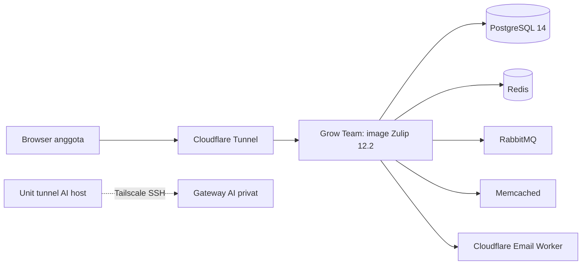
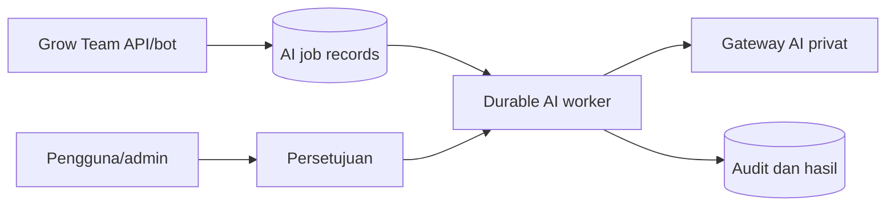

# Blueprint Grow Team

Status: 2026-09-21. Dokumen ini membedakan **terverifikasi**, **target**, dan **keputusan terbuka**.

## Tujuan

Grow Team adalah ruang kerja kolaborasi web untuk tim internal kecil, awalnya lima sampai enam anggota. Produk memakai fork Zulip 12.2 di `Growth-Circle/grow-team` dan tersedia di `team.growc.id`. Aplikasi awal menyediakan chat kanal, topik, pesan langsung, pencarian, unggah berkas, peran, dan undangan. Lihat [PRD](prd.md) dan [FRD](frd.md).

## Kondisi terverifikasi

Runtime produksi masih memakai image resmi Zulip, bukan image fork. Deploy image
fork berbranding Grow Team untuk `team.growc.id` sekarang dalam proses. Karena itu
login live masih dapat menampilkan branding lama sampai image baru berjalan dan
smoke test serta rollback diverifikasi. Engine Docker, data, volume, systemd slice,
dan tunnel dipisahkan dari Hermes. Aplikasi hanya dipublikasikan lewat loopback lalu
tunnel. Lihat `deploy/grow-team/DESIGN.md`, `README.md`, dan `VERIFICATION.md`.

## Target AI, belum diimplementasikan

Unit tunnel host hanya membuktikan jalur jaringan privat; aplikasi belum terhubung
ke gateway. Target AI memakai bot/API sidecar untuk memantau kanal terkonfigurasi,
menangani mention/tugas manual, lalu membuat record pekerjaan tahan restart.
Setiap job memakai idempotency key, retry terbatas, audit, dan konteks sesuai hak
akses. Aksi eksternal wajib menunggu persetujuan manusia. Runner container ephemeral
boleh dipakai untuk tugas opsional; aplikasi realtime tidak tidur.

## Batas arsitektur

- Jangan mengubah Hermes, sumber daya, atau layanan Hermes.
- Jangan menyimpan rahasia dalam Git atau dokumen ini.
- Jangan memperkenalkan landing page, harga, billing, aplikasi desktop, atau aplikasi mobile.
- Pertahankan protokol dan identifier Zulip yang diperlukan untuk kompatibilitas.

## Keputusan terbuka

1. Pilih isolasi pelanggan: instance per klien atau realm bersama sebelum rilis komersial.
2. Tetapkan kontrak gateway AI, kelas data, retensi audit, dan batas retry.
3. Selesaikan dan verifikasi deploy image fork berbranding sebelum menyatakan branding live.

Rujukan: [tech stack](techstack.md), [ERD](erd.md), [security](security.md), dan [roadmap](roadmap.md).
