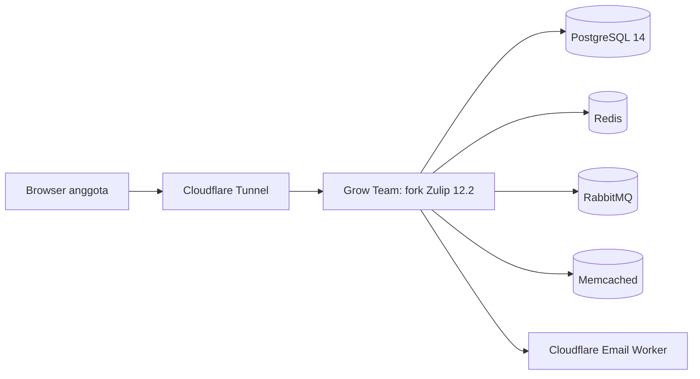
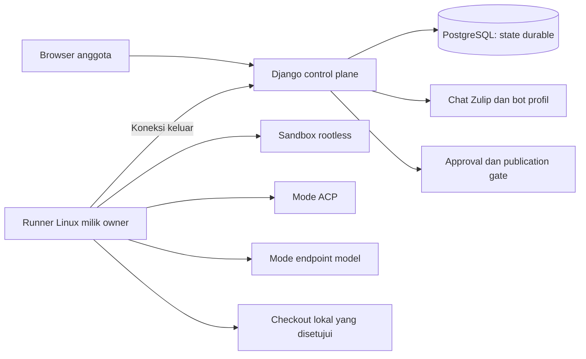

# Blueprint Grow Team

Status dokumen: penyelarasan sementara, 2026-09-23. Grow Team mempertahankan chat Zulip untuk tim internal lima sampai enam anggota. Produk dapat masuk ke pasar klien setelah gate produk dan operasi selesai.

## Tujuan

Anggota memakai browser untuk kanal, topik, DM, pencarian, berkas, dan tugas agent yang disetujui. Chat tetap memakai model dan pengalaman Zulip. Pekerjaan agent yang diterima tetap durable saat pengguna menutup browser.

## Arsitektur chat yang sudah diverifikasi

Bukti deploy chat sebelumnya mencakup `team.growc.id`, Cloudflare Tunnel, Email Worker, PostgreSQL 14, Redis, RabbitMQ, Memcached, dan engine Docker khusus Grow Team. Bukti juga mencakup login, registrasi, reset password, aset, bantuan, sesi admin, tampilan pesan, event queue, dan identitas branding. Aplikasi dipublikasi dari loopback melalui tunnel. Engine, data, volume, systemd slice, dan tunnel dipisahkan dari Hermes. Catatan ini adalah bukti bertanggal untuk chat. Catatan ini bukan bukti rilis agent saat ini. Lihat [verifikasi branding](../../deploy/grow-team/BRANDING-VERIFICATION.md).

## Arsitektur agent yang diterima

Django menyimpan identitas, pairing, grant, profil, job, attempt, approval, artifact, audit, dan outbox. Runner TypeScript terpisah berjalan pada laptop atau server milik owner. Runner membuat koneksi keluar ke control plane. Runner tidak membuka port masuk.

Dua mode awal tetap terpisah:

- **ACP:** agent yang tersedia berjalan dalam sandbox dengan adapter yang didaftarkan owner.
- **Endpoint:** runtime endpoint model memakai provider dan konfigurasi yang telah diuji.

Endpoint model tidak memberi akses repository dengan sendirinya. Server dan runner memeriksa workspace, tools, pembatalan, pemeriksaan, dan publication.

## Status komponen dan gate rilis

| Area                        | Status                                                | Arti                                                                                                                                   |
| --------------------------- | ----------------------------------------------------- | -------------------------------------------------------------------------------------------------------------------------------------- |
| Chat dan branding Grow Team | Bukti deploy bertanggal tersedia                      | Runtime chat telah diverifikasi pada cakupan laporan branding. Bukti perlu diulang untuk perubahan rilis berikutnya.                   |
| Control plane agent         | Ada di source                                         | Model durable, protocol v1, pairing, secret, grant, lifecycle, dan audit tersedia.                                                     |
| Runner dan containment      | Komponen selesai direview untuk Task 0–6              | Task 0–6 telah melalui review komponen. Ini belum menjadi sertifikasi produk penuh.                                                    |
| Image runner                | Image `1c3ebcde3d7e` diuji sebagai intermediate image | Image ini bukan image rilis final. Paket, notice, recovery, dan gate rilis tetap perlu bukti final.                                    |
| Enable profil               | Ada di source                                         | Probe hanya merekam readiness. Enable adalah aksi eksplisit pada revision yang diuji; bukti backend ada pada `6725a74`.                |
| UI agent                    | Terbit di image `12.2-grow-team.22`                   | Pengaturan agent, dialog tugas, drawer tugas, dan berbagi agent berjalan di produksi (`83b1a57b9e4`). Baris penerimaan UI belum lulus. |
| Operasi rilis               | Pending                                               | Migrasi agent sudah berjalan di produksi. Baris penerimaan, recovery, rollback, dan sertifikasi keamanan belum selesai.                |

## Batas otoritas

Akses memerlukan intersection owner, realm, principal, resource, scope, grant aktif, dan ACL saat ini. Role administrator platform tidak memberi authority runner atau credential milik owner lain. Default tim tidak memberi grant baru.

Trigger otomatis berasal dari mention personal yang sah atau DM antara satu anggota dan satu agent yang telah diotorisasi. DM grup memerlukan mention personal eksplisit. Tindakan manual memakai provenance pesan. Mention grup, wildcard, pesan bot, edit pesan, dan chat biasa tidak menjadi izin pemantauan umum. Sistem tidak melakukan fallback model atau perpindahan mode otomatis.

## Keputusan terbuka

1. Pilih isolasi pelanggan: instance per klien atau realm bersama.
2. Tetapkan operasi dukungan, retensi, dan kewajiban komersial setelah pilot internal.
3. Produksi internal sudah menjalankan runner dan koneksi model sebelum gate rilis final selesai. Selesaikan gate itu sebelum agent tersedia untuk klien.

Rujukan: [PRD](prd.md), [BRD](brd.md), [FRD](frd.md), [ERD](erd.md), [tech stack](techstack.md), [security](security.md), [roadmap](roadmap.md), [bukti penerimaan](agent-acceptance.md), [keputusan harness](agent-harness-decision.md), dan lima spesifikasi agent: [connections and coding harness](spec/2026-09-21-agent-connections-and-coding-harness.md), [lifecycle and mention flow](spec/2026-09-21-agent-lifecycle-and-mention-flow.md), [settings, connections, and team defaults](spec/2026-09-22-agent-settings-connections-and-team-defaults.md), [execution, context, skills, and MCP](spec/2026-09-22-agent-execution-context-skills-and-mcp.md), serta [administrator agent](spec/2026-09-23-agent-administrator.md).
