# ERD Grow Team

Status dokumen: penyelarasan sementara dari `zerver/models/agents.py`, 2026-09-22. Diagram menunjukkan relasi utama ForeignKey dan OneToOneField source saat ini. Diagram ini tidak menyatakan migrasi telah diterapkan di produksi.

## Model chat yang tetap dipakai

`Realm`, `UserProfile`, `Stream`, `Recipient`, `Subscription`, `Message`, `UserMessage`, `Attachment`, dan `Reaction` tetap menjadi model chat Zulip. `Message.realm` dan target recipient tetap menentukan batas chat. Model agent tidak menggantikan model ini.

## Model agent aktual

```mermaid
erDiagram
  REALM ||--o| AGENT_REALM_SETTINGS : has
  REALM ||--o{ AGENT_RUNNER : scopes
  USER_PROFILE ||--o{ AGENT_RUNNER : owns
  AGENT_RUNNER o|--o| AGENT_PAIRING : exchanged_runner
  USER_PROFILE o|--o{ AGENT_PAIRING : approves_owner
  AGENT_RUNNER ||--o{ AGENT_RUNNER_CREDENTIAL : authenticates
  AGENT_RUNNER_CREDENTIAL o|--o| AGENT_RUNNER_CREDENTIAL : rotates_from
  USER_PROFILE ||--o{ AGENT_SECRET : owns
  AGENT_RUNNER ||--o{ AGENT_PROVIDER : registers
  USER_PROFILE ||--o{ AGENT_PROVIDER : owns
  AGENT_SECRET o|--o{ AGENT_PROVIDER : encrypts
  AGENT_RUNNER ||--o{ AGENT_REPOSITORY : registers
  USER_PROFILE ||--o{ AGENT_REPOSITORY : owns
  AGENT_RUNNER ||--o{ AGENT_PROFILE : runs
  USER_PROFILE ||--o{ AGENT_PROFILE : owns
  USER_PROFILE ||--o| AGENT_PROFILE : bot_user
  AGENT_PROVIDER o|--o{ AGENT_PROFILE : configures
  AGENT_REPOSITORY o|--o{ AGENT_PROFILE : defaults
  AGENT_RUNNER o|--o{ AGENT_GRANT : target
  AGENT_PROVIDER o|--o{ AGENT_GRANT : target
  AGENT_PROFILE o|--o{ AGENT_GRANT : target
  AGENT_REPOSITORY o|--o{ AGENT_GRANT : target
  USER_PROFILE ||--o{ AGENT_GRANT : owns
  USER_PROFILE o|--o{ AGENT_GRANT : principal
  USER_GROUP o|--o{ AGENT_GRANT : principal
  AGENT_PROFILE ||--o{ AGENT_CONVERSATION : scopes
  AGENT_REPOSITORY o|--o{ AGENT_CONVERSATION : context_repo
  MESSAGE o|--o{ AGENT_CONVERSATION : anchor
  AGENT_CONVERSATION ||--o{ AGENT_JOB : contains
  USER_PROFILE ||--o{ AGENT_JOB : requests
  AGENT_PROFILE ||--o{ AGENT_JOB : selects
  AGENT_RUNNER ||--o{ AGENT_JOB : serves
  AGENT_REPOSITORY o|--o{ AGENT_JOB : uses
  MESSAGE o|--o{ AGENT_JOB : source_or_result
  AGENT_JOB ||--o{ AGENT_ATTEMPT : attempts
  AGENT_RUNNER ||--o{ AGENT_ATTEMPT : runs
  AGENT_JOB ||--o{ AGENT_CONTEXT_REF : references
  MESSAGE o|--o{ AGENT_CONTEXT_REF : message_ref
  AGENT_ATTEMPT o|--o{ AGENT_INPUT : delivers
  AGENT_JOB ||--o{ AGENT_INPUT : receives
  USER_PROFILE ||--o{ AGENT_INPUT : authors
  MESSAGE o|--o{ AGENT_INPUT : source
  AGENT_ATTEMPT ||--o{ AGENT_OPERATION : records
  AGENT_JOB ||--o{ AGENT_APPROVAL : needs
  AGENT_ATTEMPT ||--o{ AGENT_APPROVAL : needs
  AGENT_OPERATION ||--o{ AGENT_APPROVAL : decides
  USER_PROFILE o|--o{ AGENT_APPROVAL : approves
  AGENT_ATTEMPT ||--o{ AGENT_ARTIFACT : stores
  AGENT_ATTEMPT ||--o{ AGENT_VERIFICATION : verifies
  AGENT_OPERATION o|--o{ AGENT_VERIFICATION : checks
  AGENT_ARTIFACT ||--o{ AGENT_VERIFICATION : output
  AGENT_ATTEMPT ||--o{ AGENT_CHECKPOINT : checkpoints
  AGENT_CHECKPOINT o|--o{ AGENT_JOB : resume_checkpoint
  AGENT_CHECKPOINT o|--o{ AGENT_ATTEMPT : source_checkpoint
  AGENT_JOB ||--o{ AGENT_AUDIT_EVENT : audits
  AGENT_ATTEMPT o|--o{ AGENT_AUDIT_EVENT : audit_attempt
  USER_PROFILE o|--o{ AGENT_AUDIT_EVENT : acts
  AGENT_JOB o|--o{ AGENT_OUTBOX : publishes
  AGENT_RUNNER ||--o{ AGENT_SETUP_OPERATION : probes
  USER_PROFILE ||--o{ AGENT_SETUP_OPERATION : owns
  AGENT_PROFILE o|--o{ AGENT_SETUP_OPERATION : checks
  AGENT_PROVIDER o|--o{ AGENT_SETUP_OPERATION : checks
  AGENT_SETUP_OPERATION ||--o{ AGENT_PROBE_GRANT : grants_probe
  AGENT_RUNNER ||--o{ AGENT_PROBE_GRANT : receives_probe
  AGENT_PROVIDER o|--o{ AGENT_PROBE_GRANT : receives_probe
  USER_PROFILE ||--o{ AGENT_SEND_INTENT : sends
  MESSAGE o|--o| AGENT_SEND_INTENT : source_message
  AGENT_PROFILE ||--o{ AGENT_DISPATCH_RECEIPT : admits
  USER_PROFILE ||--o{ AGENT_DISPATCH_RECEIPT : requests
  AGENT_JOB o|--o{ AGENT_DISPATCH_RECEIPT : creates
  MESSAGE o|--o{ AGENT_DISPATCH_RECEIPT : source_message
```

Semua `AgentRecord` memiliki UUID, realm, dan timestamp. `AgentPairing` dapat belum memiliki realm atau owner sampai browser menyetujui pairing. `AgentRunnerCredential` menyimpan hash access dan refresh credential. `AgentSecret` menyimpan ciphertext, wrapped key, dan key ID. `AgentProvider` dapat memakai secret terenkripsi atau referensi credential lokal, tetapi tidak keduanya. Credential dapat kosong bila endpoint tidak memerlukannya.

`AgentGrant` memilih tepat satu principal user atau group dan satu target resource. Grant membawa action, scope, policy version, expiry, dan revocation. Grant bukan bypass role administrator.

`AgentJob` menyimpan requester, conversation, profile, runner, repository, source, result, policy, budget, revision, dan state. `AgentAttempt` menyimpan lease epoch, descriptor, process state, cursors, dan stop evidence. `AgentOperation`, `AgentApproval`, `AgentVerification`, dan `AgentArtifact` membatasi effect, keputusan, pemeriksaan, dan hasil. Satu operasi dapat memiliki beberapa record approval menurut ForeignKey source. Constraint service menentukan approval yang dapat dikonsumsi.

`AgentSetupOperation` dan `AgentProbeGrant` menyimpan probe readiness. Setup scope tidak memberi authority history pesan. `AgentSendIntent` dan `AgentDispatchReceipt` menyimpan admission pesan dan receipt idempotent.

## Kontrak settings pending Task9

`AgentRealmSettings` saat ini menyimpan feature flag, limit, retensi, dan revision. Default profile nullable, selection revision, actor, timestamp, serta metadata lokasi runner adalah kontrak aditif Task9. Enable eksplisit sesudah probe juga kontrak Task9. Source saat ini masih auto-enable profil setelah probe siap.

Model ini menggantikan placeholder `AI_JOB`, `AI_MODEL`, atau sidecar schema. Lihat [FRD](frd.md) dan tiga spesifikasi agent: [connections and coding harness](spec/2026-09-21-agent-connections-and-coding-harness.md), [lifecycle and mention flow](spec/2026-09-21-agent-lifecycle-and-mention-flow.md), serta [settings, connections, and team defaults](spec/2026-09-22-agent-settings-connections-and-team-defaults.md).
