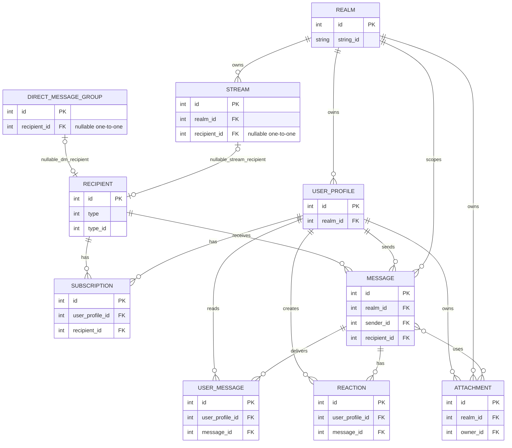
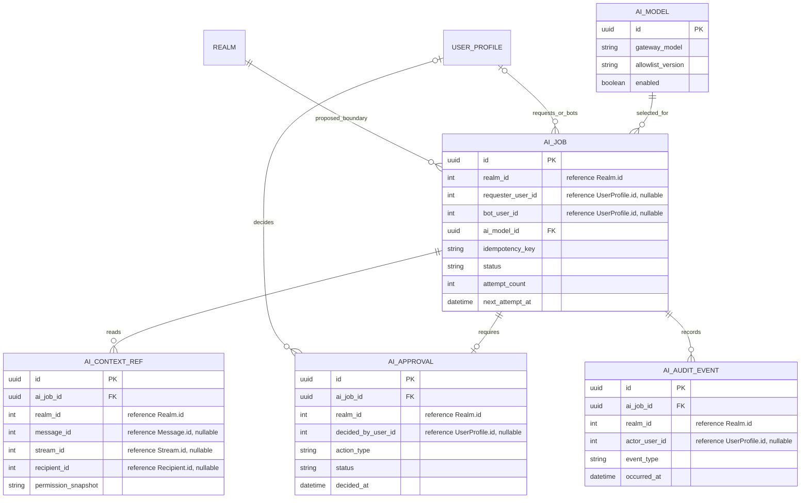

# ERD Grow Team

Status: diagram pertama adalah model source Zulip yang terverifikasi dari `zerver/models`. Diagram kedua adalah proposal AI untuk ide inti Grow Team, tetapi belum ada migrasi, tabel, atau agent runtime.

## Model aktual

`Recipient` tidak memiliki foreign key langsung ke `Realm`. Ia memakai pasangan
polimorfik `type` dan `type_id`: stream atau direct-message group. Pasangan ini
bukan foreign key database. `Stream.recipient` dan `DirectMessageGroup.recipient`
adalah OneToOne nullable, sehingga kedua sisi relasi dapat tidak ada (`o|--o|`).
Realm pesan berasal dari `Message.realm`; batas realm untuk recipient diturunkan
melalui targetnya.
`Subscription` menghubungkan pengguna dan recipient. `UserMessage` menyimpan
status per pengguna. Relasi rinci tetap mengikuti source.

## Model AI yang diusulkan

Proposal sidecar storage: simpan referensi konteks, bukan salinan pesan penuh bila
tidak perlu. Field `int` merujuk ke primary key integer ORM Zulip saat ini;
ia tidak menyatakan foreign key lintas database sudah ada. Validasi izin pada
enqueue dan sebelum eksekusi. Ini bukan migrasi ORM Zulip dan belum ada tabel
runtime. Jangan membuatnya sebelum FR-08–FR-19 dan review keamanan disetujui.
