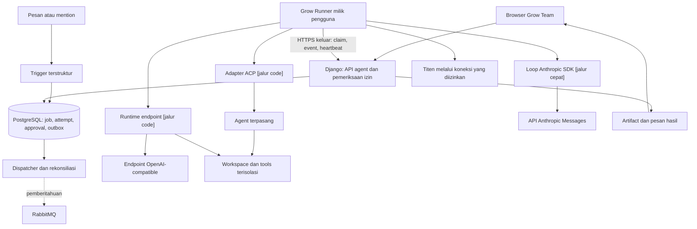
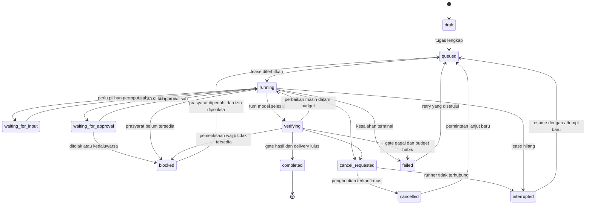
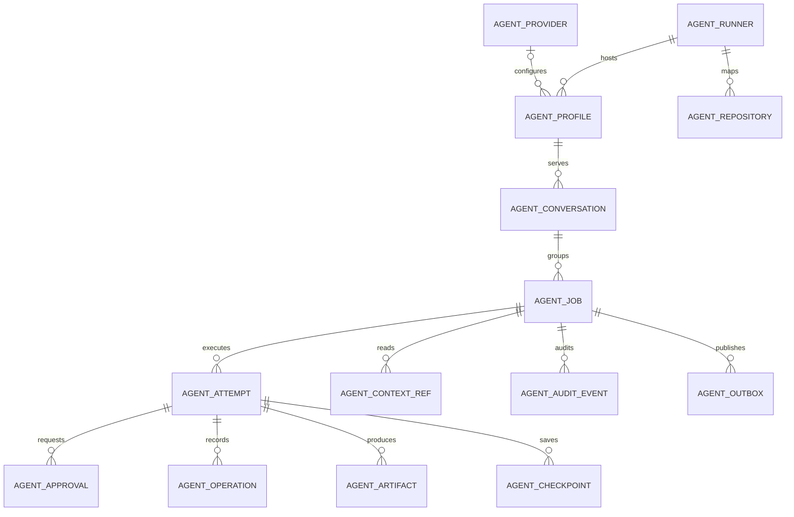

# Spesifikasi Koneksi Agent dan Coding Harness Grow Team

Tanggal: 2026-09-21. Diperbarui 2026-09-24.

Status: **sebagian sudah diimplementasikan; image `12.2-grow-team.22` (`83b1a57b9e4`) menjalankan control plane, runner, dan UI agent, tetapi Coding belum tersertifikasi dan [baris AT](../agent-acceptance.md) belum lulus.**

**Pembaruan 2026-09-24 (v2):** job `answer` dan `manage` sekarang berjalan pada
**jalur cepat**. [Spesifikasi jalur cepat](2026-09-24-agent-fast-lane.md) mengatur
jalur cepat secara rinci. Jalur code tetap seperti pada dokumen ini, kecuali bagian
yang ditandai "[jalur cepat]". Bagian yang berubah: 1, 3, 4.1–4.2, 5–5.3, 6, 6.1,
7.1–7.3, 8.1 (satu contoh), 8.2, 10.1–10.3, 13.4, 15.1, 17, 18, 19.1–19.2, 20, 21,
23, 24, 25, 26, 27, dan 28.

Alur operasional dan kasus regresi dijabarkan dalam
[spesifikasi lifecycle dan mention](2026-09-21-agent-lifecycle-and-mention-flow.md).

Baseline source Grow Team: `6937f019670f27f04f7d18e3c77a5f8e08321e0b`, branch `grow-team`.
Referensi pembelajaran Buzz: `ef2aa1ae38fadcc0bc22b8bf6ed96b35933146be`.
Pemeriksaan tambahan web Buzz: `5079c770fe30bb3d8204822ce6c2431eacac6d4b`.

## 1. Arah produk dan keputusan pengguna

Grow Team akan menjadi tempat anggota tim memberi tugas kepada agent, mengikuti
pekerjaannya, meninjau perubahan kode, dan mengendalikan tindakan lanjutan.
Percakapan tetap menggunakan kanal, topik, dan DM Grow Team yang sudah ada.

Arahan pengguna yang sudah dikonfirmasi:

1. Agent berjalan pada **laptop atau server milik pengguna** dan terhubung ke Grow Team.
2. Pengguna juga dapat menambahkan **endpoint OpenAI-compatible**. Aturan ini
   berlaku untuk jalur code. Jalur cepat memakai koneksi model Anthropic Messages
   sesuai [spesifikasi jalur cepat](2026-09-24-agent-fast-lane.md) bagian 6.2.
3. Agent dapat mengerjakan coding, bukan hanya mengirim jawaban teks.
4. Pekerjaan saat ini menghasilkan spesifikasi dan ide implementasi.
5. Antarmuka pengguna harus berjalan **melalui browser tanpa aplikasi desktop**.

Keputusan teknis dalam dokumen ini adalah **rekomendasi**, kecuali lima arahan
tersebut. Dokumen ini tidak menyatakan koneksi agent, runner, tabel AI, atau API
baru sudah tersedia. Tidak ada uji integrasi provider atau runtime agent dalam
penyusunan dokumen ini.

Rekomendasi produk: **pertahankan Zulip sebagai aplikasi web Grow Team dan adaptasi
pola harness Buzz**. Source web Buzz yang diperiksa menyediakan penjelajah
repository dan halaman undangan. Jalur chat serta pengelolaan agent yang diperiksa
masih menggunakan API Tauri pada aplikasi desktop. Rebrand Buzz akan memerlukan
pekerjaan tambahan untuk memenuhi alur browser yang diminta pengguna.

Ini adalah penilaian cakupan pekerjaan, bukan hasil benchmark. Pengguna belum
memutuskan atau mengotorisasi perpindahan platform. Kelengkapan harness Buzz tetap
bermanfaat sebagai referensi dan kandidat runtime terpisah dari antarmukanya.

Dokumen ini memberikan kontrak kemampuan yang dibutuhkan pada kedua jalur.
Bagian arsitektur Django, model ORM, endpoint Grow Team, dan peta file menjelaskan
implementasi konkret **jika Grow Team tetap memakai Zulip**. Pada jalur tersebut,
gunakan **Grow Runner** pada perangkat pengguna dengan dua mode runtime:
**agent yang sudah tersedia** dan **agent bawaan yang memakai endpoint model**.
Pada jalur Buzz, gunakan komponen upstream yang lulus pilot dan kerjakan hanya gap
terhadap kontrak ini; jangan membangun ulang seluruh rancangan Django.

Grow Runner berupa CLI atau layanan latar tanpa jendela aplikasi. Anggota tim
memakai browser untuk chat, memberi tugas, meninjau diff, dan memberi approval.
Jika repository berada pada server, perangkat anggota tidak perlu memasang runner.
Jika repository berada pada laptop, pemilik laptop memasang runner sekali agar
agent dapat bekerja pada perangkat tersebut. Menutup tab tidak menghentikan job.

Endpoint model menyediakan inferensi. Runner menyediakan lingkungan kerja,
akses repository, tools, pembatalan, dan pemeriksaan hasil. Menambahkan URL model
saja tidak memberi model kemampuan membaca atau mengubah repository.

## 2. Kondisi repository yang diperiksa

Pemeriksaan mencakup dokumen produk, deployment, dan source pada jalur integrasi
yang relevan. Graf parsial digunakan untuk navigasi; kesimpulan diperiksa kembali
pada source. Ini bukan audit seluruh Zulip atau pemeriksaan ulang produksi.

| Temuan                                                                            | Bukti lokal                                                                                     | Implikasi rancangan                                                                                |
| --------------------------------------------------------------------------------- | ----------------------------------------------------------------------------------------------- | -------------------------------------------------------------------------------------------------- |
| Produk memakai fork Zulip, dengan Django dan Tornado.                             | [Tech stack](../techstack.md), [pyproject.toml](../../../pyproject.toml)                        | Pertahankan autentikasi, realm, dan aplikasi chat.                                                 |
| Frontend memakai TypeScript, jQuery, dan Handlebars.                              | [package.json](../../../package.json), [settings_bots.ts](../../../web/src/settings_bots.ts)    | Tambahkan panel mengikuti pola UI yang ada.                                                        |
| UserProfile memiliki bot, pemilik bot, dan jenis bot.                             | [users.py](../../../zerver/models/users.py), `UserProfile`, sekitar baris 447                   | Gunakan identitas bot; jangan buat sistem anggota paralel.                                         |
| Mention dan DM dapat memicu service bot. Pesan bot tidak memicu service bot lain. | [message_send.py](../../../zerver/actions/message_send.py), `get_service_bot_events`, baris 587 | Gunakan hasil parsing mention dan pertahankan pencegahan loop.                                     |
| Pengiriman pesan berada dalam transaksi database.                                 | [message_send.py](../../../zerver/actions/message_send.py), `do_send_messages`, baris 935       | Trigger agent dapat memiliki outbox dalam transaksi yang sama.                                     |
| Pemeriksaan akses pesan tersedia.                                                 | [message.py](../../../zerver/lib/message.py), `access_message`, baris 389                       | Gunakan pemeriksaan otoritatif ini untuk context broker.                                           |
| Kanal memiliki helper pemeriksaan akses.                                          | [streams.py](../../../zerver/lib/streams.py), `access_stream_common` dan `access_stream_by_id`  | Jangan menyalin logika izin ke runner.                                                             |
| RabbitMQ dan pola publish setelah commit sudah ada.                               | [queue.py](../../../zerver/lib/queue.py), `queue_event_on_commit`, baris 465                    | Gunakan sebagai pemberitahuan kerja; record database tetap menjadi sumber status.                  |
| Registrasi event queue dapat dibatasi dengan jenis event dan narrow.              | [events_register.py](../../../zerver/views/events_register.py)                                  | Dapat dipakai untuk integrasi; queue ini bukan jurnal job tahan restart.                           |
| Topik disimpan sebagai teks `Message.subject`.                                    | [messages.py](../../../zerver/models/messages.py), baris 84                                     | Jangan menganggap judul topik sebagai ID sesi yang tetap.                                          |
| Laporan deployment menyebut batas total tiga core dan RAM 6 GiB.                  | [Panduan deployment](../../../deploy/grow-team/README.md)                                       | Tempatkan komputasi coding pada runner pengguna. Angka ini berasal dari dokumen, bukan probe baru. |
| Agent, worker AI, dan migrasi AI masih target.                                    | [Blueprint](../blueprint.md), [FRD](../frd.md), [ERD](../erd.md)                                | Seluruh modul baru di bawah adalah pekerjaan implementasi.                                         |

### 2.1 Hubungan dengan dokumen produk awal

- Spesifikasi ini merinci FR-08–FR-19; fitur chat FR-01–FR-07 dan branding FR-20 tetap menjadi fondasi.
- FR-10 diperluas: allowlist berlaku per provider, termasuk gateway privat dan endpoint milik pengguna.
- Gateway Wulan menjadi salah satu pilihan provider. Ketersediaannya bukan prasyarat untuk koneksi milik pengguna.
- Proposal penyimpanan AI pada ERD awal masih bersifat konseptual. Dokumen ini merekomendasikan record kontrol dalam ORM Django agar izin dan transaksi berada di satu tempat.
- Dispatcher dan runner tetap terpisah dari request chat. Tidak ada proses coding di dalam worker pesan, outgoing webhook, atau proses Tornado.
- Satu job dapat memiliki banyak approval dan attempt. Hubungan approval satu-ke-satu pada gambar awal tidak menjadi kontrak implementasi.

## 3. Istilah

| Istilah       | Arti dalam Grow Team                                                                                         |
| ------------- | ------------------------------------------------------------------------------------------------------------ |
| Runner        | Program pada laptop/server pengguna yang menerima pekerjaan dan mengelola proses agent.                      |
| Agent         | Runtime yang membaca tugas, memanggil model, memakai tools, dan menghasilkan pekerjaan.                      |
| Provider      | Layanan model dengan endpoint, metode autentikasi, model, dan kemampuan tertentu.                            |
| Profil agent  | Konfigurasi agent yang dapat dipilih anggota: runtime, runner, provider opsional, repository, dan kebijakan. |
| Control plane | Bagian Grow Team yang mengatur identitas, izin, job, approval, dan hasil.                                    |
| Workspace     | Salinan kerja repository yang dikelola runner untuk satu attempt.                                            |
| Job           | Satu permintaan pengguna dengan tujuan dan kriteria selesai.                                                 |
| Attempt       | Satu usaha eksekusi job; memiliki lease, workspace, dan hasil pemeriksaan sendiri.                           |
| Lease         | Hak eksekusi berjangka untuk satu attempt.                                                                   |
| Fencing token | Nomor generasi yang menolak kiriman dari pemegang lease lama.                                                |
| Artifact      | Diff, ringkasan, laporan tes, atau berkas hasil dengan akses terkontrol.                                     |
| ACP           | Protokol antara pengendali dan coding agent. **[jalur code]**                                                 |
| MCP           | Protokol antara agent dan layanan tools.                                                                     |
| Jalur cepat   | Loop `@anthropic-ai/sdk` di proses runner untuk job `answer` dan `manage`. Lihat [spesifikasi jalur cepat](2026-09-24-agent-fast-lane.md). |
| Jalur code    | Container, adapter ACP, dan endpoint child yang ada pada dokumen ini, untuk job `code`.                       |

## 4. Sasaran, skenario, dan batas versi awal

### 4.1 Skenario utama

1. Rama memasangkan runner di laptop, mendaftarkan repository, dan memilih agent.
2. Anggota yang diberi akses menyebut profil agent pada topik pekerjaan.
3. Agent membaca konteks yang diizinkan, menyiapkan workspace, mengubah kode, dan menjalankan pemeriksaan.
4. Grow Team menampilkan progres, diff, hasil tes, serta tindakan yang membutuhkan keputusan pengguna.
5. Laptop offline; job menampilkan status yang benar dan dapat dilanjutkan tanpa menggandakan tindakan eksternal.
6. **[jalur code]** Pengguna menambahkan endpoint OpenAI-compatible dan menggunakannya melalui runtime agent bawaan pada runner yang dipilih.
7. **[jalur cepat]** Anggota me-mention profil `answer` atau `manage`; runner memanggil koneksi model `anthropic_messages` sesuai [spesifikasi jalur cepat](2026-09-24-agent-fast-lane.md).

Contoh permintaan: “Perbaiki validasi formulir login pada repository ini.
Tambahkan pemeriksaan regresi yang relevan. Hasilkan diff untuk saya tinjau.”
Koneksi provider, repository, branch dasar, dan kebijakan diambil dari pilihan
terstruktur pengguna, bukan ditebak dari isi percakapan.

### 4.2 Masuk versi awal

- Runner milik pengguna, koneksi keluar melalui HTTPS, pairing, pencabutan akses, dan status perangkat.
- Profil agent pribadi; berbagi kepada anggota tertentu melalui izin eksplisit pemilik perangkat.
- **[jalur code]** Adapter ACP dan runtime endpoint OpenAI-compatible.
- **[jalur cepat]** Loop `@anthropic-ai/sdk` di proses runner untuk job `answer` dan `manage`.
- Repository Git yang didaftarkan secara lokal oleh pemilik runner.
- Pembuatan tugas melalui UI dan mention pada kanal/topik yang dikonfigurasi.
- DM kepada bot sebagai jalur privat, dengan hasil tetap pada audiens yang sama.
- Coding dalam workspace terpisah, diff, pemeriksaan, cancel, resume, dan approval.
- Push ke branch tugas dan pembuatan draft PR sebagai tindakan opsional yang diberi izin tersendiri.
- Penyimpanan status tahan restart, audit operasional, artifact terkontrol, dan integrasi memori Titen yang dibatasi.

### 4.3 Tahap berikutnya

- Runner yang disediakan Grow Team, marketplace agent, penagihan, dan isolasi pelanggan komersial.
- Eksekusi multi-agent untuk satu job; awalnya satu eksekutor agar kepemilikan workspace jelas.
- Merge otomatis, deploy produksi, perubahan database produksi, dan terminal host tanpa pembatasan.
- Penjadwalan proaktif yang dapat mengubah kode tanpa permintaan atau mandat pengguna.
- Dukungan Windows dengan jaminan isolasi setara; pilot awal menargetkan Linux, lalu macOS setelah uji adapter dan sandbox.
- Aplikasi desktop Grow Team; alur utama harus tersedia melalui browser.

Monitoring kanal pada FR-08 berarti menerima trigger terpilih. Keanggotaan kanal
tidak otomatis memberi agent mandat untuk mengubah repository.

## 5. Pilihan arsitektur

Dipensiunkan 2026-09-24: pemilik sudah memutuskan platform. Grow Team tetap
memakai Zulip dengan control plane Django dan runner milik pengguna. Lihat
[keputusan SDK agent](../agent-sdk-decision.md) dan
[spesifikasi jalur cepat](2026-09-24-agent-fast-lane.md) untuk keputusan runtime
yang berlaku sekarang.

## 6. Arsitektur bila mempertahankan Zulip



### 6.1 Penempatan komponen

| Komponen              | Teknologi usulan                                                            | Tanggung jawab                                                                               |
| --------------------- | --------------------------------------------------------------------------- | -------------------------------------------------------------------------------------------- |
| API dan model kontrol | Python/Django yang sudah dipakai                                            | Auth, realm, ACL, policy, state machine, referensi konteks, artifact, approval.              |
| Dispatcher            | Worker/management command Django terpisah                                   | Outbox, retry terjadwal, pemeriksaan lease, serta penerbitan hasil. Tidak menjalankan model. |
| Antrean               | PostgreSQL sebagai sumber; RabbitMQ sebagai pemicu                          | Claim atomik, recovery ketika pemberitahuan hilang, dan pembagian kerja.                     |
| Grow Runner           | TypeScript dengan Node yang dipatok saat implementasi                       | Pairing, claim, proses agent, supervisor, workspace, checkpoint lokal.                       |
| Adapter ACP **[jalur code]** | SDK ACP TypeScript, versi dipatok                                    | Negosiasi kemampuan, prompt, progres, izin, dan cancel.                                      |
| Runtime endpoint **[jalur code]** | Kandidat: subprocess `buzz-agent` atau modul TypeScript; pilih satu pada P0 | Loop model/tools, validasi argumen, budget, dan pemulihan konteks.                    |
| Loop jalur cepat **[jalur cepat]** | `@anthropic-ai/sdk` di proses runner, versi terkunci                 | Streaming, loop alat, effort, dan cache sesuai spesifikasi jalur cepat.                       |
| Tools coding          | Tool broker dan MCP lokal                                                   | Baca/edit berkas, pencarian, shell terisolasi, pemeriksaan, dan artifact.                    |
| UI                    | TypeScript/jQuery/Handlebars existing                                       | Pengaturan koneksi dan panel tugas dalam aplikasi web.                                       |

Runner tidak mendapat koneksi PostgreSQL atau RabbitMQ aplikasi. Browser tidak
memegang credential runner. Model tidak mendapat API key pengguna Grow Team.
ACP digunakan pada koneksi lokal runner–agent; ACP stdio tidak diekspos langsung
ke internet. MCP juga tidak menjadi mekanisme pairing perangkat.

## 7. Dua mode koneksi agent

Bagian ini berlaku untuk **jalur code** (job `code`). Job `answer` dan `manage`
memakai jalur cepat; lihat [spesifikasi jalur cepat](2026-09-24-agent-fast-lane.md).

### 7.1 Mode agent terpasang **[jalur code]**

Pengguna memilih executable adapter yang sudah dipasang dan diizinkan secara
lokal. Grow Team menyimpan alias adapter, bukan perintah shell bebas dari chat.
Runner memulai proses dengan argumen terstruktur dan working directory attempt.

Kandidat adapter: Codex melalui `codex-acp`, Claude Code melalui
`claude-agent-acp`, dan Goose melalui antarmuka ACP yang didukung versinya.
Daftar ini adalah target sertifikasi, bukan klaim bahwa semuanya sudah lulus
integrasi Grow Team. Paket adapter harus dipatok dan diuji sebelum ditawarkan
sebagai pilihan siap coding.

Autentikasi vendor berlangsung pada perangkat pengguna mengikuti kemampuan
adapter. Grow Team tidak meminta password akun vendor. Dukungan langganan,
API key, gateway, dan resume mengikuti adapter yang benar-benar diuji.
Dokumentasi [codex-acp](https://github.com/agentclientprotocol/codex-acp/blob/main/README.md)
dan [claude-agent-acp](https://github.com/agentclientprotocol/claude-agent-acp/blob/main/README.md)
menjadi titik awal, bukan pengganti uji versi rilis.

### 7.2 Mode endpoint OpenAI-compatible **[jalur code]**

Pengguna menambahkan provider melalui UI, memilih runner, memasukkan model, lalu
menjalankan tes koneksi. Grow Runner menjalankan agent bawaan yang memanggil
provider tersebut dan memakai tool broker lokal untuk coding. Mode ini melayani
job `code`. Job `answer` dan `manage` memakai loop `@anthropic-ai/sdk` dengan API
Anthropic Messages pada jalur cepat; lihat
[spesifikasi jalur cepat](2026-09-24-agent-fast-lane.md) bagian 6.

Runtime ini harus memiliki loop tool-calling sendiri. Respons teks biasa dari
endpoint tidak dianggap sebagai perubahan kode. Provider yang hanya mendukung
teks dapat diberi status siap chat, tetapi tombol coding dinonaktifkan.

### 7.3 Kemampuan yang dicatat per versi **[jalur code]**

Tabel ini membandingkan dua mode jalur code. Kemampuan jalur cepat ada di
[spesifikasi jalur cepat](2026-09-24-agent-fast-lane.md) bagian 3.

| Kemampuan              | Agent terpasang                      | Runtime endpoint                                         |
| ---------------------- | ------------------------------------ | -------------------------------------------------------- |
| Percakapan dan progres | Negosiasi ACP, normalisasi event     | Implementasi loop dan event oleh runner                  |
| Baca/edit repository   | Adapter dan batas sandbox yang diuji | Tool broker milik Grow Runner                            |
| Shell dan pemeriksaan  | Diperiksa melalui kontrak adapter    | Proses terisolasi dengan batas resource                  |
| Permission request     | Dipetakan ke policy Grow Team        | Diterapkan sebelum tool berjalan                         |
| Resume native          | Hanya jika kemampuan tersedia        | Rekonstruksi dari checkpoint terstruktur                 |
| Penggunaan token/biaya | Dapat tidak tersedia                 | Gunakan usage provider jika tersedia                     |
| Pemadatan konteks      | Mengikuti kemampuan adapter          | Runtime membuat ringkasan dan mempertahankan tugas aktif |

Status koneksi dan kemampuan harus terpisah. `online` belum berarti
`code_ready`. Adapter yang tidak dapat memenuhi kebijakan eksekusi hanya
ditawarkan untuk kemampuan yang dapat dibuktikan. Jangan menyembunyikan
keterbatasan izin adapter dengan konfigurasi otomatis yang mengizinkan semuanya.

## 8. Alur pengguna

### 8.1 Memasangkan runner

1. Buka **Pengaturan → Agent → Runner → Hubungkan perangkat**.
2. Pasang paket runner yang sudah dirilis pada laptop/server pengguna.
3. Jalankan perintah pairing dengan alamat Grow Team.
4. Browser menampilkan nama perangkat, fingerprint, pemilik, dan izin yang diminta.
5. Pengguna yang sedang login menyetujui pairing perangkat miliknya.
6. Runner menyimpan credential pada penyimpanan lokal yang terlindungi.
7. UI menampilkan hasil handshake, versi runner, dan waktu heartbeat terakhir.

Nama perintah berikut adalah **kontrak CLI usulan**, belum tersedia:

```text
grow-runner connect --server https://team.growc.id
grow-runner workspace add /home/rama/Project/example --alias example
grow-runner agent add --adapter codex-acp --name coding-rama  # contoh jalur code
grow-runner doctor
grow-runner start
```

Penambahan workspace lokal harus dilakukan pemilik perangkat. Admin realm tidak
dapat memasukkan path arbitrer agar perangkat anggota membacanya. Pengaturan
agent yang dibagikan hanya memperluas pengguna yang dapat memberi tugas dalam
scope yang sudah disetujui pemilik runner.

### 8.2 Menambahkan endpoint

Form berisi nama koneksi, runner pelaksana, base URL, jenis API, model,
credential, batas konteks, dan batas penggunaan. Model dapat dipilih dari
discovery atau diisi manual jika endpoint tidak menyediakan daftar model.
Field "jenis API" (`api_mode`) menerima `chat_completions` dan `responses` untuk
jalur code. Nilai `anthropic_messages` menandai koneksi model jalur cepat; lihat
[spesifikasi jalur cepat](2026-09-24-agent-fast-lane.md) bagian 6.2.

Tombol **Uji koneksi** menjalankan probe pada runner yang dipilih. Ini penting
untuk endpoint localhost, LAN, atau jaringan privat yang hanya dapat diakses
perangkat pengguna. Grow Team menampilkan kemampuan yang lulus, bukan sekadar
hasil HTTP 200. Jika runner offline, simpan konfigurasi sebagai belum diuji.

### 8.3 Memulai tugas coding

1. Pilih **Kerjakan dengan agent** pada menu sebuah pesan, atau mention profil agent.
2. Pilih repository, branch dasar, mode kerja, dan hasil yang diminta.
3. Tampilkan scope yang akan diberikan: konteks chat, workspace, tools, dan penggunaan provider.
4. Buat job setelah pengguna mengirim tugas. Mandat ini mencakup baca/edit/test dalam scope terpilih.
5. Agent memposting status awal dan tautan panel tugas pada percakapan asal.
6. Panel menampilkan langkah singkat, berkas berubah, pemeriksaan, dan keputusan yang tertunda.
7. Hasil akhir menampilkan diff, bukti pemeriksaan, batas verifikasi, dan tindakan lanjutan yang tersedia.

Mention dapat langsung membuat job jika profil sudah memiliki binding repository
dan kebijakan yang jelas. Jika pilihan masih ambigu, buat draft dan minta
pengguna memilih. Jangan menebak repository atau menjalankan push dari kalimat
yang hanya dikutip sebagai konteks.

### 8.4 Instruksi susulan dan pembatalan

Pesan lanjutan harus menunjuk job melalui tombol atau ID job. Topik dapat
memiliki beberapa job, sehingga “lanjut” tidak boleh dialamatkan secara acak.
Steering native hanya dipakai bila adapter mendukungnya. Jika tidak, instruksi
masuk antrean turn berikutnya. Perubahan tujuan yang membatalkan pekerjaan lama
memerlukan cancel/replan yang tercatat.

Tombol **Batalkan** mengubah status menjadi `cancel_requested` segera. Status
`cancelled` baru tampil setelah runner membuktikan proses dan turunannya berhenti.
Jika runner hilang, UI menampilkan `interrupted` dengan status penghentian belum
terkonfirmasi. Tombol **Lanjutkan** membuat attempt baru setelah pemeriksaan izin
dan workspace, bukan sekadar mengulang perintah terakhir.

## 9. Pairing, transport, dan identitas runner

### 9.1 Pairing perangkat

- Runner menghasilkan identitas perangkat dan rahasia polling yang berentropi tinggi.
- Server memberi kode pengguna berumur pendek; target awal kedaluwarsa 10 menit.
- Pengguna menyetujui kode melalui sesi browser terautentikasi dan pemeriksaan CSRF.
- Server menetapkan `realm_id` dan `owner_user_id` dari sesi tersebut, bukan dari body runner.
- Runner menukar rahasia polling setelah persetujuan. Kode yang terlihat pengguna tidak cukup untuk mengambil credential.
- Pairing sekali pakai, dibatasi percobaannya, dan mencatat fingerprint serta aktor persetujuan.
- Target awal access token 24 jam dan refresh credential 30 hari, dengan rotasi saat digunakan.
- Database menyimpan hash credential perangkat. Pencabutan runner membatalkan token, refresh, claim baru, dan lease aktif.

Angka masa berlaku adalah default pilot yang diusulkan. Penyimpanan lokal memakai
keychain OS jika tersedia; fallback berupa berkas khusus pemilik perangkat.
Credential tidak muncul dalam argumen proses, pesan chat, URL, atau log.

### 9.2 Transport keluar dari perangkat

Versi awal menggunakan HTTPS request singkat dan polling pekerjaan, dengan waktu
tunggu maksimum 25 detik per request. Runner tidak membuka port inbound.
Panggilan model dan proses coding berjalan lokal, di luar request HTTP Grow Team.
Tidak ada request publik yang ditahan selama seluruh pekerjaan coding.

WebSocket dapat ditambahkan setelah kebutuhan latency terbukti. Jika ditambahkan,
tetap perlukan heartbeat, sequence, acknowledgement, replay, dan otorisasi yang
sama. Koneksi terbuka tidak menggantikan penyimpanan job tahan restart.

### 9.3 Trust perangkat

Pemilik runner mengendalikan mesin dan prosesnya. Pairing membuktikan identitas
perangkat, bukan kejujuran hasil tes atau keamanan seluruh host. Anggota yang
berbagi repository kepada runner menerima batas kepercayaan tersebut.
UI menyebut “pemeriksaan pada runner”; CI repository tetap bukti terpisah.
Jangan mengiklankan perangkat pengguna sebagai lingkungan yang telah diattestasi.

## 10. Kontrak adapter dan endpoint

Bagian 10.1–10.3 berlaku untuk **jalur code**. Koneksi model jalur cepat mengikuti
[spesifikasi jalur cepat](2026-09-24-agent-fast-lane.md) bagian 6.

### 10.1 ACP **[jalur code]**

Adapter melakukan `initialize`, mencatat versi dan kemampuan, lalu membuat sesi
melalui `session/new`. Working directory harus merupakan path workspace attempt.
Runner menerima `session/update` dan menormalkan progres ke event Grow Team.
`session/load` hanya digunakan jika kemampuan `loadSession` tersedia.
`session/cancel` diteruskan, disusul penghentian proses jika agent tidak merespons.
Rujukan: [ACP overview](https://agentclientprotocol.com/protocol/v1/overview) dan
[session setup](https://agentclientprotocol.com/protocol/v1/session-setup).

Permission request diputuskan menurut grant pengguna dan policy yang berlaku.
Runner memilih `optionId` dari opsi yang benar-benar dikirim adapter; jangan
menganggap ID selalu bernama `allow_once`. Penolakan, expiry, atau cancel tidak
boleh berubah menjadi izin otomatis. Kemampuan filesystem dan terminal yang
ditawarkan client hanya diaktifkan jika implementasinya tersedia dan diuji.
Rujukan: [ACP tool calls](https://agentclientprotocol.com/protocol/v1/tool-calls).

Adapter memiliki antarmuka internal usulan: `probe`, `start_session`,
`send_turn`, `cancel`, `resume`, `close`, dan `capabilities`. Tidak semua metode
wajib tersedia pada setiap adapter. `end_turn` hanya menutup turn model;
completion verifier Grow Team tetap menentukan hasil job.

### 10.2 Profil endpoint **[jalur code]**

Tabel ini mengatur koneksi model jalur code. Koneksi model jalur cepat memakai
field terpisah pada [spesifikasi jalur cepat](2026-09-24-agent-fast-lane.md)
bagian 6.2.

| Field                       | Aturan                                                                                               |
| --------------------------- | ---------------------------------------------------------------------------------------------------- |
| `owner_user_id`, `realm_id` | Ditentukan server; selalu diperiksa pada akses.                                                      |
| `runner_id`                 | Perangkat yang melakukan probe dan inferensi. Tidak boleh berganti diam-diam.                        |
| `base_url`                  | URL dasar tervalidasi, misalnya `https://llm.example.net/v1`.                                        |
| `api_mode`                  | `chat_completions` atau `responses` untuk jalur code; hasil probe dapat merekomendasikan pilihan.    |
| `model_id`                  | ID yang dikonfirmasi provider atau diisi pengguna; tidak diganti otomatis.                           |
| `credential_ref`            | Referensi secret, bukan nilai secret pada respons API biasa.                                         |
| `allowed_models`            | Model yang diizinkan pemilik; katalog provider bukan izin otomatis.                                  |
| `context_window_tokens`     | Batas konfigurasi pengguna/provider; tidak dianggap ditemukan hanya dari probe sederhana.            |
| `max_output_tokens`         | Diterjemahkan adapter sesuai API; tidak semua provider menerima field yang sama.                     |
| `capability_report`         | Waktu probe, versi runner, mode API, tool-calling, streaming, usage, dan batas yang belum diketahui. |
| `data_scope`                | Kelas repository/konteks yang diizinkan dikirim ke provider.                                         |
| `config_version`            | Naik ketika endpoint, credential, model, atau policy berubah; probe lama menjadi kedaluwarsa.        |

Runtime menyusun path API sekali: `/chat/completions` atau `/responses` relatif
terhadap base URL yang dinormalisasi. Jangan menambahkan `/v1` dua kali.
`GET /models` bersifat opsional. Tidak tersedianya discovery tidak menggagalkan
model yang diisi manual dan lulus probe inferensi. Koneksi jalur cepat memakai
path tetap `/v1/messages`; lihat spesifikasi jalur cepat bagian 6.2.

### 10.3 Probe kemampuan **[jalur code]**

Probe kemampuan jalur cepat memakai gerbang terpisah: `POST /v1/messages` dengan
streaming dan satu `tool_use`, dijabarkan pada
[spesifikasi jalur cepat](2026-09-24-agent-fast-lane.md) bagian 6.2 dan 12 (gerbang F0).

Probe jalur code menggunakan data sintetis, tidak membaca repository, dan
menampilkan bahwa provider dapat mengenakan biaya. Langkahnya:

1. Validasi URL dan konektivitas dari runner terpilih.
2. Uji autentikasi dan model melalui permintaan kecil.
3. Uji satu tool sintetis `probe_echo`, lengkap dengan schema argumen.
4. Kirim hasil tool kembali dan periksa respons lanjutan.
5. Uji stream jika dipilih, termasuk penggabungan argumen tool yang datang bertahap.
6. Simpan hasil sebagai `passed`, `unsupported`, atau `unknown` per kemampuan.

Timeout dan gangguan jaringan berarti `unknown`, bukan bukti provider tidak
mendukung kemampuan. Kegagalan tool-calling membatasi profil ke chat.
String JSON dalam jawaban teks tidak dieksekusi sebagai tool call.
Dokumentasi [function calling OpenAI](https://developers.openai.com/api/docs/guides/function-calling)
menjelaskan pola pertukaran tool untuk jalur code, tetapi provider lain tetap
harus diuji. Probe jalur cepat memakai dokumentasi Anthropic Messages tool use,
bukan dokumentasi ini.

### 10.4 Loop runtime endpoint

1. Bentuk konteks dari tugas, aturan repository, izin, dan referensi yang masih sah.
2. Panggil provider dengan katalog tools terbatas.
3. Validasi nama tool, JSON argumen, schema, ID panggilan, dan sisa budget.
4. Periksa grant; hentikan untuk approval bila tindakan melampaui grant.
5. Jalankan tool melalui broker, bukan melalui teks shell yang langsung dipercayai dari respons model.
6. Catat hasil terstruktur dengan pasangan ID panggilan yang benar.
7. Lanjutkan sampai turn selesai, dibatalkan, gagal, atau budget habis.
8. Jalankan completion verifier sebelum menyatakan job selesai.

Output stream yang belum lengkap tidak boleh memicu eksekusi. Saat cancel,
pertahankan pasangan tool/result yang valid; jangan memutar ulang tool mutasi
hanya karena respons model terputus. Retry 429/5xx harus terbatas dan menghormati
`Retry-After`. Kesalahan auth, izin, atau quota memerlukan tindakan yang sesuai,
bukan pengulangan tanpa batas. Pergantian provider memerlukan persetujuan scope
data dan model yang baru.

## 11. Workspace dan alur coding

### 11.1 Pendaftaran repository

Runner memetakan ID repository ke path lokal yang sudah didaftarkan pemilik.
URL origin dan alias dapat dikirim ke control plane; path absolut lokal tidak
perlu ditampilkan kepada semua anggota. Normalisasi origin ke identitas stabil
untuk policy dan Titen. Repository tanpa origin tetap dapat memakai ID lokal,
tetapi tidak boleh ditebak sebagai project Titen yang lain.

Mode awal mengerjakan commit dasar yang dipilih. Perubahan pengguna yang belum
di-commit tidak ikut disalin secara implisit. UI menjelaskan jika working tree
utama memiliki perubahan dan menawarkan pemilihan commit yang jelas.

### 11.2 Persiapan attempt

- Ambil lock workspace dan catat branch, base commit, origin, status awal, serta versi policy.
- Buat worktree/checkout terpisah untuk attempt; jangan menggunakan working tree aktif pengguna.
- Jika sandbox memakai worktree Git, perhatikan bahwa `.git` dapat menunjuk common Git directory di luar worktree.
- Jangan memasang common Git directory pengguna secara writable ke sandbox. Gunakan checkout terpisah atau Git broker dengan hak terbatas.
- Dependency cache boleh dibagi hanya melalui konfigurasi yang aman; writable cache dari job lain bukan input tepercaya.
- Submodule, Git LFS, hook Git, filter, dependency install script, dan symlink diperiksa sebelum diberi akses atau dijalankan.
- Aturan proyek dibaca sesuai hierarki lokal. File repository tidak dapat memperluas izin perangkat atau credential.

### 11.3 Tahap eksekusi

| Tahap   | Bukti yang dihasilkan                                                                           |
| ------- | ----------------------------------------------------------------------------------------------- |
| Inspect | Repository dan base commit terkonfirmasi; file relevan dan pemeriksaan yang tersedia diketahui. |
| Plan    | Ringkasan perubahan, kriteria hasil, dan kebutuhan input/approval.                              |
| Edit    | Diff aktual dari workspace, bukan hanya daftar file yang diklaim model.                         |
| Verify  | Perintah, working directory, exit code, waktu, hash tree, dan artifact keluaran.                |
| Review  | Ringkasan diff, risiko, serta pemeriksaan yang lulus, gagal, atau belum dijalankan.             |
| Deliver | Patch/diff pada Grow Team, atau branch/draft PR jika ada izin yang sesuai.                      |

Model dapat mengusulkan perintah tes. Daftar pemeriksaan wajib berasal dari
profil repository yang disetujui pemilik. Perubahan terhadap file tes atau
konfigurasi pemeriksaan harus terlihat dalam diff; agent tidak boleh menyatakan
berhasil hanya dengan menghapus pemeriksaan yang gagal.

### 11.4 Kriteria selesai

Untuk target `patch`, job selesai ketika diff sudah disimpan, pemeriksaan wajib
lulus pada tree akhir, ringkasan tersedia, dan pengiriman hasil terkonfirmasi.
UI menampilkan “Selesai — diff siap ditinjau”. Pemeriksaan yang tidak tersedia
tidak boleh dilaporkan lulus; job memerlukan keputusan cakupan atau tetap blocked.

Untuk target `draft_pr`, tambahan gate adalah approval push/PR, remote branch
yang cocok dengan commit hasil, dan identitas PR terverifikasi. Job selesai tidak
berarti sudah merge atau deploy. Implementasi merge/deploy berada pada tahap
lanjutan dengan spesifikasi tindakan tersendiri.

Hasil tes harus mengacu ke tree akhir. Setiap edit setelah tes membatalkan
kesimpulan pemeriksaan terkait. Kondisi remote yang berubah setelah approval
memerlukan rekonsiliasi dan, jika scope berubah, approval baru.

## 12. State machine dan kelanjutan tugas

Gunakan satu state machine job yang eksplisit. `phase` menyimpan tahap coding;
`status` menyimpan keadaan eksekusi. Hindari menyimpulkan status dari teks model.



Transisi tambahan yang wajib: draft/queued/waiting dapat dibatalkan; waiting
yang kehilangan lease menjadi interrupted; penolakan approval menjadi blocked
atau pembatalan sesuai tindakan pengguna. `blocked` berarti prasyarat yang
disebutkan secara konkret belum tersedia. Transisi keluar blocked memerlukan
prasyarat tersebut dipenuhi dan pemeriksaan ulang izin. Masuk blocked menghentikan
proses aktif serta mengakhiri attempt setelah penghentian terkonfirmasi; jika
belum terkonfirmasi, gunakan interrupted. Kelanjutan membuat attempt baru.

`waiting_for_runner` adalah alasan tampilan untuk job queued, bukan bukti agent
sedang bekerja. Setiap transisi memakai versi record agar keputusan bersamaan
tidak menimpa satu sama lain. State terminal attempt lama tidak dibuka kembali;
resume membuat attempt baru pada job yang sama dengan checkpoint asal tercatat.

## 13. Antrean tahan restart dan pencegahan pekerjaan ganda

### 13.1 Trigger dan outbox

Pembuatan pesan/trigger yang dipilih, record job, serta outbox harus memiliki
batas transaksi yang jelas. Pada integrasi mention native, tulis trigger/outbox
dalam transaksi pengiriman pesan. Tidak ada panggilan jaringan atau model dalam
transaksi tersebut. Dispatcher mengolah outbox setelah commit.

`queue_event_on_commit` mencegah publish sebelum commit, tetapi source helper
tidak menyediakan jurnal untuk crash di antara commit dan publish. Karena itu
job baru membutuhkan outbox dan pemindai rekonsiliasi. RabbitMQ boleh mengirim
pemberitahuan lebih dari sekali; database menentukan apakah pekerjaan sudah
diambil. Lihat [helper queue](../../../zerver/lib/queue.py).

Kunci deduplikasi trigger: `(realm_id, source_message_id, agent_profile_id,
trigger_kind)`. Untuk tugas manual, gunakan idempotency key dari UI dengan scope
peminta dan realm. Permintaan ulang dengan key sama dan payload berbeda ditolak.
Edit pesan tidak menjalankan ulang job otomatis; pengguna membuat instruksi
susulan dengan identitas sendiri.

### 13.2 Claim dan lease

Claim memilih job yang cocok dengan runner, policy, kemampuan, dan kapasitas.
Gunakan transaksi serta row lock, misalnya `SELECT FOR UPDATE SKIP LOCKED`.
Hanya satu attempt aktif per job. Target awal: heartbeat 15 detik dan lease
90 detik. Setiap attempt membawa `(job_id, attempt_id, lease_epoch)`.

API event, approval execution, artifact, dan completion menolak epoch lama.
Runner juga memeriksa expiry secara lokal. Sesudah koneksi kontrol hilang,
runner tidak memulai tool mutasi baru; proses berjalan dihentikan sesuai deadline
yang disepakati, paling lambat saat lease berakhir. Server tidak menugaskan ulang
pekerjaan yang efeknya belum diketahui hanya berdasarkan timeout jaringan.

Fencing database tidak dapat menghentikan proses host yang mengabaikannya.
Karena itu workspace setiap attempt terpisah, proses diawasi secara lokal, dan
credential tindakan eksternal diberikan melalui broker dengan grant berjangka.

### 13.3 Retry dan efek eksternal

Transport event menggunakan `event_id` dan sequence; kiriman ulang harus aman.
Receipt dicatat sebelum acknowledgement. Claim yang responsnya hilang dapat
direkonsiliasi runner melalui daftar lease aktif, tanpa membuat attempt kedua.

Jangan menjanjikan exactly-once lintas jaringan dan Git provider. Gunakan
pengiriman berulang yang dapat dideduplikasi, operation ledger, dan rekonsiliasi.
Jika push/PR mungkin berhasil tetapi respons hilang, periksa remote ref atau PR
yang terkait operation ID sebelum mencoba lagi. Jika kepastian belum diperoleh,
tahan operasi dalam `outcome_unknown` dan tampilkan tindakan pemulihan.

### 13.4 Posting hasil

Pembuatan pesan hasil dan pencatatan `result_message_id` harus atomik melalui
action Django. Outbox publikasi memegang unique delivery key. Retry tidak
menciptakan pesan akhir kedua. Pemeriksaan hak baca/tulis dijalankan lagi tepat
sebelum posting. Jika audiens berubah, tahan hasil dalam panel yang masih sah;
jangan memindahkannya ke kanal yang lebih luas sebagai fallback.

**[jalur cepat]** Hasil jalur cepat memakai **pesan draft** yang server edit
selama model menulis, bukan satu pesan yang muncul sesudah selesai. Server
menerbitkan hasil segera sesudah `result.prepared`, tanpa menunggu
`attempt.stopped`. Aturan lengkap ada di
[spesifikasi streaming](2026-09-24-agent-streaming-delivery.md).

## 14. Permission dan approval

### 14.1 Matriks izin

| Tindakan                                       | Grant awal                                   | Gate tambahan                                                                      |
| ---------------------------------------------- | -------------------------------------------- | ---------------------------------------------------------------------------------- |
| Membaca konteks tugas                          | Referensi terpilih dan ACL aktif             | Context broker memeriksa tiap reference.                                           |
| Membaca repository                             | Repository terdaftar dan path yang diizinkan | Aturan symlink serta file sensitif.                                                |
| Mengedit kode                                  | Workspace attempt                            | Tidak mengubah working tree utama pengguna.                                        |
| Menjalankan tes/build                          | Profil pemeriksaan repository                | Sandbox dan batas resource; script repository dianggap kode yang dapat dieksekusi. |
| Memasang dependency                            | Tidak otomatis dalam semua profil            | Network dan lifecycle script harus diizinkan dalam grant.                          |
| Commit lokal                                   | Dapat menjadi bagian mandat coding           | Hanya perubahan attempt; aturan atribusi repository harus dipenuhi.                |
| Push branch tugas                              | Izin terpisah                                | Remote, branch, commit hasil, dan expected remote head terikat approval.           |
| Membuat draft PR                               | Izin terpisah                                | Base/head, repository, judul, dan isi yang akan diterbitkan dapat ditinjau.        |
| Merge/deploy/ubah data produksi                | Di luar versi awal                           | Tidak muncul sebagai tool tersedia.                                                |
| Hapus data, reset, atau bersihkan WIP pengguna | Tidak diberikan                              | Memerlukan mandat spesifik; tidak menjadi mekanisme recovery otomatis.             |

Grant berasal dari pengguna berwenang, bukan dari kalimat model, instruksi dalam
repository, atau reaction emoji pada chat. Tindakan yang sudah diizinkan dalam
scope tugas tidak meminta persetujuan berulang tanpa perubahan scope.

### 14.2 Record approval

Approval menyimpan aktor, scope, action type, argumen yang dinormalisasi,
repository, branch, hash diff/commit, policy version, attempt, expiry, dan nonce
sekali pakai. Server memeriksa ulang hak aktor ketika keputusan diterima dan
ketika tindakan dimulai. Persetujuan untuk satu diff tidak berlaku bagi diff baru.

Untuk push, gunakan compare-and-swap terhadap remote head atau ekuivalennya.
Push paksa tidak termasuk grant standar. Untuk PR, rekonsiliasi berdasarkan
repository dan head branch. Approval lama yang tidak lagi cocok tampil sebagai
kedaluwarsa, bukan diubah diam-diam.

### 14.3 Penghentian yang nyata

Hook `_Stop` dari pola Buzz dapat mengingatkan pekerjaan tertunda, tetapi tidak
menjadi otoritas completion atau approval. Timeout hook tidak boleh membuka
akses mutasi. Policy enforcement berada pada control plane dan tool broker.

Shell umum dapat melewati pembatasan berbasis nama perintah. Karena itu larangan
push tidak cukup diterapkan dengan menolak teks `git push`: sandbox tidak mendapat
credential Git write, dan akses jaringan dibatasi. Operasi Git eksternal berjalan
melalui broker terpisah. Aturan yang sama berlaku pada kode Python, curl, dan
subprocess yang dapat menghubungi layanan eksternal.

## 15. Credential, jaringan, dan isolasi eksekusi

### 15.1 Credential provider

**[jalur code]** Untuk credential provider OpenAI-compatible baru dari UI,
rekomendasi awal adalah penyimpanan terenkripsi dengan envelope encryption dan
kunci di luar database. API hanya mengembalikan metadata dan status tersimpan.
Runner mengambil secret melalui jalur khusus dengan otorisasi profil, pengguna,
dan lease attempt. Probe memakai grant sementara yang terikat konfigurasi
provider dan runner; grant probe tidak memberi akses repository atau izin
coding. Secret tidak masuk event biasa.

Sediakan pilihan referensi credential lokal untuk pengguna yang tidak ingin
menyimpannya pada server. Dalam mode ini, konfigurasi dan pengujian tetap dapat
dilihat di UI, tetapi pengisian nilai secret dilakukan pada perangkat.
Secret model disimpan pada supervisor/transport adapter, bukan environment
shell proyek. Rotasi membatalkan cache secret dan meningkatkan config version.

**[jalur cepat]** Kunci koneksi model jalur cepat tinggal hanya pada berkas
privat host runner, mode 600. Server tidak menyimpan dan tidak dapat
mengembalikan kunci ini. Server hanya menyimpan metadata koneksi: `api`, host
`base_url`, `model`, dan status probe terakhir. Rekomendasi penyimpanan
terenkripsi di server tidak berlaku untuk kunci model jalur cepat. Lihat
[spesifikasi jalur cepat](2026-09-24-agent-fast-lane.md) bagian 6.2.

Kredensial agent native **[jalur code]** dapat memiliki kebutuhan berbeda.
Adapter wajib mendokumentasikan file/env yang dipakai dan melakukan uji
kebocoran terhadap tool shell. Jangan memasang seluruh home directory, SSH
agent, cloud config, atau Docker socket pengguna ke sandbox.

### 15.2 Endpoint milik pengguna

- Request model berasal dari runner terpilih, bukan fetch URL arbitrer dari server Grow Team.
- Gunakan HTTPS dan verifikasi sertifikat untuk endpoint jaringan publik.
- HTTP loopback boleh untuk model lokal dengan pilihan eksplisit pemilik runner.
- Endpoint LAN/Tailscale dapat diizinkan per hostname/port oleh pemilik; jangan memblokir semua alamat privat lalu menggagalkan kasus ini.
- Metadata cloud, target di luar allowlist, dan redirect yang memindahkan credential ke origin lain ditolak.
- Validasi DNS/IP dilakukan pada setiap koneksi; redirect tidak meneruskan header Authorization lintas origin.
- Header tambahan hanya dari daftar yang dibatasi; nilai rahasia mendapat perlakuan yang sama dengan API key.
- Domain control plane untuk pairing dipatok pada konfigurasi runner; prompt tidak dapat menggantinya.

### 15.3 Sandbox

Pilot coding memakai lingkungan eksekusi terisolasi yang lulus probe platform:
user tanpa hak root, mount workspace terbatas, resource limit, dan kebijakan
egress. Rootless container pada Linux menjadi target awal. Worktree sendiri
hanya memberi isolasi perubahan Git, bukan batas keamanan OS.

Jika native agent mempunyai tools yang tidak bisa diarahkan melalui broker,
seluruh proses agent harus berada dalam batas eksekusi yang sesuai. Jika adapter
atau platform tidak dapat membuktikan batas yang diperlukan, jangan mengaktifkan
coding bersama. Mode host dengan kepercayaan penuh, jika kelak disediakan,
memerlukan spesifikasi dan persetujuan pemilik yang terpisah.

## 16. Konteks chat, perubahan audiens, dan Titen

### 16.1 Context broker

Scope efektif merupakan irisan: hak peminta, hak identitas bot, izin pemilik
runner, policy repository, policy provider, dan lingkup tugas. API runner tidak
menerima user ID arbitrer untuk impersonasi. Principal berasal dari job yang
dibuat server, lalu setiap context reference diperiksa melalui helper Zulip.

Periksa ulang izin saat enqueue, claim, pembacaan tambahan, approval, download
artifact, dan posting hasil. Penghapusan anggota atau pencabutan koneksi harus
menghentikan pembacaan berikutnya. Data yang sudah terkirim ke perangkat/model
tidak dapat ditarik kembali; pencabutan menghentikan akses selanjutnya.

Jangan menyatukan konteks seluruh kanal secara otomatis. Ambil pesan terpilih,
potongan topik yang dibatasi, dan file yang relevan. HTML chat dirender secara
aman; teks, attachment, output tool, dan ringkasan lama dianggap input tidak
tepercaya. Jangan menampilkan chain of thought dalam panel tugas atau audit.

### 16.2 Topik dan sesi

Identitas percakapan agent menggunakan ID internal dengan `realm_id`, bot,
repository binding, dan anchor message. `stream_id` dan judul topik adalah
metadata routing yang dapat berubah. Job terpisah tidak berbagi konteks model
hanya karena judul topiknya sama.

Sebelum melanjutkan atau mempublikasikan hasil, resolusi anchor memeriksa apakah
pesan dipindah, dihapus, atau audiens berubah. Jika perubahan memperluas audiens,
tahan hasil dan minta peminta memilih tujuan yang sah. DM tidak berubah menjadi
hasil kanal publik. Public stream yang dapat dibaca bot belum tentu mendapat
izin memicu coding.

### 16.3 Memori Titen

- Titen menjadi memori bersama; database job tetap jurnal operasional Grow Team.
- Resolve origin Git lowercase melalui `titen_project_resolve` sebelum compile project.
- Gunakan `user:rama` untuk Rama; pengguna lain memerlukan pemetaan subject manusia yang stabil.
- Jangan memasukkan project, task, agent, atau run ke `subject_id`.
- Panggil `titen_compile` sekali pada batas tugas dengan project ID dan anggaran token.
- Revalidasi konteks hasil recall. Memori tidak memberi izin membaca repo atau melakukan tindakan.
- Shared memory memakai visibility `organization`; actor-only memory memerlukan pilihan eksplisit pengguna.
- Simpan hanya keputusan yang diterima, fakta terverifikasi, atau prosedur yang mendapat otorisasi.
- Jangan menyimpan secret, percakapan mentah, chain of thought, atau keluaran rutin tool.
- Kegagalan recall tidak menghalangi coding yang aman. Jangan membuat project memori baru tanpa otorisasi yang sesuai.

Runner dapat memakai koneksi Titen yang sudah diotorisasi atau bridge MCP yang
terbatas. Konektivitasnya diprobe; jangan menganggap endpoint MCP remote dapat
dipakai adapter yang hanya mendukung stdio. Ringkasan checkpoint tetap berisi
tujuan, hasil teramati, file/hash, pekerjaan tersisa, serta langkah berikutnya.
Ringkasan tidak menjadi instruksi sistem dan harus diperiksa terhadap workspace.

## 17. Model data usulan

Gunakan model ORM dalam aplikasi Zulip yang sama dan migrasi aditif. Bagian ini
mencakup entitas jalur code dan jalur cepat bersama; kolom yang bertanda
**[jalur code]** hanya terisi pada attempt jalur code.

| Entitas                 | Data pokok                                                                               | Aturan                                                                                                   |
| ----------------------- | ---------------------------------------------------------------------------------------- | -------------------------------------------------------------------------------------------------------- |
| `AgentRunner`           | ID, realm, pemilik, nama, fingerprint, versi, platform, last heartbeat, status           | Satu perangkat dapat memiliki registrasi terpisah per realm. Tidak ada credential lintas realm implisit. |
| `AgentRunnerCredential` | Runner, hash token/refresh, expiry, revocation, rotation lineage                         | Secret tidak disimpan sebagai teks biasa.                                                                |
| `AgentProvider`         | Pemilik, realm, runner, base URL, api mode (`chat_completions`/`responses` jalur code, atau `anthropic_messages` jalur cepat), model policy, config version | Provider pribadi dibagikan hanya melalui grant. Kunci jalur cepat tidak tersimpan di sini; lihat bagian 15.1. |
| `AgentSecret`           | Ciphertext, key ID, secret type, pemilik, realm, versi                                   | API list/detail tidak mengembalikan plaintext. Tidak dipakai untuk kunci model jalur cepat.               |
| `AgentRepository`       | Realm, owner, runner workspace alias, canonical origin, allowed refs, verify profile     | Path lokal dipetakan runner; server tidak dapat memilih path baru.                                       |
| `AgentProfile`          | Bot user, runner, adapter **[jalur code]**, provider opsional, capability report, policy version | Mode ACP tidak wajib memiliki provider terpisah. Profil `answer`/`manage` tidak memakai `adapter`.        |
| `AgentGrant`            | Principal/group, profil, repository, kanal/DM scope, tindakan, expiry                    | Izin admin platform tidak otomatis menjadi izin perangkat pengguna.                                      |
| `AgentConversation`     | Realm, profil, anchor message, repository, session reference                             | Judul topik bukan primary key.                                                                           |
| `AgentJob`              | Peminta, percakapan, tujuan, delivery target, idempotency key, status, phase, version    | Sumber status otoritatif; teks model bukan status.                                                       |
| `AgentAttempt`          | Job, nomor attempt, runner, `lane` (`fast` atau `code`), adapter/provider version **[jalur code]**, base commit **[jalur code]**, lease epoch, deadline | Attempt yang sudah berakhir immutable untuk eksekusi. Server menulis `lane` saat claim; runner tidak memilihnya. |
| `AgentContextRef`       | Job, jenis reference, message/file/repo reference, scope, waktu validasi                 | Snapshot izin bukan pengganti pemeriksaan akses baru.                                                    |
| `AgentApproval`         | Job/attempt, operation hash, policy, approver, decision, expiry, consumed time           | Banyak approval per job; keputusan sekali pakai.                                                         |
| `AgentOperation`        | Attempt, operation ID, tool class, argument digest, status, remote receipt               | Mendukung rekonsiliasi efek eksternal dan `outcome_unknown`.                                             |
| `AgentArtifact`         | Attempt, jenis, checksum, size, storage ref, ACL, expiry                                 | Download melewati pemeriksaan akses; URL publik tidak digunakan.                                         |
| `AgentCheckpoint`       | Attempt, base/tree hash, summary, context refs, next step, adapter session ref **[jalur code]** | Tidak berisi raw reasoning atau secret; isi ringkasan tidak dipercaya sebagai fakta. Jalur cepat tidak melanjutkan sesi model; lihat spesifikasi jalur cepat bagian 9. |
| `AgentAuditEvent`       | Realm, job/attempt, sequence, aktor, jenis, timestamp, payload terbatas                  | Append-only pada API aplikasi; bukan klaim tahan manipulasi oleh administrator database.                 |
| `AgentOutbox`           | Delivery key, event type, payload ref, attempt count, next attempt, status               | Recovery tidak bergantung pada queue broker yang masih menyimpan pesan.                                  |



Semua record tenant menyimpan `realm_id`. Validasi bahwa semua reference berada
pada realm yang sama dilakukan dalam service layer dan pengujian negatif.
Gunakan constraint database untuk invariant yang dapat ditegakkan di sana;
jangan menganggap Django ForeignKey tunggal sudah menegakkan kesamaan realm.

Constraint minimum:

- Unique trigger key dan unique idempotency key pada scope yang ditentukan.
- Unique `(job_id, attempt_number)` dan paling banyak satu attempt aktif per job.
- Unique `(attempt_id, event_id)` serta sequence yang tidak mundur.
- Unique operation ID dan delivery key.
- Approval dikonsumsi melalui compare-and-swap, dengan versi dan hash operasi yang cocok.
- Claim, approval consumption, dan status akhir berada dalam transaksi.
- Index antrean pada realm, status, runner, dan `next_attempt_at`; index audit pada job dan sequence.

## 18. Kontrak API usulan

Seluruh route di tabel ini adalah **usulan**, bukan endpoint aktif. Pada jalur
Zulip, daftarkan melalui pola API existing dan dokumentasikan dalam OpenAPI.
Bedakan auth manusia dari credential perangkat. Runner tidak dapat memakai
endpoint administratif hanya karena tokennya valid.

| Endpoint relatif terhadap `/api/v1`    | Principal                            | Fungsi                                                     |
| -------------------------------------- | ------------------------------------ | ---------------------------------------------------------- |
| `POST /agent/pairings`                 | Runner belum terdaftar, rate-limited | Memulai pairing tanpa akses data organisasi.               |
| `POST /agent/pairings/approve`         | Pengguna login                       | Menetapkan kepemilikan perangkat dari sesi sah.            |
| `POST /agent/pairings/exchange`        | Pemegang rahasia pairing             | Menukar pairing yang sudah disetujui.                      |
| `GET /agent/runners`                   | Pengguna                             | Daftar perangkat sesuai hak.                               |
| `POST /agent/runners/{id}/revoke`      | Pemilik/admin dengan scope           | Mencabut koneksi tanpa menghapus data perangkat.           |
| `POST /agent/runner/token/refresh`     | Runner                               | Rotasi credential perangkat.                               |
| `POST /agent/runner/heartbeat`         | Runner                               | Liveness, kapasitas, dan lease aktif.                      |
| `POST /agent/runner/claims`            | Runner                               | Claim pekerjaan yang memenuhi grant dan capability.        |
| `GET /agent/runner/leases`             | Runner                               | Rekonsiliasi claim yang responsnya hilang.                 |
| `GET /agent/runner/controls`           | Runner                               | Poll cancel, keputusan approval, dan perubahan policy.     |
| `POST /agent/runner/events`            | Runner dan lease                     | Batch event terstruktur dengan deduplikasi.                |
| `POST /agent/runner/context`           | Runner dan lease                     | Meminta reference yang diizinkan job.                      |
| `POST /agent/runner/credential-access` | Runner dan grant aktif               | Mengambil secret untuk probe atau attempt yang ditentukan. |
| `POST /agent/runner/operations/run` **[jalur cepat]** | Runner dan lease      | Jalankan satu alat baca dan kembalikan hasil dalam satu request. |
| `POST /agent/providers`                | Pengguna                             | Menambah konfigurasi provider; credential write-only.      |
| `POST /agent/providers/{id}/probe`     | Pemilik/pengguna berizin             | Mengantrekan probe pada runner terpilih.                   |
| `POST /agent/profiles`                 | Pengguna berizin                     | Menambah profil agent dan binding yang sudah sah.          |
| `GET /agent/jobs`                      | Pengguna                             | Daftar tugas dengan filter ACL sebelum pagination/count.   |
| `POST /agent/jobs`                     | Pengguna                             | Membuat job dengan idempotency key.                        |
| `GET /agent/jobs/{id}`                 | Pengguna berizin                     | Detail state, attempt, dan hasil.                          |
| `GET /agent/jobs/{id}/events`          | Pengguna berizin                     | Progres setelah sequence tertentu.                         |
| `POST /agent/jobs/{id}/cancel`         | Peminta/operator berizin             | Meminta penghentian.                                       |
| `POST /agent/jobs/{id}/resume`         | Pengguna berizin                     | Membuat attempt baru setelah preflight.                    |
| `POST /agent/approvals/{id}/decision`  | Approver berwenang                   | Keputusan terikat versi dan operation hash.                |
| `POST /agent/runner/artifacts`         | Runner dan lease                     | Upload terbatas ukuran, checksum, dan tipe.                |
| `GET /agent/artifacts/{id}`            | Pengguna berizin                     | Download dengan pemeriksaan akses saat request.            |

API tambahan untuk update provider, grant, binding repository, atau penonaktifan
profil mengikuti service permission yang sama. Endpoint pairing tidak menerima
realm target dari input tak terautentikasi sebagai bukti kewenangan. Seluruh
resource ID berasal dari scope principal, termasuk error dan telemetry.

**[jalur cepat]** Protokol v2 menambah tiga hal di atas tabel ini, dijabarkan
penuh pada [spesifikasi jalur cepat](2026-09-24-agent-fast-lane.md) bagian 5.4
dan 8.2:

1. Event Zulip `agent_job_ready` membangunkan runner pemilik profil sesudah job
   commit, berisi `job_id` dan `lane` saja.
2. Respons `POST /agent/runner/claims` membawa `attempt.lane`,
   `attempt.context_bundle` (paket konteks), dan `attempt.model_policy`.
3. Runner mengirim event `result.draft` (snapshot teks, maks 1 per detik) lewat
   jalur event runner yang ada. Server menolak `result.draft` dari attempt jalur
   code.

Contoh payload job manual, tanpa credential:

```json
{
  "agent_profile_id": "bb70d753-b8cf-4a69-895c-a77eb124ec29",
  "repository_id": "d1b0f965-7443-409d-9890-f98ddc4b3c74",
  "source_message_id": 1204,
  "base_ref": "main",
  "delivery_target": "patch",
  "request": "Perbaiki validasi formulir login dan jalankan pemeriksaan terkait.",
  "idempotency_key": "11936731-6938-4f04-928d-d496cbca3194"
}
```

`realm_id` dan peminta diturunkan server. Branch diresolusi ke base commit sebelum
attempt dimulai dan commit tersebut ditampilkan pada hasil.

Contoh envelope event runner:

```json
{
  "schema_version": 1,
  "event_id": "19446987-e3bc-42a3-9f59-2bcdb14bc1ab",
  "job_id": "dd052769-8dce-4482-9dc6-75788f36702d",
  "attempt_id": "e2a9c622-67d4-40ce-8f02-21d2dbfa9891",
  "lease_epoch": 2,
  "sequence": 18,
  "type": "verification.finished",
  "occurred_at": "2026-09-21T14:00:00Z",
  "payload": {
    "check_id": "login-regression",
    "exit_code": 0,
    "artifact_id": "3021616f-425f-4c38-a1fa-6fb96bb16fdd"
  }
}
```

Event ini bukan izin untuk menyatakan selesai. Server memeriksa urutan, lease,
artifact, dan seluruh verification record, termasuk hash tree yang disimpan
pada record pemeriksaan. Payload dibatasi schema dan ukuran; stdout mentah
tidak dapat dimasukkan ke field bebas tanpa batas.

## 19. Tampilan dan interaksi web

Seluruh alur anggota tersedia pada browser: login, chat, konfigurasi koneksi,
pengiriman tugas, progres, review, approval, cancel, dan resume. Tidak ada
ketergantungan pada aplikasi desktop atau API Tauri pada perangkat anggota.
Pemasangan CLI/layanan latar hanya diperlukan pada perangkat pelaksana coding.
Job berjalan di runner dan tetap berlangsung saat tab ditutup; saat tab dibuka
lagi, panel memuat status dan event tersimpan dari server.

### 19.1 Pengaturan Agent

Tiga area utama: **Runner**, **Koneksi model**, dan **Profil agent**. Pisahkan
status perangkat dari status login vendor **[jalur code]** dan kemampuan coding.
Profil `answer`/`manage` menampilkan status koneksi model jalur cepat, bukan
login vendor. Tampilkan pemilik, scope berbagi, last seen, versi, serta tombol
tes atau cabut akses. API key tidak tampil kembali setelah disimpan.

### 19.2 Panel tugas pada percakapan

Panel menampilkan tujuan, peminta, agent, repository, branch dasar, state,
fase, budget, diff, pemeriksaan, artifact, dan keputusan yang tertunda.
Gunakan ringkasan aktivitas seperti “Membaca validasi login” atau “Menjalankan
tes autentikasi”. Jangan menampilkan reasoning internal.

**[jalur code]** Panel tugas coding dapat memakai polling event setiap 2–5 detik
saat aktif, lebih lambat saat idle, dan berhenti saat tab tidak relevan.

**[jalur cepat]** Panel tugas `answer`/`manage` menerima status lewat event
server secara real-time, bukan polling. Ritme pesan draft dan snapshot mengikuti
[spesifikasi streaming](2026-09-24-agent-streaming-delivery.md) bagian 4. Pesan
status bot tetap memakai event pesan Zulip yang sudah tersedia. Update dibatasi
frekuensinya; setiap token model tidak menjadi pesan chat baru.

### 19.3 Keadaan yang harus dirancang

Belum ada runner, runner offline, login vendor kedaluwarsa, provider belum diuji,
model tidak mendukung tools, repository belum terdaftar, kapasitas penuh, izin
dicabut, approval kedaluwarsa, operasi berstatus tidak pasti, tugas dibatalkan,
dan artifact sudah lewat retensi harus memiliki pesan serta tindakan pemulihan.

Gunakan pola frontend existing, string yang dapat diterjemahkan, keyboard,
focus management, light/dark mode, dan layar sempit. Diff besar ditampilkan
bertahap; HTML/ANSI/log dan nama berkas tidak dirender sebagai HTML tepercaya.
Tautan pesan asal harus melalui helper URL existing agar rename/move tidak
ditangani dengan string URL buatan sendiri.

## 20. Pola Buzz yang diambil dan gap yang harus diuji

Dipensiunkan 2026-09-24: pemilik sudah memutuskan platform Zulip dan runtime
jalur cepat memakai `@anthropic-ai/sdk`, bukan pola runtime `buzz-agent`. Lihat
[keputusan SDK agent](../agent-sdk-decision.md). Jalur code tetap dapat memakai
pola `buzz-acp`/`buzz-dev-mcp` sebagai acuan sesuai bagian 7 dan 10 di atas.

Lisensi Buzz adalah Apache-2.0. Jika menyalin atau memodifikasi source, sertakan
lisensi, pertahankan notice yang relevan, dan beri penanda perubahan sesuai
ketentuannya. Rebrand tidak menghapus kewajiban lisensi dependency atau memberi
hak atas merek upstream. Lihat [LICENSE Buzz](https://github.com/block/buzz/blob/ef2aa1ae38fadcc0bc22b8bf6ed96b35933146be/LICENSE).

## 21. Anggaran resource dan penyimpanan

Nilai berikut adalah target pilot untuk diuji, bukan hasil benchmark.

| Batas                        | Default usulan                                            | Perilaku saat tercapai                                       |
| ---------------------------- | --------------------------------------------------------- | ------------------------------------------------------------ |
| Job aktif per runner **[jalur code]** | 1                                                 | Job lain tetap queued.                                       |
| Job aktif per runner **[jalur cepat]** | 4 (default)                                      | Job lain tetap queued.                                       |
| Job aktif realm pilot **[jalur code]** | 2                                                | Tidak menambah proses coding pada server chat.               |
| Job aktif realm pilot **[jalur cepat]** | 8                                               | Tidak menambah proses coding pada server chat.               |
| Waktu kerja aktif job **[jalur code]** | 60 menit; batas konfigurasi awal 120 menit       | Checkpoint dan status terhenti; tidak memulai turn baru.     |
| Tool rounds `code` **[jalur code]** | 40                                                  | Hentikan dengan alasan budget; jangan laporkan completed.    |
| Tool rounds `answer` **[jalur cepat]** | 8                                                | Hentikan dengan alasan budget; jangan laporkan completed.    |
| Tool rounds `manage` **[jalur cepat]** | 20                                               | Hentikan dengan alasan budget; jangan laporkan completed.    |
| Timeout shell                | 2 menit; pemeriksaan yang diizinkan dapat sampai 20 menit | Hentikan process tree dan simpan hasil timeout.              |
| Retry transport transient    | 2 retry per operasi                                       | Tampilkan error setelah rekonsiliasi yang diperlukan.        |
| Recovery context overflow    | 2 usaha per turn                                          | Simpan checkpoint; hentikan bila tetap gagal.                |
| Heartbeat/lease              | 15/90 detik                                               | Tandai koneksi tidak sehat dan hentikan efek baru.           |
| Waktu tunggu approval        | 15 menit                                                  | Approval expired; job blocked tanpa menjalankan tindakan.    |
| Event terstruktur            | 64 KiB per event                                          | Tolak atau ubah ke artifact sesuai schema.                   |
| Keluaran tool ke model       | 50 KiB per hasil                                          | Potong dengan penanda; hasil penuh mengikuti batas artifact. |
| Artifact pilot               | 10 MiB per berkas; 50 MiB per job                         | Tampilkan batas, tanpa upload otomatis ke layanan publik.    |

Tetapkan batas token input/output per provider dan job. Ukuran konteks model
harus berasal dari konfigurasi yang diperiksa; probe singkat tidak membuktikan
ukuran konteks maksimum. Estimasi lokal diberi label estimasi.

Hard cost limit hanya dapat dijanjikan jika pricing dan usage dapat dihitung
serta admission model dapat dikendalikan. Pada adapter/provider dengan usage
tidak lengkap, tampilkan biaya tidak diketahui dan gunakan batas waktu/turn.
Policy yang mensyaratkan hard cost cap menolak profil yang tidak mendukungnya.

Retensi awal yang diusulkan: event operasional 30 hari, artifact/log teredaksi
7 hari, dan metadata keputusan approval 90 hari. Ringkasan hasil mengikuti
retensi chat. Workspace hasil diarsipkan lokal dan tidak dibersihkan sebelum
artifact tersimpan serta tidak ada lease aktif. Penghapusan mengikuti policy
retensi yang disetujui pemilik; WIP pengguna bukan target pembersihan.

Telemetry mencakup waktu antre, waktu kerja, alasan gagal, retry, cancel latency,
lease kedaluwarsa, versi adapter **[jalur code]**, jumlah duplicate yang ditahan,
dan publication lag. Jangan memasukkan credential, isi file, atau prompt ke label
metrik. Telemetry jalur cepat memakai metrik tambahan pada
[spesifikasi jalur cepat](2026-09-24-agent-fast-lane.md) bagian 11.

## 22. Risiko dan mitigasi desain

| Risiko                                               | Kontrol yang harus dibuktikan                                                                                               |
| ---------------------------------------------------- | --------------------------------------------------------------------------------------------------------------------------- |
| Prompt injection meminta akses tambahan              | Policy di luar model, context broker, dan grant yang tidak dapat ditulis agent.                                             |
| Credential bocor lewat shell atau log                | Pemisahan secret dari proses proyek, redaction, serta uji environment dan filesystem.                                       |
| Runner membaca repository yang tidak dipilih         | Pendaftaran lokal, realpath/symlink checks, dan sandbox mount yang dibatasi.                                                |
| Dua attempt menulis hasil bersamaan                  | Lock, lease epoch, workspace terpisah, dan remote ref compare-and-swap.                                                     |
| Disconnect setelah push berhasil                     | Operation ledger dan pemeriksaan remote sebelum retry.                                                                      |
| Izin chat berubah saat job berjalan                  | Recheck akses dan penahanan hasil; jangan mengandalkan permission snapshot.                                                 |
| Topik diganti atau dipindah                          | Anchor stabil, metadata routing terpisah, dan pemeriksaan audiens baru.                                                     |
| Endpoint digunakan untuk mengakses jaringan sensitif | Probe dari runner, allowlist owner, validasi redirect/DNS, dan penolakan metadata service.                                  |
| Laporan tes palsu atau tidak sesuai tree             | Bukti command/tree, completion verifier, dan CI terpisah untuk keputusan merge.                                             |
| Lonjakan pekerjaan memperlambat chat                 | Batas antrean, query index, worker terpisah, dan komputasi pada runner.                                                     |
| Adapter berubah setelah upgrade                      | Paket dipatok, capability report versioned, dan conformance suite sebelum upgrade.                                          |
| File besar/ANSI/HTML merusak UI                      | Batas ukuran, escaping, artifact, dan rendering diff bertahap.                                                              |
| Pengguna kehilangan runner                           | Cabut credential, tandai attempt interrupted, dan pulihkan pada perangkat baru hanya dari artifact/checkout yang disetujui. |

## 23. Matriks pengujian dan kriteria penerimaan

Gunakan fake agent ACP, provider HTTP sintetis, serta proses shell nyata yang
terbatas. Tes tidak memerlukan credential provider produksi. Probe provider
nyata dilakukan terpisah dengan izin, batas biaya, dan repository fixture.

| ID    | Skenario                                            | Hasil yang diwajibkan                                                                                                   |
| ----- | --------------------------------------------------- | ----------------------------------------------------------------------------------------------------------------------- |
| AT-01 | Pairing normal                                      | Perangkat terikat pengguna dan realm yang menyetujui.                                                                   |
| AT-02 | Kode pairing expired, replay, atau brute force      | Ditolak tanpa menerbitkan credential.                                                                                   |
| AT-03 | Runner/token dicabut                                | Claim baru ditolak; lease dan eksekusi aktif masuk jalur penghentian.                                                   |
| AT-04 | Agent ACP terpilih **[jalur code]**                 | Handshake, prompt, progres, izin, dan cancel sesuai kemampuan yang dinegosiasikan.                                      |
| AT-05 | ACP tanpa `loadSession` **[jalur code]**            | Resume memakai sesi baru dan checkpoint; tidak memanggil metode yang tidak didukung.                                    |
| AT-06 | Endpoint hanya Chat Completions **[jalur code]**    | Probe tool round-trip dan coding fixture lulus melalui mode tersebut. Dipensiunkan untuk jalur cepat 2026-09-24; jalur cepat memakai gerbang F0 (POST /v1/messages). |
| AT-07 | Endpoint hanya Responses **[jalur code]**           | Probe dan coding lulus tanpa mengirim schema Chat Completions. Dipensiunkan untuk jalur cepat 2026-09-24; lihat AT-06.  |
| AT-08 | Endpoint teks tanpa tools **[jalur code]**          | Siap chat; coding tidak diaktifkan.                                                                                     |
| AT-08 (v2, 2026-09-24) | Koneksi model jalur cepat tanpa `tool_use` pada probe **[jalur cepat]** | Gerbang F0 gagal; profil `answer`/`manage` tidak diaktifkan sampai probe lulus. |
| AT-09 | Endpoint localhost/private **[jalur code]**         | Request berasal dari runner yang dipilih, dengan policy jaringan yang sesuai.                                           |
| AT-09 (v2, 2026-09-24) | Koneksi model localhost/private pada jalur cepat **[jalur cepat]** | `POST /v1/messages` berasal dari runner terpilih; policy egress fondasi tetap berlaku. |
| AT-10 | JSON tool stream terpotong atau invalid **[jalur code]** | Tidak ada tool mutasi yang dijalankan.                                                                             |
| AT-10 (v2, 2026-09-24) | Delta `input_json` sebagian pada `tool_use` **[jalur cepat]** | Delta `input_json` parsial tidak pernah menjalankan alat (AF-38, FL-14).           |
| AT-11 | Mention di code block atau pesan dari bot           | Tidak membuat job coding.                                                                                               |
| AT-12 | Trigger dikirim ulang                               | Hanya satu job logis terbentuk.                                                                                         |
| AT-13 | Crash setelah commit sebelum queue publish          | Outbox dipulihkan; job tidak hilang.                                                                                    |
| AT-14 | Claim berhasil tetapi respons hilang                | Runner menemukan lease yang sama; tidak ada attempt aktif kedua.                                                        |
| AT-15 | Laptop offline ketika shell berjalan                | UI benar, tool baru ditahan, process tree dihentikan sesuai deadline.                                                   |
| AT-16 | Event attempt lama setelah resume                   | Ditolak berdasarkan lease epoch.                                                                                        |
| AT-17 | Cancel saat menunggu approval **[jalur code]**      | Approval tidak dipakai; request ACP diberi outcome yang sesuai.                                                         |
| AT-18 | Process child membuat grandchild                    | Cancel/timeout menghentikan seluruh tree pada platform yang didukung.                                                   |
| AT-19 | Working tree pengguna sudah dirty                   | WIP tetap utuh; pekerjaan berjalan pada salinan terpisah dari commit terpilih.                                          |
| AT-20 | Symlink atau common Git dir keluar scope            | Akses tidak memperluas mount atau izin repository.                                                                      |
| AT-21 | Member kehilangan akses kanal/repo                  | Pembacaan berikutnya dan publikasi ditolak sesuai scope baru.                                                           |
| AT-22 | Permintaan lintas realm                             | List, count, detail, event, approval, dan download tidak membocorkan data.                                              |
| AT-23 | Topik pindah dari privat ke audiens lebih luas      | Hasil ditahan sampai tujuan dan audiens disetujui.                                                                      |
| AT-24 | Diff berubah setelah approval                       | Approval lama tidak dapat digunakan.                                                                                    |
| AT-25 | Dua keputusan approval bersamaan                    | Tepat satu konsumsi operasi berhasil.                                                                                   |
| AT-26 | Push/PR berhasil, respons terputus                  | Remote direkonsiliasi; efek tidak digandakan.                                                                           |
| AT-27 | Model mengaku tes lulus tanpa proses tes            | Completion verifier menolak completed.                                                                                  |
| AT-28 | Edit setelah tes                                    | Bukti tes yang sudah tidak sesuai tree dinyatakan stale.                                                                |
| AT-29 | Konteks penuh, ringkasan gagal, atau provider error **[jalur code]** | Retry terbatas; tugas/checkpoint tetap dapat ditinjau.                                                    |
| AT-29 (v2, 2026-09-24) | Idle timeout, provider error, atau `max_tokens` pada jalur cepat **[jalur cepat]** | Retry terbatas ke error transient; jawaban terpotong tetap terlihat dengan pesan lanjutan. |
| AT-30 | Titen tidak tersedia                                | Pekerjaan yang aman dapat berjalan tanpa klaim recall berhasil.                                                         |
| AT-31 | Reply akhir diulang karena worker restart           | Satu pesan hasil, dengan result message ID yang sama.                                                                   |
| AT-32 | Secret sintetis pada error/header/output **[jalur code]** | Tidak muncul pada chat, event, artifact yang dibagikan, atau telemetry.                                          |
| AT-32 (v2, 2026-09-24) | Secret sintetis pada snapshot draft yang terpotong di batas delta **[jalur cepat]** | Filter rahasia menahan buffer 64 karakter; rahasia tidak tampil di pesan draft atau hasil final (FL-18). |
| AT-33 | UI dark/light, keyboard, layar sempit               | Semua state utama dan approval dapat dioperasikan.                                                                      |
| AT-34 | Upgrade/rollback runner                             | Versi tidak kompatibel ditolak dengan pesan pemulihan; job lama tetap terbaca.                                          |
| AT-35 | Pemulihan database dan artifact                     | Hubungan job, approval, result, dan checksum tetap konsisten.                                                           |
| AT-36 | Anggota memakai browser tanpa aplikasi desktop      | Login, chat, pengaturan, trigger, review, approval, cancel, dan resume bekerja; job tetap berjalan setelah tab ditutup. |

Pilot dinyatakan memenuhi kebutuhan inti bila AT-01–AT-32 yang relevan pada
platform dan mode yang dirilis serta AT-36 lulus. AT-33–AT-35 harus lulus sebelum
penggunaan tim secara umum. Dukungan platform/adapter yang belum diuji harus ditandai belum
didukung, bukan dikecualikan diam-diam dari hasil kelulusan.

## 24. Tahapan implementasi

Dipensiunkan 2026-09-24: rencana P0-P6 ini campur jalur code dan jalur cepat.
Jalur cepat memakai rencana rilis F0-F5 pada
[spesifikasi jalur cepat](2026-09-24-agent-fast-lane.md) bagian 12. Tahapan
jalur code tetap dilacak lewat [bukti penerimaan](../agent-acceptance.md).

## 25. Peta perubahan jika platform tetap Zulip

Dipensiunkan 2026-09-24: peta file ini mencampur jalur code dan jalur cepat, dan
sebagian path sudah diimplementasikan sejak commit `6937f019670f`. Lihat
[keputusan SDK agent](../agent-sdk-decision.md) dan source terkini untuk lokasi
modul jalur cepat (`services/grow-agent-runner/`).

Hindari refactor besar jalur pesan; perubahan agent harus dapat dinonaktifkan
tanpa mengubah pengiriman chat biasa.

## 26. Rilis, pemulihan, dan rollback

1. Rilis migrasi aditif dan feature flag dalam keadaan mati.
2. Buat backup database, upload/artifact, serta konfigurasi terenkripsi; periksa checksum.
3. Jalankan restore ke target terpisah sebelum pilot tim, termasuk akses secret yang diperlukan untuk pemulihan.
4. Aktifkan satu realm, satu runner, satu repository fixture, dan dua mode koneksi yang disyaratkan pengguna.
5. Lakukan smoke: pairing → trigger → edit → test → diff → cancel/reconnect → hasil.
6. Aktifkan push/draft PR hanya setelah approval dan rekonsiliasi remote terbukti.
7. Ukur beban chat, antrean, database, dan artifact. Perluas pilot berdasarkan hasilnya.

Rollback fitur agent dimulai dengan mematikan trigger baru, menolak claim baru,
meminta cancel untuk attempt aktif, dan menunggu atau menandai penghentian yang
belum terkonfirmasi. Cabut credential/grant yang terdampak. Turunkan versi aplikasi
hanya ke versi yang kompatibel dengan migrasi aditif; jangan menghapus tabel job
atau journal pemulihan sebagai bagian rollback biasa.

Jangan memulihkan seluruh database chat ke backup lama hanya untuk menonaktifkan
agent, karena pesan baru dapat hilang. Artefak, branch tugas, dan PR yang sudah
terbit tetap dicatat dan direkonsiliasi. Rollback tidak menggunakan reset keras,
pembersihan working tree pengguna, atau penghapusan volume.

Dipensiunkan 2026-09-24: paragraf runbook Buzz tidak berlaku lagi. Pemilik sudah
memutuskan Zulip sebagai platform. Lihat [keputusan SDK agent](../agent-sdk-decision.md).

## 27. Traceability dan keputusan sebelum implementasi

| Kebutuhan                                | Bagian spesifikasi  | Bukti penerimaan utama    |
| ---------------------------------------- | ------------------- | ------------------------- |
| Agent pada laptop/server pengguna        | 7–9, 15             | AT-01–AT-05, AT-15, AT-18 |
| Endpoint OpenAI-compatible **[jalur code]** | 7.2, 8.2, 10.2–10.4 | AT-06–AT-10             |
| Koneksi Anthropic Messages **[jalur cepat]** | Lihat [spesifikasi jalur cepat](2026-09-24-agent-fast-lane.md) §6.2 | AT-08–AT-10 (v2), FL-01–FL-30 |
| Agent dapat coding                       | 11, 14, 23          | AT-19–AT-20, AT-27–AT-28  |
| Antarmuka browser tanpa aplikasi desktop | 1, 5.2, 19          | AT-36                     |
| FR-08/FR-09: monitor dan trigger         | 4, 8, 13            | AT-11–AT-12               |
| FR-10: allowlist model/provider          | 10, 15              | AT-06–AT-10, AT-32        |
| FR-11: job tahan restart                 | 12–13, 17           | AT-13–AT-16, AT-31        |
| FR-12/FR-13: jalur panjang dan budget    | 9.2, 10.4, 21       | AT-15, AT-18, AT-29       |
| FR-14: cancel/resume                     | 8.4, 12–13          | AT-05, AT-15–AT-18        |
| FR-15: konteks sesuai izin               | 16                  | AT-21–AT-23               |
| FR-16: approval                          | 14                  | AT-17, AT-24–AT-26        |
| FR-17: audit dan hasil                   | 13.4, 17–19         | AT-27–AT-28, AT-31–AT-32  |
| FR-18: runner terisolasi                 | 11, 15              | AT-18–AT-20, AT-32        |
| FR-19: tenant boundary                   | 16–18               | AT-22                     |

Arahan pengguna tentang dua mode koneksi dan antarmuka browser sudah pasti. Keputusan berikut tetap
merupakan gate desain dengan rekomendasi dan cara penentuannya:

| Keputusan                    | Rekomendasi                                                                         | Cara menutup keputusan                                                                             |
| ---------------------------- | ----------------------------------------------------------------------------------- | -------------------------------------------------------------------------------------------------- |
| Platform produk              | **Diputuskan:** Zulip.                                                              | Lihat bagian 5.                                                                                     |
| Runtime jalur cepat          | **Diputuskan (v2, 2026-09-24):** `@anthropic-ai/sdk` di proses runner.              | Lihat [keputusan SDK agent](../agent-sdk-decision.md).                                             |
| Adapter pertama **[jalur code]** | Satu agent yang benar-benar digunakan tim, lalu tambah adapter setelah lulus suite. | Catat pilihan dan pin versi pada hasil sertifikasi jalur code.                                  |
| OS awal                      | Linux, lalu macOS setelah isolasi diuji.                                            | Bukti process-tree cancellation, auth, dan sandbox pada OS yang dirilis.                           |
| Secret provider              | Encrypted server storage untuk UI; referensi lokal sebagai pilihan.                 | Uji rotasi, restore, dan redaction sebelum memasukkan credential nyata.                            |
| Durasi retensi               | Nilai pilot pada bagian 21.                                                         | Persetujuan pemilik data dan uji expiry tanpa menghilangkan hasil aktif.                           |

Tidak ada keputusan yang membenarkan klaim fitur telah tersedia. Implementasi
berikutnya harus memecah pekerjaan berdasarkan platform terpilih, mempertahankan
WIP lain, dan menyertakan pemeriksaan yang relevan pada setiap perubahan.

## 28. Sumber primer dan batas penelitian

Sumber diperiksa pada 2026-09-21. Source lokal dan arahan pengguna menjadi acuan
untuk keadaan Grow Team. Dokumen produk membedakan kondisi source, laporan
runtime sebelumnya, dan target. Halaman upstream dapat berubah setelah tanggal
ini; pin versi saat implementasi.

- [PRD Grow Team](../prd.md), [FRD](../frd.md), [Blueprint](../blueprint.md), [ERD](../erd.md), [Security](../security.md), dan [Roadmap](../roadmap.md).
- **[jalur cepat]** [Keputusan SDK agent](../agent-sdk-decision.md) dan
  [spesifikasi jalur cepat](2026-09-24-agent-fast-lane.md), diperiksa 2026-09-24.
  Rujukan ini menggantikan Buzz sebagai sumber utama untuk job `answer` dan `manage`.
- **[jalur code]** [ACP overview](https://agentclientprotocol.com/protocol/v1/overview), [session setup](https://agentclientprotocol.com/protocol/v1/session-setup), [tool calls](https://agentclientprotocol.com/protocol/v1/tool-calls), dan [TypeScript SDK](https://github.com/agentclientprotocol/typescript-sdk).
- [MCP transports](https://modelcontextprotocol.io/specification/2026-07-28/basic/transports).
- [Zulip event queue](https://docs.zulip.com/api/register-queue) dan [outgoing webhooks](https://zulip.com/help/outgoing-webhooks).
- **[jalur code]** [OpenAI function calling](https://developers.openai.com/api/docs/guides/function-calling).

Tidak ada benchmark kecepatan pengembangan, uji runtime agent, uji provider nyata,
atau migrasi data dalam pekerjaan dokumentasi ini. Pilihan platform dan klaim
kesiapan produksi harus didasarkan pada hasil pilot yang dapat diperiksa.
