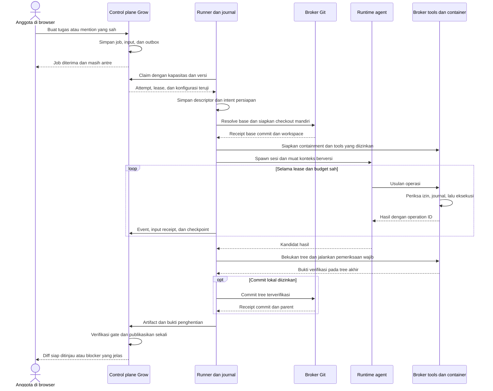

# Spesifikasi Eksekusi Agent, Konteks, Skills, MCP, dan UX Coding

Tanggal: 2026-09-22, Asia/Jakarta.

Status: **sebagian sudah diimplementasikan; claim, sandbox, checkpoint, dan verifier ada pada `83b1a57b9e4`, tetapi instruksi profil, skills, MCP, dan protokol v2 belum ada ([baris EX](../agent-acceptance.md)).**

> **Status 2026-09-24:** job `answer` dan `manage` sekarang memakai jalur cepat.
> Lihat [spesifikasi jalur cepat](2026-09-24-agent-fast-lane.md) dan
> [keputusan SDK](../agent-sdk-decision.md). Bila ada konflik, spesifikasi jalur cepat berlaku.
>
> Bagian yang digantikan untuk jalur cepat:
>
> - §1, §3, §4: alur umum sekarang punya dua jalur. Publikasi sesudah bukti stop hanya
>   untuk jalur code. Jalur cepat terbit segera (jalur cepat bagian 8).
> - §5.1: respons claim membawa paket konteks.
> - §7.1, §7.2: container model hanya untuk jalur code. Jalur cepat adalah jalur terpisah
>   yang server pilih, bukan fallback ke host.
> - §8, §9.3, §9.4: checkpoint, verifikasi, dan commit hanya untuk jalur code.
> - §9.2: urutan instruksi menjadi urutan prompt dan prefix cache (jalur cepat bagian 6.4).
> - §9.6: tidak ada native session load di jalur cepat.
> - §11: jalur cepat hanya memakai MCP HTTP lewat broker. MCP stdio hanya di jalur code.
> - §12: panel tugas menampilkan streaming (spesifikasi streaming bagian 4).
> - §13.4, §13.5: protokol v2 membawa `lane`, paket konteks, `model_policy`, dan `result.draft`.
> - §14: urutan adopsi: jalur cepat lebih dulu.
> - §15: EX-13 sampai EX-19 hanya jalur code; EX-16 dan EX-60 punya versi baru; EX-35
>   dipensiunkan.

Baseline dokumentasi: `0fce9f0ab8f3e9c715dcb3c782db7b07eb22d47e`.
Snapshot implementasi paralel: `fb12e290d0c5a1efcde274f8ee502433ac236219`.
Baseline source Buzz: `6a86531ac9d27b5123cca14636ced581578975df`.

## 1. Tujuan dan hubungan dengan spec sebelumnya

Dokumen ini menjelaskan bagaimana agent mengambil tugas, menyiapkan repository,
menjalankan proses terisolasi, mempertahankan konteks, memeriksa hasil, membuat
commit, dan memakai skills serta MCP. Setiap tahap mempunyai perilaku browser,
bukti keberhasilan, serta tindakan pemulihan.

Dokumen ini melengkapi:

1. [Koneksi dan coding harness](2026-09-21-agent-connections-and-coding-harness.md), selanjutnya **spec harness**.
2. [Lifecycle dan mention](2026-09-21-agent-lifecycle-and-mention-flow.md), selanjutnya **spec lifecycle**.
3. [Pengaturan dan default tim](2026-09-22-agent-settings-connections-and-team-defaults.md), selanjutnya **spec settings**.

State machine, grant, outbox, pairing, publisher, dan target hasil dari dokumen
tersebut tetap berlaku. Dokumen ini memperinci kontraknya. Tambahan instruksi
profil, skill, dan koneksi MCP mengisi bagian yang sengaja ditunda pada bagian
9.2 spec settings. Tambahan tersebut memerlukan schema dan pengujian tersendiri.

Keputusan pengguna yang dipertahankan:

- Semua pengaturan, tugas, review, dan pemulihan tersedia di web Grow Team.
- Runner berjalan pada laptop atau server milik pengguna. Tidak perlu aplikasi desktop.
- Agent terpasang melalui adapter dan runtime endpoint OpenAI-compatible tetap tersedia sesuai kemampuan yang diuji.
- Default tim hanya menjadi pilihan awal pada tugas baru; anggota dapat memilih agent lain.
- Default hasil coding adalah `patch`. Push dan draft PR membutuhkan otorisasi tindakan terkait. Merge dan deploy belum masuk cakupan.
- Pekerjaan implementasi sebelumnya sedang berjalan. Perubahan pada turn penelitian ini hanya berupa spec baru.

“Tidak kehilangan konteks” berarti input yang diterima dan bukti pekerjaan dapat
ditelusuri serta dipulihkan sesuai batas penyimpanan. Ini bukan jaminan model
mengingat semua percakapan. “Tidak slop” diterjemahkan menjadi pemeriksaan scope,
diff, tes, dan klaim hasil; bukan skor subjektif atau janji kode selalu benar.

## 2. Metode penelitian dan temuan Buzz

Source dan tes dibaca pada commit yang dipatok. Graf parsial dari penelitian
sebelumnya membantu pencarian; keputusan diperiksa kembali pada source terbaru.
Tes upstream dibaca sebagai contoh regresi, **tidak dijalankan dalam penelitian
ini**. Pembacaan ini juga tidak membuktikan konfigurasi produksi Buzz.

| ID    | Bukti Buzz                                                        | Temuan pada jalur yang diperiksa                                                                                                                                               | Konsekuensi untuk Grow Team                                                                                                         |
| ----- | ----------------------------------------------------------------- | ------------------------------------------------------------------------------------------------------------------------------------------------------------------------------ | ----------------------------------------------------------------------------------------------------------------------------------- |
| BX-01 | [Listener][buzz-listener], [antrean][buzz-queue]                  | Pesan melewati pemeriksaan pengirim, filter, scope sesi, lalu antrean. Antrean mempunyai batas dan jalur pembuangan event.                                                     | Ambil pemisahan admission dan eksekusi; gunakan job/outbox durable Grow, tanpa membuang tugas yang sudah diterima.                  |
| BX-02 | [Antrean][buzz-queue], [scope][buzz-scope]                        | Satu scope yang sedang berjalan tidak diproses sebagai turn paralel biasa; batching dan kebijakan sesi memengaruhi urutan.                                                     | Satu writer per attempt; follow-up memakai input berurutan, bukan sesi baru tanpa hubungan.                                         |
| BX-03 | [Pemulihan relay][buzz-relay-recovery]                            | Replay overflow merupakan upaya pengiriman ulang, bukan receipt bahwa consumer sudah menerapkan input.                                                                         | Bedakan diterima server, diterima runner, dan diterapkan runtime.                                                                   |
| BX-04 | [Spawn lokal][buzz-runtime], [proses][buzz-process]               | Desktop menjalankan program harness dengan working directory, konfigurasi spawn, nonce, dan process group.                                                                     | Jangan menganggap semua agent Buzz berjalan dalam container. Grow tetap memakai containment yang sudah dipilih.                     |
| BX-05 | [Backend][buzz-backend], [pod Kubernetes][buzz-pod]               | Backend eksekusi terpisah; Kubernetes membuat pod dengan resource limits dan workspace `emptyDir`.                                                                             | Reuse batas driver eksekusi; Kubernetes bukan prasyarat runner laptop/server. Workspace pod sendiri bukan backup.                   |
| BX-06 | [Image][buzz-image], [reconciler][buzz-reconcile]                 | Image harus memakai digest; rekonsiliasi memakai intent dan identitas objek. Penghapusan pod memakai fence observasi.                                                          | Catat identitas container immutable dan konfigurasi sebelum spawn; jangan membunuh proses hanya berdasarkan nama/PID lama.          |
| BX-07 | [Nest][buzz-nest], [repository][buzz-repos]                       | Nest menyediakan direktori pengetahuan. `REPOS` dapat menunjuk checkout yang sudah ada.                                                                                        | Ambil organisasi pengetahuan, tetapi checkout pengguna tidak menjadi workspace writable tugas.                                      |
| BX-08 | [Panduan Git Nest][buzz-nest-guide], [skill CLI][buzz-cli-skill]  | Panduan mengatur staging relevan, identitas Git, serta clone/pull/push melalui CLI.                                                                                            | Itu bukan bukti pipeline commit dan verifikasi universal. Grow membutuhkan Git broker dan gate hasil sendiri.                       |
| BX-09 | [Publikasi Git][buzz-git-cas]                                     | Penyimpanan Git relay menerbitkan manifest dengan compare-and-swap; konflik tidak diulang memakai hasil lama.                                                                  | Ambil prinsip pemeriksaan head dan rekonsiliasi. Grow tetap memakai Git provider yang terdaftar, bukan membangun relay Git baru.    |
| BX-10 | [Handoff][buzz-handoff], [regresi][buzz-regressions]              | Handoff merangkum konteks, mengembalikan prompt aktif, dan membatasi recovery. Tes mencakup pembatalan serta history tool/result.                                              | Ringkasan melengkapi checkpoint terstruktur. Ledger operasi tetap menjadi sumber hasil tindakan.                                    |
| BX-11 | [Discovery skill][buzz-hints], [load skill][buzz-builtin]         | Nama/deskripsi skill masuk katalog; isi serta berkas pendukung dimuat saat dibutuhkan.                                                                                         | Terapkan pemuatan bertahap melalui broker dengan versi paket dan batas akses.                                                       |
| BX-12 | [Bootstrap Nest][buzz-nest]                                       | Skill CLI bawaan ditulis ke direktori canonical; template mempunyai versi dan integrasi direktori harness.                                                                     | Paket bawaan Grow dapat berversi. Jangan menyalin seluruh skill/config pribadi host ke agent tim.                                   |
| BX-13 | [MCP runtime][buzz-mcp], [lockfile][buzz-lock]                    | Jalur `buzz-agent` yang diperiksa menjalankan server stdio, menginisialisasi, membaca tools, memberi namespace, serta membatasi timeout/restart. Lockfile memuat `rmcp` 1.8.0. | MCP harus mempunyai adapter dan sertifikasi versi. Ini bukan bukti semua runtime Buzz mendukung semua transport.                    |
| BX-14 | [Loop tools][buzz-agent-loop], [permission][buzz-permission]      | Loop `buzz-agent` meminta izin sebelum tool MCP. Deny dan cancel menghentikan panggilan tersebut.                                                                              | Izin Grow diperiksa di broker sebelum tindakan. Konfigurasi MCP bukan izin otomatis.                                                |
| BX-15 | [Lifecycle hooks][buzz-hooks]                                     | `_Stop` dan `_PostCompact` adalah hook advisory yang diaktifkan operator. Timeout/budget dapat mengakhiri keberatan hook.                                                      | Hook membantu perilaku agent; verifier otoritatif tetap berada di luar model dan hook.                                              |
| BX-16 | [Bagian MCP UI][buzz-mcp-ui], [panel konfigurasi][buzz-config-ui] | UI membedakan runtime dan sumber konfigurasi MCP. Daftar enabled/disabled bukan bukti tool berhasil dipakai.                                                                   | Tampilkan tersimpan, teruji, dan efektif pada attempt secara terpisah.                                                              |
| BX-17 | [Client ACP][buzz-acp-client]                                     | Jalur client dapat menjawab permission dengan opsi `allow_once` secara otomatis.                                                                                               | Permintaan izin dari runtime saja tidak membuktikan ada keputusan pengguna. Grow memakai policy broker dan approval ledger sendiri. |

Jalur lokal Buzz, runtime `buzz-agent`, dan backend Kubernetes bukan satu
mekanisme yang boleh dicampur. Misalnya, pod Buzz memakai secret environment dan
root filesystem writable. Grow mempertahankan broker credential serta root
filesystem read-only yang ditetapkan fondasinya. [Source pod][buzz-pod].

Pada source yang diperiksa, tidak ditemukan satu kontrak yang membuktikan setiap
agent otomatis mengambil issue, membuat checkout terisolasi, menjalankan semua
tes wajib, lalu melakukan commit. Kontrak berikut merupakan **desain Grow Team**
yang memakai pelajaran Buzz, bukan klaim fitur Buzz yang tinggal diaktifkan.

## 3. Keputusan desain dan istilah

| Pilihan                                                           | Manfaat                                             | Batas                                                                  | Keputusan                                  |
| ----------------------------------------------------------------- | --------------------------------------------------- | ---------------------------------------------------------------------- | ------------------------------------------ |
| Menyalin harness Buzz beserta workspace dan konfigurasi desktop   | Mendapat perilaku upstream langsung.                | Berbeda dari Zulip, ownership Grow, serta broker yang sedang dibangun. | Tidak dipilih.                             |
| Mempertahankan fondasi Grow dan mengambil pola lifecycle Buzz     | Kontrak task, ACL, konteks, serta hasil tetap satu. | Perlu conformance untuk tiap adapter.                                  | Dipilih.                                   |
| Membuat scheduler Kubernetes dan recursive multi-agent sejak awal | Mendukung orchestration lebih luas.                 | Menambah domain kegagalan sebelum satu tugas coding terbukti.          | Ditunda; interface driver dapat diperluas. |

| Istilah         | Arti                                                                  |
| --------------- | --------------------------------------------------------------------- |
| Agent           | Profil dan identitas percakapan yang dapat menerima tugas.            |
| Runner          | Supervisor pada perangkat yang terhubung ke Grow Team.                |
| Job             | Satu tugas pengguna yang tahan restart.                               |
| Attempt         | Satu usaha eksekusi job dengan lease epoch tertentu.                  |
| Claim           | Transaksi server yang menyerahkan attempt kepada runner.              |
| Fetch Git       | Mengambil objek/ref repository untuk menentukan base commit.          |
| Runtime session | Sesi adapter atau loop model dalam satu attempt.                      |
| Container model | Lingkungan proses native agent tanpa checkout project.                |
| Container tool  | Lingkungan untuk operasi repository dan pemeriksaan.                  |
| Checkpoint      | Paket data pemulihan yang terikat input, tree, artifact, dan operasi. |
| Skill           | Instruksi/prosedur beserta resource yang dimuat sesuai kebutuhan.     |
| Koneksi MCP     | Koneksi ke katalog tools/resource melalui transport yang didukung.    |

“Pull kerjaan” mencakup dua hal berbeda: **claim job dari server** dan **fetch
repository dari Git**. Keduanya mempunyai izin, receipt, serta kegagalan sendiri.
Model tidak melakukan polling antrean Grow melalui prompt atau shell.

## 4. Alur utuh dari tugas sampai hasil



Push/draft PR menambah tahap broker Git setelah verifikasi dan approval. Diagram
tidak memberi model akses langsung ke database job, Docker socket, atau credential.
Target `answer` menggunakan jalur baca dengan gate hasil yang sesuai, tanpa edit
atau commit.

## 5. Claim tugas, antrean, dan pekerjaan bersamaan

### 5.1 Kontrak claim

1. Admission menyimpan job dan input sebelum mengirim wake-up runner.
2. Runner memeriksa kapasitas lokal, kesehatan journal, disk, serta kemampuan sandbox.
3. Runner melakukan request outbound dengan credential perangkat, versi protokol, dan request ID stabil.
4. Server memilih job yang cocok dengan runner, profil, revision, repository, izin, serta deadline.
5. Transaksi server mengunci kapasitas runner/realm dan job, lalu menerbitkan satu attempt aktif beserta epoch.
6. Runner menyimpan descriptor dan lease dalam journal sebelum menyiapkan resource.
7. Runner merekonsiliasi respons claim yang hilang melalui request ID dan lease aktif.
8. Poll berikutnya menunggu kapasitas; backoff memakai jitter dan batas yang dapat dikonfigurasi.

Lock job saja tidak cukup: dua claim untuk job berbeda dapat melampaui kapasitas
runner. Gunakan lock kapasitas dalam urutan konsisten dan constraint satu attempt
aktif per job. Tidak ada model, fetch Git, atau spawn container dalam transaksi.

Poll fallback tetap bekerja ketika sinyal antrean hilang. Browser ditutup tidak
menghentikan job. Outbox bukan sumber otoritas lease; database tetap menentukan
siapa yang boleh bekerja.

### 5.2 Fairness dan kapasitas

Pertahankan default pilot: satu job aktif per runner, dua per realm; heartbeat
15 detik dan lease 90 detik. Nilai berasal dari spec harness, bukan benchmark.
`AgentRealmSettings` pada snapshot juga memiliki batas 100 queued per realm dan
20 per profil. Jangan membuat angka kedua di frontend.

Di antara job yang eligible, gunakan urutan penerimaan stabil dengan penanda
waktu server dan ID sebagai pemutus seri. Job yang belum eligible tidak menahan
seluruh runner. Requester tidak dapat memilih prioritas tak terbatas. Beban satu
profil dipagari quota admission; bobot prioritas dapat ditambah kemudian.

Antrean penuh menolak admission dengan alasan yang dapat ditindaklanjuti. Tugas
yang sudah mendapat receipt tidak boleh dibuang untuk memberi ruang tugas baru.
UI menampilkan posisi sebagai estimasi jika eligibility dapat berubah.

### 5.3 Banyak agent dan banyak repository

- Profil berbeda dapat berjalan bersamaan hanya bila kapasitas mengizinkan.
- Satu attempt memiliki satu workspace dan satu executor yang boleh menulis.
- Dua job pada repository sama memakai checkout serta branch berbeda.
- Job B tidak melihat perubahan job A yang belum menjadi base yang dipilih.
- Hasil agent lain masuk sebagai referensi yang diberi izin, bukan akses workspace langsung.
- Follow-up pada job aktif memakai `AgentInput` dan sequence existing. Pesan biasa bukan pemicu run tambahan.

Tidak ada redispatch ke profil/server lain secara diam-diam ketika laptop tidur.
Resume atau perpindahan runner mengikuti spec settings, termasuk pemeriksaan
ulang data scope dan artifact. Event epoch lama tetap ditolak.

## 6. Menyiapkan repository dan mengambil base Git

### 6.1 Pilihan yang terlihat pada tugas

Form menampilkan repository alias, base ref, serta base commit jika sudah
terkonfirmasi. Default proposal: `base_policy=resolve_at_start` mengambil head
ref yang diizinkan saat persiapan pertama. Pilihan lanjutan
`base_policy=pinned_commit` mempertahankan commit yang telah dipilih pengguna.
Keduanya harus dicatat; jangan menyebut sebuah SHA terpilih lalu menggantinya.

Sesudah base tersimpan pada job, retry/resume memakai base tersebut. Mengambil
base lebih baru merupakan permintaan rebase atau tugas baru yang terlihat,
termasuk tes serta approval baru jika tree berubah. Commit yang tidak bisa
diperoleh menghasilkan blocker, bukan fallback ke HEAD checkout pengguna.

### 6.2 Urutan persiapan

1. Resolve alias melalui konfigurasi runner yang didaftarkan pemilik.
2. Cocokkan identitas origin, ref yang diizinkan, dan policy version descriptor.
3. Fetch melalui Git broker ke penyimpanan yang dikelola runner.
4. Catat requested ref, resolved commit, waktu, dan hasil pemeriksaan objek.
5. Buat checkout mandiri pada direktori attempt baru.
6. Gunakan `.git` mandiri tanpa writable common directory atau alternates milik pengguna.
7. Buat branch internal unik, misalnya `grow/job-<id>/attempt-<number>`.
8. Bersihkan konfigurasi warisan: hooks, credential helpers, filters, signing, dan URL berkredensial.
9. Cocokkan tree awal dengan base commit dan simpan workspace receipt.
10. Siapkan dependency dari image/cache yang disetujui sebelum model mulai mengedit.

Descriptor awal memuat permintaan base. Receipt `workspace_prepared` mengikat
hasil resolve ke attempt/epoch dan diperiksa server sebelum mutasi dimulai.
Jangan mengubah descriptor yang sudah berhash secara diam-diam. Simpan binding
workspace hasil sebagai record immutable yang dirujuk manifest eksekusi/checkpoint.

Nama branch dibentuk dari ID tervalidasi, bukan teks tugas. Fetch tidak menjalankan
`git pull` pada checkout aktif pengguna. WIP, index, branch, dan stash pengguna
tidak berubah. Uncommitted changes hanya dapat menjadi input melalui alur impor
patch eksplisit yang ditinjau; alur impor itu bukan syarat pilot ini.

Git broker memakai argumen terstruktur dan konfigurasi yang dikendalikan.
Repository tidak dapat menyetel `core.sshCommand`, hooks, filters, atau helper
untuk mengeksekusi kode host. Submodule dan LFS memerlukan origin/object policy
tersendiri; default berhenti dengan kebutuhan yang jelas jika belum didukung.
Credential clone berbeda scope dari credential push.

### 6.3 Dependency dan cache

Image toolchain dipatok digest. Cache dependency read-only dipisahkan menurut
realm/project, runtime, lockfile, dan toolchain digest. Shared cache writable
antar job tidak menjadi input tepercaya. Jangan menyimpan token registry dalam
image layer, paket skill, log, atau artifact.

Dependency install yang perlu jaringan berjalan sebagai operasi broker terpisah,
sesuai grant dan approval existing. Catat registry yang diizinkan, lockfile,
script install yang berjalan, serta artifact hasil. Jangan membuka jaringan
container model/tool biasa hanya karena dependency gagal.

## 7. Spawn container dan sesi agent

### 7.1 Ikuti keputusan containment aktif

Snapshot implementasi menetapkan rootless Linux, container model tanpa repository,
container tool terpisah, dan broker di luar keduanya. Model terpasang melalui ACP
serta runtime endpoint TypeScript memakai batas kebijakan yang sama.
Rinciannya ada pada `internals/docs/agent-sandbox-design.md` di snapshot tersebut.
Bagian 17 memuat cara membaca snapshot tanpa menyentuh worktree aktif.

| Komponen                  | Akses                                                              | Lifecycle                                                                   |
| ------------------------- | ------------------------------------------------------------------ | --------------------------------------------------------------------------- |
| Supervisor dan watchdog   | Lease, journal, identitas container, API kontrol terbatas.         | Berjalan sebagai layanan runner; watchdog tetap berguna bila runtime crash. |
| Broker model              | Tujuan provider tetap, credential model, batas token/biaya.        | Kemampuan per attempt dicabut saat lease/cancel.                            |
| Container model native    | Home sementara, adapter yang dipatok, socket model khusus attempt. | Tidak mempunyai checkout, Docker socket, host home, atau MCP native bebas.  |
| Runtime endpoint terbatas | Codec provider dan katalog tool Grow.                              | Tidak mengeksekusi shell langsung dari output model.                        |
| Container tool            | Checkout disposable, dependency yang disetujui, output terbatas.   | Tidak mempunyai socket model atau credential kontrol/Git/provider.          |
| Broker Git                | Fetch, commit lokal, serta tindakan remote yang diberi izin.       | Memakai ledger dan identitas repository, tree, parent, serta target.        |

Jangan memuat config, plugin, MCP, hook, atau skill pribadi host ke proses native.
Pada pilot ACP, native environments tetap kosong; operasi project masuk melalui
dynamic tools Grow. Penambahan skills/MCP pada spec ini melalui broker, bukan
alasan mengaktifkan kembali tools native yang melewati policy.

### 7.2 Resource intent dan urutan spawn

Sebelum create container, journal menyimpan `attempt_id`, epoch, peran container,
image digest, hash mount/env policy, resource limits, serta nonce spawn. Label
container membawa identitas non-secret tersebut. Simpan immutable container ID
sesudah create; jangan memakai nama saja untuk stop atau adopsi ulang.

Urutan supervisor:

1. Pastikan lease dan configuration digest masih sah.
2. Selesaikan checkout, dependency, dan manifest konteks.
3. Buat kemampuan broker khusus attempt dan aktifkan watchdog.
4. Create lingkungan tool dengan mount serta limits yang diperiksa.
5. Create lingkungan model bila adapter memerlukannya.
6. Verifikasi identitas image dan konfigurasi containment yang teramati.
7. Jalankan handshake adapter, lalu buat sesi dengan konfigurasi yang dipatok.
8. Daftarkan hanya katalog tool efektif dari broker.
9. Kirim konteks dan input aktif; catat receipt sebelum menandai agent bekerja.

Tahap seperti **Mengambil kode**, **Menyiapkan lingkungan**, dan **Memulai agent**
adalah activity/subphase pada `inspect` dengan status job existing. Jangan
menambah state terminal baru hanya untuk spinner UI.

Jika runtime tidak tersedia atau conformance sandbox gagal, task berhenti dengan
alasan spesifik. Tidak ada fallback otomatis menjalankan native agent pada host.
Windows/macOS memerlukan backend yang lulus contract yang sama; label OS saja
tidak membuatnya `code_ready`. Server Linux terhubung tetap dapat dipakai dari
browser pada perangkat lain.

### 7.3 Crash, stop, dan pembersihan

Pada startup, runner merekonsiliasi journal dengan container berlabel miliknya
sebelum menerima claim. Create yang berhasil tetapi responsnya hilang ditemukan
melalui identitas intent. Jika terdapat duplikat, tahan attempt dan hentikan
resource yang terbukti miliknya; jangan memilih salah satu secara acak.

Control disconnect membekukan dispatch dan memulai penghentian sesuai rancangan
sandbox aktif yang lebih ketat. Expiry lease adalah batas akhir, bukan izin
menunggu 90 detik sambil terus bekerja. Cabut broker grants, tutup stream model,
batalkan sesi best effort, lalu hentikan seluruh container dan keturunannya.
`cancelled` membutuhkan bukti stop; proses yang tidak dapat diverifikasi menjadi
`interrupted`. Tombol Cancel tidak menjanjikan pembalikan efek remote.

Pertahankan workspace serta journal pemulihan sampai artifact tersimpan dan
policy retensi yang disetujui mengizinkan cleanup. Penghapusan tidak berlaku
untuk checkout pengguna. Driver Kubernetes kelak wajib membawa kontrak ini;
`emptyDir` saja tidak memenuhi kebutuhan pemulihan ketika pod hilang.

### 7.4 Spawn agent berbeda dari membuat profil atau subagent

Menambah profil menyimpan identitas/config. Claim menyiapkan attempt. Spawn
menjalankan executor untuk attempt tersebut. Browser tidak dapat mengirim binary,
PID, image, command, atau mount host bebas untuk ketiga tindakan itu.

Pilot mendukung banyak profil dan job independen sesuai kapasitas. Recursive
subagent tidak diaktifkan melalui shell, native tools, skill, atau MCP. Bila
delegasi ditambahkan nanti, child wajib menjadi job terdaftar dengan parent,
scope, budget bersama, kedalaman terbatas, serta cancel propagation. Hasil child
harus diperiksa sebelum diintegrasikan parent. Ini gate lanjutan, bukan fitur
yang diasumsikan sudah tersedia dari tombol Tambah agent.

## 8. Edit, pemeriksaan kualitas, dan commit

### 8.1 Kontrak kerja sebelum edit

Setiap job code mempunyai tujuan, batas perubahan, acceptance criteria, base,
dan required checks. Agent menyusun rencana singkat dari inspeksi source serta
aturan project. Rencana tidak perlu approval tambahan bila pekerjaan sudah
diotorisasi. Pertanyaan hanya muncul untuk keputusan yang memengaruhi scope,
izin, atau hasil yang belum jelas.

Aturan wajib berasal dari policy repository yang disetujui pemilik. Instruksi
project dan skill memberi panduan, tetapi tidak dapat menghapus required checks
atau memberi izin push. Tes yang diperlukan harus memeriksa perilaku atau
regresi bermakna. Perubahan dokumentasi sederhana cukup diperiksa dengan check
yang sesuai; jangan menambahkan unit test yang hanya menyalin implementasi.

### 8.2 Mencegah hasil asal jadi

| Risiko                                          | Pemeriksaan yang diwajibkan                                                  | Perilaku jika tidak terpenuhi                                         |
| ----------------------------------------------- | ---------------------------------------------------------------------------- | --------------------------------------------------------------------- |
| Implementasi melebar dari permintaan            | Bandingkan file/diff dengan scope dan rencana; tampilkan penyimpangan.       | Agent memperbaiki scope atau meminta keputusan yang spesifik.         |
| Mengklaim API/file tersedia tanpa bukti         | Referensi source, schema, atau hasil probe yang bisa ditinjau.               | Klaim ditandai belum terverifikasi.                                   |
| Menghapus tes agar hijau                        | Perubahan tes/config terlihat; required checks tetap dari snapshot policy.   | Tidak dapat menyelesaikan job dengan mengurangi policy sendiri.       |
| Tes hijau pada kode lama                        | Tree dan input pemeriksaan diikat ke receipt.                                | Edit sesudah tes membuat bukti terkait stale.                         |
| Mengulang solusi gagal tanpa perubahan          | Catat fingerprint kegagalan, upaya perbaikan, dan budget.                    | Berhenti dengan blocker setelah budget; jangan terus memanggil model. |
| Perubahan format/refactor besar tanpa kebutuhan | Tampilkan ukuran diff dan file di luar scope.                                | Batas profil repository dapat menahan hasil untuk review scope.       |
| Model menyebut selesai tanpa hasil              | Verifier mengambil diff, exit code, commit, artifact, serta receipt sendiri. | Job tidak menjadi completed.                                          |
| Dua agent saling menyetujui tanpa bukti         | Review tambahan tetap menghasilkan temuan yang merujuk diff/tes.             | Persetujuan model kedua tidak menggantikan gate deterministik.        |

Tidak perlu skor “kualitas AI 98%”. Kartu hasil memisahkan **checks lulus**, **checks
gagal**, **belum diperiksa**, dan **perlu review manusia**. Kelulusan tes mengurangi
risiko; ia tidak membuktikan seluruh intent pengguna atau keamanan kode.

### 8.3 Snapshot verifikasi yang tidak berubah

Supervisor mengambil lock mutation, menunggu tool selesai, lalu membekukan
snapshot file kandidat. Snapshot meliputi tracked files, penghapusan, dan
untracked files yang diusulkan sebagai hasil. Tool penulis tidak berjalan
bersamaan dengan verifier.

Buat candidate Git tree dengan index privat yang dikendalikan broker. Jangan
mengubah index checkout pengguna. Required checks dijalankan pada salinan tree
itu di container tool. Repository, image, lockfile/dependency set, command,
working directory, waktu, exit code, timeout, serta output artifact tercatat.

Check yang menghasilkan build output memakai lokasi output terpisah. Jika check
mengubah source, perubahan tersebut menjadi kandidat baru dan perlu verifikasi
ulang. Fingerprint environment/checks melengkapi tree hash, sehingga dependency
atau command berbeda tidak dianggap bukti yang sama.

Hasil lulus hanya sah untuk tree yang sama, policy checks yang sama, dan input
build relevan yang sama. Cache hasil verifikasi boleh dipakai hanya jika seluruh
binding itu cocok. Jangan menjalankan ulang suite besar tanpa perubahan atau
alasan baru; gunakan pemeriksaan yang disetujui untuk jenis perubahan tersebut.

### 8.4 Membuat commit lokal

Commit lokal adalah operasi `git.commit` existing. Ia tidak memerlukan approval
berulang jika grant tugas sudah memberinya izin. Target patch tetap dapat
diselesaikan tanpa commit bila grant hanya mengizinkan diff. UI menjelaskan
**Commit lokal dibuat** dan **Belum dikirim ke remote** secara terpisah.

Urutan Git broker:

1. Pastikan attempt, epoch, parent, tree, dan grant masih cocok.
2. Ambil manifest file dari candidate tree yang sudah diperiksa.
3. Tolak path keluar checkout, secret terdeteksi, file terlalu besar, dan metadata runtime.
4. Periksa diff lengkap, termasuk file baru, file biner, penghapusan, dan perubahan permission.
5. Catat intent commit dengan operation ID, parent, tree, identitas, serta digest pesan.
6. Buat objek commit dan update ref internal dengan compare-and-swap terhadap parent yang diharapkan.
7. Baca kembali commit, parent, tree, dan ref; simpan receipt sebelum mengirim sukses.

Jangan menggunakan `git add .` sebagai pengganti manifest yang ditinjau. Jangan
membawa `.env`, token, transcript mentah, cache, atau berkas di luar tugas. `.gitignore`
dan secret scan merupakan pemeriksaan tambahan, bukan bukti semua secret pasti
terdeteksi. Artifact mempunyai pemeriksaan data scope sendiri.

Identitas author, committer, trailer, DCO, serta signing berasal dari konfigurasi
yang disetujui dan aturan repository. Jangan menebak identitas dari orang yang
meminta tugas. Untuk repository Grow Team, setiap pesan commit wajib berakhir
dengan trailer berikut, setelah baris kosong:

```text
Co-Authored-By: CADIS <agent@cadis.digital>
```

Broker dapat memakai `commit-tree` dan `update-ref` dengan environment Git yang
dibatasi. Repository hooks tidak boleh berjalan pada host broker. Bila policy
mewajibkan hook/check, daftarkan sebagai pemeriksaan container yang eksplisit.
Signing yang diwajibkan memakai broker khusus; kunci pribadi tidak diberikan ke
shell atau proses model.

Default satu commit hasil per attempt yang siap ditinjau. Checkpoint tidak perlu
membuat commit tambahan. Multi-commit hanya bila tugas/policy memerlukan rangkaian
perubahan yang dapat direview terpisah. Jangan squash, amend, atau rewrite commit
pengguna. No-op yang sah menghasilkan laporan tanpa commit kosong.

### 8.5 Crash saat commit dan pengiriman Git

Simpan semua input objek commit, termasuk timestamp identitas, sebelum membuatnya.
Jika proses terputus, broker menghitung/memeriksa objek dan ref yang diharapkan.
Ia tidak membuat commit baru dengan timestamp berbeda pada retry yang sama.
Ref yang sudah bergerak menjadi konflik; jangan menimpa atau menganggap commit
berhasil hanya karena ada objek Git dengan pesan serupa.

Push/draft PR tetap memakai operation ledger dan approval spec harness. Bind
approval ke commit/tree, remote, branch, expected head, scope, epoch, dan expiry.
Gunakan branch khusus tugas. Perubahan base atau konflik remote membatalkan
bukti/approval yang tidak lagi cocok. Jangan force push.

Jika respons push hilang, periksa ref remote dan object ID. Jika respons PR hilang,
cari PR berdasarkan repository, head/base, dan identitas operasi. Receipt cocok
menyelesaikan rekonsiliasi tanpa duplikasi. Ketidakpastian tetap
`outcome_unknown`; timeout tidak membuktikan tindakan gagal.

### 8.6 Penyelesaian dan review manusia

Untuk patch, simpan diff yang dapat diaplikasikan pada base, file manifest,
ringkasan perubahan, required checks pada tree akhir, serta batas hasil. Berkas
biner harus mempunyai artifact yang cukup untuk rekonstruksi atau ditandai tidak
dapat diekspor; jangan mengklaim patch lengkap jika isinya hilang.

Publisher existing mengirim satu hasil setelah ACL audiens diperiksa ulang.
Completed membutuhkan gate target dan bukti penghentian eksekusi. **Selesai — diff
siap ditinjau** tidak berarti pengguna sudah menerima perubahan, kode sudah
merge, atau aplikasi sudah deploy. Review penerimaan manusia tetap terpisah.

## 9. Konteks, checkpoint, dan resume

### 9.1 Empat lapisan yang dipisahkan

| Lapisan           | Contoh                                                                   | Otoritas dan penyimpanan                                            |
| ----------------- | ------------------------------------------------------------------------ | ------------------------------------------------------------------- |
| Kontrak tugas     | Permintaan asli, acceptance criteria, batas scope, input susulan.        | Record job/input server; jangan diganti oleh ringkasan.             |
| Konteks referensi | Pesan yang diizinkan, aturan project, spec, skills terpilih.             | ID sumber, revision/hash, dan ACL saat dibaca.                      |
| Bukti eksekusi    | Operasi, diff/tree, checks, commit, artifact, approval, receipt.         | Broker/journal dan database; model tidak dapat mengesahkan sendiri. |
| Ringkasan kerja   | Keputusan, hal yang sudah dicoba, pekerjaan tersisa, langkah berikutnya. | Output model berlabel ringkasan; diverifikasi terhadap bukti.       |

Titen adalah memori bersama untuk konteks project yang relevan, bukan penyimpanan
utama status job. Pemanggilan project resolve/compile memakai broker serta scope
yang sudah ditetapkan fondasi. Tidak ada penyimpanan transcript, credential,
prompt mentah, atau penalaran internal ke memori. Ringkasan job tidak otomatis
menjadi pengetahuan bersama yang terverifikasi.

### 9.2 Instruksi yang efektif

Tambahkan `instruction_revision` pada konfigurasi profil yang dipatok. Deskripsi
direktori agent tetap deskripsi, bukan system prompt terselubung. Editor instruksi
menunjukkan revision tersimpan dan kapan revision berlaku.

Urutan penyusunan konteks:

1. Policy runtime yang tidak dapat diedit model.
2. Permintaan pengguna dan batas otorisasi tugas yang berlaku.
3. Instruksi peran profil yang telah disetujui.
4. Aturan repository dengan scope path dari snapshot base.
5. Metadata skills yang tersedia, lalu isi skills yang diaktifkan.
6. Referensi percakapan, bukti kerja, dan ringkasan checkpoint.

Urutan ini mengatur penyampaian instruksi, bukan peningkatan hak. Semua teks
repository, pesan, skill, MCP, dan ringkasan tetap tidak dapat memperluas grant.
Aturan project yang lebih spesifik berlaku pada path terkait selama tidak
bertentangan dengan instruksi pengguna dan policy. Konflik yang memengaruhi hasil
ditampilkan sebelum tindakan terkait.

Broker membaca `AGENTS.md`/aturan project sesuai hierarki dalam repository yang
diberi izin. Ia tidak menelusuri home pribadi. Aturan nested dimuat sebelum edit
path terkait. Edit aturan oleh agent ditampilkan sebagai perubahan kode;
perubahan itu tidak langsung memperluas instruksi atau policy attempt aktif.

### 9.3 Manifest checkpoint

Gunakan `AgentCheckpoint` existing untuk ringkasan dan referensi. Tambahkan
manifest pemulihan berversi sebagai artifact privat; jangan memasukkan seluruh
workspace ke event. Field berikut adalah delta usulan, bukan payload v1 existing:

| Isi manifest                                                         | Syarat                                                          |
| -------------------------------------------------------------------- | --------------------------------------------------------------- |
| Job, source attempt, epoch, checkpoint ID, schema version            | Identitas terikat satu realm dan job.                           |
| Descriptor/configuration digest dan versi runtime                    | Menunjukkan konfigurasi yang benar-benar digunakan.             |
| Base commit, current tree, commit lokal, workspace snapshot artifact | Dapat direkonstruksi dan diperiksa checksum.                    |
| Input cursor dan daftar input yang belum pasti diterapkan            | Tidak menganggap delivery sama dengan applied.                  |
| Batas sequence journal dan daftar operasi belum selesai              | Resume mengetahui tindakan yang wajib direkonsiliasi.           |
| Context refs, versi instruksi, skills, serta MCP catalog digest      | Isi dan hak baca dapat diperiksa ulang.                         |
| Required checks digest dan verification refs                         | Tes lama tidak dipindahkan ke tree baru tanpa validasi.         |
| Scope, keputusan, pekerjaan tersisa, satu langkah berikutnya         | Ringkasan tidak menjadi bukti tindakan atau izin baru.          |
| Lokasi durability dan waktu expiry artifact                          | UI membedakan tersimpan di runner dan sudah tersalin ke server. |

Manifest tidak menyimpan bearer token, cookie, secret environment, atau raw
reasoning. Native session reference tidak menjadi credential dan bukan satu-satunya
cara recovery. Native session data yang diperlukan harus mendapat perlindungan
serta retensi yang sama dengan konteks privat.

### 9.4 Konsistensi checkpoint

Checkpoint dibentuk setelah mutasi tool selesai, sebelum compaction, sebelum
waiting/stop yang terkontrol, setelah verifikasi, dan sebelum delivery. Journal
operasi tetap ditulis pada setiap tindakan; checkpoint tidak menggantikannya.

Supervisor mengambil mutation lock, mencatat sequence cut, lalu membuat snapshot
workspace dan manifest. Simpan berkas secara atomic dengan checksum dan fsync.
Upload artifact immutable terlebih dahulu, baru publish checkpoint reference
dengan idempotency key. Checkpoint dianggap tersedia di server hanya setelah
seluruh referensinya durable dan diverifikasi.

Server menolak manifest yang mencampur tree sebelum edit dengan receipt setelah
edit, input cursor melewati input yang belum pasti, atau artifact attempt lain.
Jika proses mati sebelum checkpoint baru selesai, checkpoint sebelumnya tetap
berlaku dan journal dipakai untuk rekonsiliasi.

Snapshot recovery mencakup perubahan biner dan file baru yang diizinkan, tidak
hanya `git diff` teks. Bila artifact melampaui batas, simpan lokal dan tampilkan
**Pemulihan hanya tersedia di perangkat ini**. Jangan mengklaim bisa pindah server
atau tahan kehilangan disk sampai salinan lengkap benar-benar tersedia.

### 9.5 Compaction dan input susulan

Compaction memakai batas token yang dikonfigurasi dan estimasi yang diberi label.
Simpan tujuan asli, input aktif, batas scope, keputusan penting, referensi bukti,
serta tugas tersisa. Potong keluaran tool besar dengan penanda dan tautan artifact;
jangan memotong tujuan atau hasil mutasi sampai maknanya berubah.

Ikuti pelajaran handoff Buzz: batasi recovery, pertahankan prompt aktif, dan jaga
pasangan tool/result. Output ringkasan yang kosong atau gagal tidak boleh
menghapus history yang masih tersedia. Batas recovery mengikuti spec harness,
dua usaha per turn; habis budget menghasilkan blocker yang dapat dilanjutkan.

`pending`, `delivered`, `applied`, dan `delivery_uncertain` tetap mempunyai arti
berbeda. `applied` memerlukan receipt adapter yang didukung. Jika adapter tidak
bisa membuktikannya, tandai uncertain dan jangan mengirim ulang instruksi mutasi
secara buta. Tidak ada janji exactly-once pemahaman model; ledger menjaga efek
tool dan sequence menjaga identitas input.

### 9.6 Resume yang dapat dipercaya

1. Periksa ACL, grant, artifact, konfigurasi, dan status stop attempt lama.
2. Rekonsiliasi operasi yang berpotensi sudah terjadi, terutama commit/push/PR/MCP mutasi.
3. Buat attempt baru dan epoch baru; jangan membuka attempt terminal lama.
4. Rekonstruksi checkout dari base dan snapshot yang cocok.
5. Periksa hash tree, versi extensions, serta konteks yang masih boleh dibaca.
6. Load native session hanya bila capability, versi, dan batas aksesnya cocok.
7. Jika load tidak tersedia, mulai sesi baru dari manifest, bukti, dan ringkasan.
8. Berikan input yang belum diterapkan beserta identitasnya secara terkontrol.
9. Jalankan langkah berikutnya dan verifikasi ulang sesuai perubahan.

Pending approval lama tidak ikut aktif. Perubahan izin dapat membuat konteks atau
skill tidak lagi boleh dimuat; tampilkan kebutuhan penyesuaian scope, jangan
mengambil ulang dari cache privat. Pindah provider membutuhkan persetujuan data
scope. Pindah runner hanya tersedia jika artifact lengkap dan policy perangkat
baru cocok.

Tombol **Mulai ulang dari base** menghasilkan attempt baru yang jelas dan
mempertahankan hasil lama. Tombol itu tidak membersihkan workspace pengguna atau
menyembunyikan pekerjaan yang belum terkirim.

## 10. Skills dan instruksi agent

### 10.1 Bagaimana Buzz menambah dan memakai skill

Buzz Nest memasang skill CLI bawaan melalui template berversi. Pada runtime
`buzz-agent`, discovery memeriksa `.agents/skills`, `.goose/skills`, dan
`.claude/skills` di working directory, serta `.agents/skills` di home. Katalog
nama/deskripsi dibuat pada awal sesi. `load_skill` membaca isi dan berkas
pendukung saat dibutuhkan. [Nest][buzz-nest], [discovery][buzz-hints],
[loader][buzz-builtin].

Itu tidak membuktikan semua runtime mempunyai UI marketplace atau perilaku skill
yang sama. Grow mengambil format paket serta pemuatan bertahap, dengan scope
yang lebih sempit daripada discovery home. Import bukan eksekusi script.

Format [Agent Skills][agent-skills] menggunakan direktori dengan `SKILL.md`,
frontmatter nama/deskripsi, dan resource opsional seperti scripts atau references.
Grow memvalidasi format tersebut, lalu menambahkan manifest versi serta policy
sendiri. Field `allowed-tools` merupakan deklarasi paket, bukan sumber grant.

### 10.2 Alur tambah skill di browser

Lokasi: **Pengaturan → Agent → Skills**. Tampilkan katalog yang dapat diakses,
source, version/digest, pemilik, profil yang memakai, dan status pemeriksaan.

1. Pemilik memilih **Tambah skill**.
2. Pilih paket bawaan, path skill dalam repository terdaftar, atau paket impor eksplisit.
3. Untuk Git, pilih source yang diizinkan dan ref; import menyelesaikannya menjadi commit tetap.
4. Server/runner menampilkan nama, deskripsi, isi, daftar berkas, license, dan kebutuhan tools.
5. Validator memeriksa struktur, ukuran, path, executable, symlink, serta checksum.
6. Pemilik meninjau paket, lalu menyimpannya sebagai versi immutable.
7. Pilih profil dan repository scope yang boleh memakai versi tersebut.
8. Preview konfigurasi efektif dan jalankan probe yang sesuai sebelum aktif untuk tugas baru.

Tindakan impor dari URL tidak menerima arbitrary fetch ke metadata/LAN. URL Git
atau registry menggunakan source policy yang disetujui. Arsip ditolak jika berisi
path traversal, hard link, symlink escape, device/FIFO, jumlah berkas berlebihan,
atau hasil ekstraksi melampaui batas. Secret scan membantu peninjauan, tanpa
menjanjikan deteksi sempurna.

Paket komunitas tidak aktif karena muncul dalam percakapan atau hasil MCP.
Import baru dan update versi merupakan intent pengguna/pemilik. Sistem tidak
mengunduh script tambahan saat model menyebut nama skill yang belum terpasang.

### 10.3 Aktivasi dan pemuatan bertahap

Bedakan tiga hal pada UI:

- **Tersedia**: anggota boleh melihat/memakai paket dalam scope grant.
- **Terpasang pada profil**: versi itu masuk kandidat konfigurasi profil.
- **Dipakai pada tugas ini**: isi versi tersebut telah dimuat pada attempt.

Konfigurasi profil memilih ID dan versi, bukan nama bebas. Namespace UI dapat
menampilkan `tim/nama-skill` dan source untuk mencegah benturan. Dua paket bernama
sama harus dipilih eksplisit; jangan memakai prinsip file pertama menang.

Saat runtime mulai, kirim hanya metadata skill yang relevan dan diizinkan.
Tool broker `skills.load` membaca manifest yang dibekukan dan memeriksa grant
kembali. Supporting file harus terdaftar, berada dalam root paket, cocok hash,
dan mempunyai batas output. Native agent menerima hasil melalui dynamic tools
yang sama; jangan memasang symlink menuju home pengguna.

Pemuatan instruksi tidak menjalankan script. Script hanya berjalan sebagai
operasi `shell.run`/tool yang disetujui, di container tool, dengan argv, working
directory, akses data, dan budget yang jelas. Script tidak mendapat credential
baru karena berada di folder skill. Dependency script mengikuti policy install
yang sama dengan repository.

Default usulan pilot: maksimum 20 skill terikat pada profil, total metadata
32 KiB, satu body 32 KiB, satu supporting file sampai batas tool result existing,
dan satu paket 5 MiB/200 berkas. Angka ini merupakan batas implementasi awal,
bukan standar Agent Skills. Oversize ditolak dengan alasan, bukan dipotong diam-diam
sehingga instruksi berubah makna.

### 10.4 Versi, update, dan pencabutan

Attempt mematok digest skill dan instruksi. Update menampilkan diff paket dan
berlaku pada tugas baru setelah revision/probe sesuai. Attempt aktif memakai
snapshot lama selama izin tetap sah. Pencabutan keamanan menghentikan pemakaian
versi tersebut segera, termasuk cache.

Skill yang diedit agent dalam repository merupakan kandidat perubahan, bukan
paket baru yang otomatis dipercaya. Penghapusan binding tidak menghapus artifact
atau riwayat tugas yang masih wajib disimpan. Rollback memilih versi lama yang
masih diizinkan, tanpa menimpa isi versi immutable.

## 11. MCP: koneksi, tools, izin, dan kegagalan

### 11.1 MCP berbeda dari model dan adapter

Endpoint OpenAI-compatible menyediakan inferensi. ACP menghubungkan client dengan
agent runtime. MCP menyediakan tools/resource melalui koneksi tersendiri.
Mengisi URL model tidak otomatis menghubungkan MCP. Agent yang terpasang juga
tidak otomatis mewarisi seluruh server MCP pribadi pemilik runner.

Jalur yang diperiksa pada `buzz-agent` memakai subprocess stdio dan lifecycle
`initialize` melalui `rmcp`. Ada namespace tool, timeout init/list, pembersihan
child, serta pemeriksaan tool setelah restart. Ini pelajaran implementasi yang
berguna, bukan jaminan dukungan HTTP dari jalur tersebut. [MCP Buzz][buzz-mcp].

### 11.2 Transport dan versi harus eksplisit

Dokumentasi MCP berubah menurut revision. [Revision 2025-11-25][mcp-legacy]
menggunakan lifecycle initialize; [revision 2026-07-28][mcp-modern] menggunakan
metadata request dan perilaku transport baru. [Aturan kompatibilitas][mcp-versions]
membedakan client/server kedua generasi. Karena itu, jangan menganggap istilah
“MCP-compatible” cukup untuk menentukan handshake, session, atau cancellation.

Kontrak Grow:

| Jalur           | Target awal                                                   | Gate                                                                                               |
| --------------- | ------------------------------------------------------------- | -------------------------------------------------------------------------------------------------- |
| Stdio           | Paket yang dipatok dan dijalankan dalam container MCP khusus. | Probe startup, discovery, schema, tool sintetis, cancel, serta cleanup pada versi yang dinyatakan. |
| Streamable HTTP | Endpoint yang diizinkan melalui broker transport.             | Probe versi, auth, discovery, pagination, JSON/SSE, timeout, dan reconnect.                        |
| HTTP+SSE lama   | Tidak menjadi fallback generik pilot.                         | Tambahkan adapter terpisah hanya bila ada kebutuhan dan tes kompatibilitas.                        |

Pilot pertama mematok contract `2025-11-25` untuk fixture dan SDK yang memang
lulus tes itu. Dukungan `2026-07-28` menjadi capability terpisah setelah codec dan
conformance tersedia. Server modern-only mendapat status **Versi belum didukung**
jika client belum sesuai. Jangan mencoba metode mutasi untuk menebak generasi
server. Probe versi hanya memakai discovery/handshake yang aman dan terbatas.

Catat `protocol_version`, `transport`, SDK/version, auth mode, catalog digest,
waktu probe, dan kemampuan per fitur. Ketidaksesuaian versi berarti unsupported;
timeout berarti unknown. Cache kompatibilitas dipagari revision koneksi; perubahan
endpoint atau package mengharuskan probe baru.

### 11.3 Alur tambah MCP di browser

Lokasi: **Pengaturan → Agent → Koneksi MCP**.

1. Pemilik memilih koneksi HTTP atau paket stdio yang tersedia pada runner.
2. Pilih runner pelaksana; browser tidak menghubungi localhost pengguna secara langsung.
3. Untuk HTTP, masukkan endpoint serta metode auth yang didukung konektor.
4. Untuk stdio, pilih package/version dan parameter terstruktur yang diizinkan.
5. Simpan koneksi sebagai draft berversi; credential memakai mekanisme write-only existing atau referensi lokal pemilik.
6. Jalankan **Uji koneksi** dengan discovery dan tool sintetis yang aman bila tersedia.
7. Tinjau daftar tools, schema, akses data, serta tindakan yang dapat mengubah sistem lain.
8. Pilih tools yang diizinkan, profile binding, anggota/grup, dan scope repository/percakapan.
9. Simpan binding profil sebagai revision baru, periksa konfigurasi efektif, lalu aktifkan sesuai readiness.

Sukses `tools/list` hanya membuktikan discovery. UI tidak menulis **Semua tools
berfungsi** bila belum diuji. Jika tool sintetis tidak tersedia, laporkan discovery
passed dan invocation unknown. Pengujian tool nyata yang mengubah data memerlukan
intent dan scope yang jelas; jangan mengirim email atau membuat issue sebagai
efek tersembunyi tombol Test.

Tidak ada form arbitrary host command seperti `curl ... | sh`. Pemasangan paket
dilakukan oleh pemilik runner melalui alur paket yang dipatok. OAuth hanya muncul
untuk konektor yang implementasi auth-nya sudah diuji. Jangan mengklaim OAuth
universal hanya karena server mengirim metadata.

### 11.4 Tempat eksekusi dan credential

Stdio MCP berjalan pada container extension terpisah, bukan supervisor, proses
model, atau server Zulip. Default mount repository read-only dan network none.
Paket tidak dapat membaca home host, config model, Docker socket, atau credential.
Program server tetap kode yang berjalan saat startup; probe memakai containment
yang sama dengan penggunaan normal.

Untuk server stdio yang memerlukan layanan eksternal, gunakan konektor dan
transport broker dengan tujuan tetap serta credential injection yang telah
disertifikasi. Paket yang mensyaratkan credential luas dalam environment tanpa
jalur broker belum didukung pada pilot. Jangan memindahkan secret ke env untuk
membuat label readiness menjadi hijau.

HTTP MCP memakai broker yang memvalidasi origin/path, DNS/IP setiap koneksi,
redirect, TLS, dan auth audience. LAN/Tailscale hanya melalui grant host/port yang
eksplisit pada runner. Tolak metadata endpoint dan pengalihan credential ke
origin lain. MCP connection tidak menerima provider key atau device token Grow.

### 11.5 Tool broker dan perubahan katalog

Identitas efektif adalah connection ID, connection revision, tool name, schema
digest, dan semantic policy. Model melihat nama pendek yang dipetakan broker ke
identitas tersebut. Nama tool dari server berbeda tidak boleh saling menimpa.
Nilai `_Stop` atau nama tersembunyi bukan izin untuk hook otomatis.

Sebelum call, broker memeriksa lease, grant, tool/schema binding, argumen, target
resource, data scope, serta budget. Catat intent sebelum dispatch dan receipt
sebelum mengembalikan hasil. Hasil teks/resource adalah data tidak tepercaya;
tidak boleh mengganti policy atau membuat tool baru.

Annotations server, termasuk klaim read-only, adalah petunjuk. Untuk server generik,
klasifikasi efek tidak dapat dipercaya otomatis. Tahap pertama hanya mengaktifkan
tools baca dari konektor/package yang ditinjau dan terkurung. Tools mutasi remote
memerlukan schema target, approval binding, serta cara rekonsiliasi per konektor.
Jika target tindakan tidak dapat dibatasi, tool tetap tidak tersedia.

Untuk HTTP, server eksternal tetap merupakan batas kepercayaan: label read-only
tidak membuktikan implementasinya tidak mengubah data. Gunakan credential dengan
hak minimum serta konektor yang telah diperiksa. Jangan menjanjikan containment
terhadap efek internal layanan yang dikendalikan pihak lain.

`tools/list_changed` atau reconnect tidak menambah izin. Refresh katalog membuat
diff nama/schema; tools baru atau schema berubah menunggu review/probe dan
revision baru. Tool yang hilang menghasilkan error yang jelas. Jangan mengulang
call lama dengan schema baru secara diam-diam.

Resources dan prompts memerlukan grant/read limits yang sama. Resource URL bukan
izin generic fetch. Prompt dari server tidak dieksekusi sebagai instruksi sistem.
Sampling, elicitation, MCP Apps, subscriptions, dan lifecycle hooks tambahan
dinonaktifkan sampai memiliki contract tersendiri sesuai revision protokol.

### 11.6 Timeout, cancel, retry, dan disconnect

Gunakan batas waktu terpisah untuk startup/discovery dan call. Usulan pilot:
20 detik untuk discovery dan 60 detik per call, dengan maksimum sesuai policy
tugas. Budget job existing tetap menjadi batas luar. Keluaran tool dan artifact
mengikuti batas spec harness; daftar tools/schema juga dibatasi sebelum masuk
ke konteks model.

Batas usulan awal: lima koneksi per profil, maksimum 50 tool terpilih, 256 KiB
total schema sebelum pemadatan, dan 100 entri per halaman discovery. Hentikan
pagination setelah 500 entri atau batas byte/waktu tercapai. Catalog besar
menjadi artifact berhash; descriptor/event tetap tunduk pada batas 64 KiB.
Katalog yang masuk model harus muat dalam budget konteks setelah task, instruksi,
dan cadangan output dihitung. Jika tidak cukup, minta pemilihan tool lebih sempit;
jangan menghilangkan required tool secara diam-diam.

Restart proses tidak sama dengan retry tool. Panggilan baca yang terbukti aman
dapat diulang secara terbatas. Untuk mutasi, timeout/stream terputus berarti
outcome belum diketahui sampai receipt resource direkonsiliasi. JSON-RPC request
ID tidak dengan sendirinya memberi idempotensi bisnis pada server MCP.

Cancel mengikuti semantik versi transport yang dipatok. Stop lokal menghentikan
child/container stdio milik attempt. Menutup request HTTP tidak membuktikan efek
remote dibatalkan. Tampilkan tindakan remote yang mungkin tetap terjadi dan tahan
retry mutasi. Pencabutan koneksi memblokir call baru serta menutup kemampuan
broker aktif sesuai policy.

### 11.7 Hook kualitas bukan gate hasil

Grow dapat menambahkan hook advisory berversi untuk mengingatkan pekerjaan
tersisa atau memuat ringkasan sesudah compaction. Hook mempunyai timeout, budget,
dan output berlabel data. Hook tidak dapat menandai tes lulus, memberi izin tool,
atau memaksa job completed. Perilaku Buzz `_Stop` menjadi contoh pengingat;
completion verifier Grow tetap berlaku ketika hook timeout atau tidak tersedia.

## 12. UX web dari setup sampai pemulihan

### 12.1 Struktur layar

Pertahankan navigasi spec settings. Tambahkan tab **Instruksi**, **Skills**, dan
**MCP** pada profil. Direktori koneksi/paket dapat dipakai banyak profil melalui
binding; jangan membuat salinan secret untuk setiap agent.

| Layar                   | Informasi utama                                                             | Aksi                                                             |
| ----------------------- | --------------------------------------------------------------------------- | ---------------------------------------------------------------- |
| Buat tugas              | Tujuan, agent terpilih, runner/lokasi, repository/base, hasil yang diminta. | Buat tugas; ganti agent; buka opsi lanjutan.                     |
| Ringkasan sebelum jalan | Scope, checks, extensions efektif, kebutuhan akses, estimasi batas.         | Jalankan bila sudah siap; perbaiki prasyarat.                    |
| Panel tugas             | Status nyata, aktivitas saat ini, input, diff, pemeriksaan, hasil.          | Beri instruksi; batalkan; buka detail.                           |
| Pemulihan               | Alasan terhenti, checkpoint, pekerjaan tersimpan, efek belum pasti.         | Lanjutkan bila layak; selesaikan blocker; mulai ulang dari base. |
| Review hasil            | Diff, checks, commit lokal/remote, batas yang belum diperiksa.              | Unduh patch; beri masukan; otorisasi publikasi bila diperlukan.  |
| Skills/MCP              | Source/version, akses, hasil probe, profil yang memakai.                    | Tambah; uji; ubah binding; cabut.                                |

Panel setup tidak harus muncul setiap tugas. Konfigurasi yang sudah diotorisasi
dan siap dapat berjalan langsung. Ringkasan preflight tetap dapat dibuka; modal
approval hanya muncul untuk tindakan yang benar-benar memerlukannya.

### 12.2 Contoh panel tugas

```text
Perbaiki validasi formulir
Agent: Wulan · Server tim · Repository: grow-team
Base: main · a1b2c3d · Hasil: patch

Sedang memeriksa perubahan
✓ Tugas diterima
✓ Kode dasar diperoleh
✓ Lingkungan siap
✓ Perubahan dibuat
→ Pemeriksaan: validasi formulir
  Review dan hasil

[Ringkasan] [Perubahan 4] [Pemeriksaan 3] [Konteks] [Aktivitas]

Checkpoint tersalin ke server 1 menit lalu
[Beri instruksi] [Batalkan]
```

Angka di atas adalah ilustrasi. Badge berasal dari data server, bukan string
yang diparse dari jawaban agent. Tidak ada persentase kemajuan buatan. Untuk
runtime yang belum memberi usage, tampilkan **Pemakaian belum diketahui**.

Tab Aktivitas berisi ringkasan tindakan, perintah yang boleh terlihat, hasil, dan
tautan bukti. Jangan menampilkan chain of thought, raw protocol dump, header auth,
atau seluruh log sebagai pengalaman utama. Detail teknis tersedia bagi pengguna
yang berhak melalui panel terpisah dengan redaction.

### 12.3 Status dan pesan yang dapat ditindaklanjuti

| Keadaan nyata                       | Teks UI                                                | Tindakan yang tersedia                                                        |
| ----------------------------------- | ------------------------------------------------------ | ----------------------------------------------------------------------------- |
| Job tersimpan, runner offline       | Menunggu perangkat tersambung.                         | Batalkan; lihat perangkat.                                                    |
| Runner penuh                        | Mengantre; kapasitas sedang dipakai.                   | Lihat antrean yang boleh diakses; batalkan.                                   |
| Base belum resolved                 | Menyiapkan kode dari ref terpilih.                     | Lihat ref; batalkan.                                                          |
| Image/dependency tidak tersedia     | Lingkungan belum siap: kebutuhan disebutkan.           | Pemilik memperbaiki setup; coba lagi setelah siap.                            |
| Tidak ada aktivitas terbaru         | Status diperiksa terakhir pada waktu tertentu.         | Muat ulang status; batalkan sesuai kemampuan.                                 |
| Kontrol putus                       | Koneksi terputus; penghentian sedang diverifikasi.     | Lihat checkpoint; tunggu rekonsiliasi.                                        |
| Input diterima tetapi belum applied | Instruksi tersimpan; menunggu batas turn yang aman.    | Lihat input tertunda.                                                         |
| Ringkasan konteks dibuat            | Konteks diringkas; referensi pekerjaan tetap tersedia. | Buka checkpoint tanpa notifikasi chat berulang.                               |
| Artifact hanya lokal                | Pemulihan tersedia pada runner ini.                    | Hubungkan runner; ekspor melalui alur berizin.                                |
| MCP auth gagal                      | Koneksi MCP perlu autentikasi ulang.                   | Pemilik memperbaiki credential; pengguna lain melihat kebutuhan tanpa secret. |
| Push/MCP mutasi belum pasti         | Hasil tindakan belum dapat dipastikan.                 | Periksa resource remote; retry ditahan.                                       |
| Cancel belum terkonfirmasi          | Permintaan pembatalan diterima.                        | Lihat status stop; jangan tampilkan tanda selesai.                            |
| Semua gate patch lulus              | Selesai — diff siap ditinjau.                          | Buka diff, checks, dan patch.                                                 |

### 12.4 Interaksi review, extensions, dan aksesibilitas

Diff menampilkan file baru, terhapus, biner, perubahan tes, serta file di luar
scope. Checks mempunyai command, status, durasi, tree, dan keluaran yang dapat
dibuka. Hasil yang tidak memerlukan perubahan menjelaskan bukti no-op, bukan
menampilkan diff kosong seolah fitur sudah dibuat.

Kartu skill/MCP menampilkan **Konfigurasi tersimpan**, **Terakhir diuji**, dan
**Dipakai oleh attempt ini**. Perubahan konfigurasi menunjukkan **Berlaku pada
tugas berikutnya**. Tombol restart tugas tidak digabung dengan tombol Simpan.

Koneksi yang tidak dapat diakses tidak bocor melalui jumlah, nama, ID, error,
atau dropdown default. Nama lokal path host tidak ditampilkan kepada anggota
tanpa hak. Poll/event subscriptions berbagi state panel dan memakai cursor;
reconnect mengambil snapshot sebelum event berikutnya. Event terlambat tidak
menurunkan revision status.

Gunakan komponen Zulip existing, keyboard navigation, focus management, label
screen reader, serta status teks selain warna. Panel bekerja pada layar kecil,
light/dark theme, dan teks terjemahan yang panjang. Setelah submit, fokus berpindah
ke receipt tugas; validasi gagal mempertahankan draft. Browser reload membuka job
yang sama tanpa mengirim ulang tugas atau command.

## 13. Delta model, protokol, API, dan batas modul

### 13.1 Fondasi yang sudah ditemukan pada snapshot

Pada commit implementasi yang dicantumkan di awal, model sudah mendefinisikan
`AgentRepository`, `AgentJob`, `AgentAttempt`, `AgentInput`, `AgentOperation`,
`AgentCheckpoint`, `AgentArtifact`, `AgentVerification`, grant, approval, serta
outbox. `CommitArguments` sudah mengikat `tree_hash` dan `expected_parent`.
`Checkpoint` sudah memuat summary, refs, artifact, cursor, dan session reference.

`agent_protocol.py` memakai record ketat dengan `schema_version: Literal[1]`.
`ExecutionConfiguration` dan `AttemptDescriptor` mempunyai configuration digest
serta validasi kesesuaian. Menyelipkan field skill/MCP baru ke JSON v1 akan
merusak kontrak. Snapshot juga mempunyai desain sandbox dan komponen backup file;
laporannya tidak menyatakan seluruh runtime/coding/restore sudah tersertifikasi.

Daftar WIP pada worktree paralel bukan API yang dibekukan. Implementor harus
membandingkan delta berikut terhadap commit integrasi terbaru, lalu menyatukan
perubahan pada modul existing. Jangan membuat scheduler, publisher, atau policy
engine kedua.

### 13.2 Tambahan data yang diusulkan

| Record/binding            | Delta                                                                                                          | Invariant                                                                    |
| ------------------------- | -------------------------------------------------------------------------------------------------------------- | ---------------------------------------------------------------------------- |
| Job/repository request    | Base policy, requested ref, resolved base receipt.                                                             | Base dibekukan setelah resolve pertama; resume tidak diam-diam menggantinya. |
| Profile configuration     | Instruction revision/digest dan extension binding revision.                                                    | Deskripsi bukan instruksi; perubahan memengaruhi digest readiness.           |
| `AgentSkillVersion` baru  | Realm, owner, source identity/commit, manifest, checksum, artifact, review/revocation.                         | Versi immutable; tidak memuat secret.                                        |
| `AgentProfileSkill` baru  | Profile, skill version, urutan, repository scope, revision.                                                    | Nama sama tidak menimpa versi lain secara implisit.                          |
| `AgentMcpConnection` baru | Realm, owner, runner, transport/version, endpoint atau package, secret reference, network policy, revision.    | Stdio command berasal dari package registry runner; endpoint terikat policy. |
| `AgentMcpToolPolicy` baru | Connection revision, tool name/schema digest, action classification, target schema, approval/reconcile policy. | Klaim server tidak memberi otoritas mutasi.                                  |
| `AgentProfileMcp` baru    | Profile, connection, selected tool policy versions, required/optional.                                         | Binding tidak menggantikan grant peminta.                                    |
| Execution manifest        | Instruksi, skill versions, MCP catalog/policy, image/runtime/toolchain digests.                                | Immutable per attempt dan masuk configuration digest.                        |
| Checkpoint/artifact       | Manifest version/ref/checksum, journal cut, workspace snapshot, durability state.                              | Semua reference satu job/realm dan dapat diverifikasi.                       |
| Verification metadata     | Environment/check input digest dan candidate file manifest.                                                    | Tree yang sama dengan environment berbeda tidak dianggap bukti identik.      |
| Local resource journal    | Spawn intent, container IDs, nonce, checkpoint state, operation receipts.                                      | Dipulihkan sebelum claim; tidak menjadi grant di server.                     |

Nama record baru menunjukkan tanggung jawab yang diusulkan. Implementor boleh
menggabungkan tabel bila constraint tetap jelas. Jangan memakai satu blob JSON
tanpa schema, ownership, revision, atau foreign-reference validation.

### 13.3 Grant dan pemilihan extensions

Tambahkan resource target skill/MCP ke grant existing dan action typed seperti
`skill.use`, `mcp.use`, serta pengelolaan resource terkait. Hak memakai profil
bukan hak memakai semua koneksinya. Hak admin realm juga tidak otomatis membuka
credential privat atau runner pengguna lain.

Effective access adalah irisan peminta, profil, runner, repository, provider,
skill/MCP binding, target data, dan audience job. Skills/MCP wajib pada profil
membuat admission ditolak dengan receipt jika akses atau readiness belum cukup.
Job existing yang kehilangan prasyarat mengikuti transisi blocked/interrupted
serta gate stop pada spec lifecycle. Binding opsional
dapat dikeluarkan sebelum claim dengan penjelasan visible; hasil manifest efektif
harus jelas sebelum data dikirim. Tidak ada fallback tool/provider tersembunyi.
Penjelasan untuk binding privat memakai alasan umum tanpa nama/ID/count resource
yang tidak dapat diakses. Manifest untuk peminta hanya memuat resource yang sah.

Untuk answer, perluas validator hanya bagi tool MCP yang diklasifikasi serta
dibatasi baca. Jangan menambahkan `mcp.call` bebas yang melewati larangan mutasi
answer. Untuk mutasi, `McpCallArguments` wajib membawa connection/tool policy,
schema digest, argumen tervalidasi, resource target, dan operation ID. Approval
baru mengikuti ledger existing, bukan modal izin milik model.

### 13.4 Evolusi versi dan kontrak API

Usulan integrasi: protokol execution v2 untuk profil dengan instruksi/extensions
baru. Runner mengiklankan versi yang didukung saat pairing/heartbeat/catalog.
Server hanya mengirim descriptor yang dapat divalidasi runner. Record v1 tetap
dapat dipakai untuk fitur dasar tanpa extensions selama masa transisi.

Jangan mengabaikan field unknown, menurunkan v2 ke v1 sambil membuang policy, atau
menandai probe v1 sebagai readiness v2. Digest mencakup field baru dan versi
schema. Pemeriksaan active attempt tetap memakai snapshot versi asal, kecuali
revocation yang berlaku segera. Native adapter yang belum menerima instruksi
atau tool baru dinyatakan unsupported untuk profil itu.

| Operasi API tambahan     | Request penting                                              | Hasil                                                       |
| ------------------------ | ------------------------------------------------------------ | ----------------------------------------------------------- |
| Import/review skill      | Source/pin, package manifest, idempotency key.               | Draft version, hasil validasi, akses serta kebutuhan.       |
| Bind/unbind extension    | Profile revision, ID/version, scope, binding revision.       | Konfigurasi efektif baru; probe lama stale.                 |
| Create/update MCP        | Transport config typed, secret reference, expected revision. | Connection revision tanpa nilai secret.                     |
| Probe MCP                | Connection revision, runner, probe intent.                   | Kemampuan per tahap; tidak otomatis memperluas tools/grant. |
| Review catalog change    | Expected catalog digest, selected policy IDs.                | Katalog disetujui untuk konfigurasi berikutnya.             |
| Publish checkpoint       | Attempt/epoch, manifest ref/checksum, sequence cut.          | Receipt durable atau alasan penolakan.                      |
| Get recovery eligibility | Job revision dan peminta.                                    | Opsi yang sah serta blocker; tanpa melakukan resume.        |

Tabel menetapkan operasi, bukan route HTTP final. Gunakan konvensi `zerver/views`
dan actions yang sedang dibangun. Kontrak harus masuk OpenAPI, changelog Zulip,
generated client types, serta tes realm/ACL sebelum frontend mengonsumsinya.
Semua mutasi memakai expected revision dan idempotency key sesuai scope.

### 13.5 Batas modul implementasi

- `zerver/models/agents.py`: constraint dan reference record; migration aditif.
- `zerver/lib/agent_protocol.py`: union versi, schema manifest, operasi dan event yang diizinkan.
- `zerver/lib/agent_policy.py`: grant/resource intersection dan visibility, dipakai semua endpoint.
- Actions job/approval/result existing: claim, perubahan state, ledger, serta publication gate.
- Context broker existing: instruksi dan refs berizin; tidak mengambil seluruh history.
- `services/grow-agent-runner/`: journal, workspace, sandbox driver, Git broker, verifier, runtime, dan extension broker.
- UI agent existing: tabs settings, manifest efektif, activity, diff/checks, dan eligibility pemulihan.

Nama submodul runner mengikuti implementasi aktif. Interface minimal adalah
prepare workspace, spawn/observe/stop environment, execute authorized operation,
checkpoint, restore, verify candidate, commit candidate, dan close attempt.
Masing-masing menerima descriptor serta lease guard; model tidak memanggil
driver Docker/Git langsung.

## 14. Integrasi dengan pekerjaan yang sedang berjalan

### 14.1 Peta ke backlog existing

Task di bawah merujuk plan implementasi pada snapshot, bukan nomor tahap baru
yang menggantikan spec lifecycle. **S0–S6 tetap urutan backlog; P0–P6 tetap ruang
lingkup dan gate teknis** dari spec harness.

| Paket tambahan                                     | Bagian spec ini | Integrasi pada plan aktif                                                          |
| -------------------------------------------------- | --------------- | ---------------------------------------------------------------------------------- |
| Claim, capacity, input, dan outcome reconciliation | 5, 8.5, 9       | Task 3 lifecycle dan Task 5 transport/journal.                                     |
| Checkout, resource intent, watchdog, dan commit    | 6–8             | Task 6 workspace/sandbox/verifier; tindakan remote pada Task 8.                    |
| Checkpoint dan runtime continuity                  | 9               | Task 3 record/result, Task 5 journal, Task 7 ACP/endpoint.                         |
| Instruksi dan skill terbatas                       | 10, 13          | Delta model/policy Task 1–2, broker Task 7, UI Task 9.                             |
| MCP terbatas yang disertifikasi                    | 11, 13          | Paket tambahan sesudah tool broker Task 6–7 stabil; tetap memakai ledger Task 3/8. |
| UX review, recovery, dan pengaturan                | 12              | Task 9 panel/settings dan Task 10 composer/follow-up.                              |
| Acceptance dan release proof                       | 15–16           | Task 11 conformance/OpenAPI serta Task 12 release/recovery.                        |

Pelaksana lifecycle dapat meneruskan claim, cancel, result gate, dan context
broker sekarang. Delta instruksi/extensions tidak menjadi alasan mengganti kode
inti yang sedang diuji. Tulis contract v2 dan fixture-nya dalam perubahan
terpisah, lalu integrasikan setelah boundary disepakati melalui source/tests.

### 14.2 Urutan adopsi yang disarankan

1. Selesaikan satu job code sampai patch melalui claim, sandbox, cancel, checkpoint, dan verifier existing.
2. Tambahkan receipt workspace/commit serta pemulihan crash pada batas operasi yang sudah ada.
3. Lengkapi UI status nyata, diff/checks, input tertunda, dan recovery eligibility.
4. Tambahkan instruksi profil berversi serta skill bawaan/read-only melalui broker.
5. Tambahkan import skill yang ditinjau dan revision/binding/grant v2.
6. Sertifikasi satu konektor MCP baca untuk stdio dan satu untuk HTTP.
7. Tambahkan MCP mutasi hanya per konektor dengan target, approval, dan rekonsiliasi teruji.
8. Jalankan penerimaan gabungan dengan runtime native dan endpoint sebelum mengaktifkan fitur pada realm pilot.

Urutan ini memungkinkan fondasi coding dipakai tanpa menunggu marketplace,
Kubernetes, atau recursive subagents. UI harus menyembunyikan kontrol yang belum
memiliki jalur runtime efektif, atau memberi status jelas **Belum didukung**;
jangan menyimpan pengaturan yang tidak pernah dikirim ke runtime.

### 14.3 Feature flags dan rollback

Usulan capability/feature flags terpisah: instruksi profil, skills, MCP stdio,
MCP HTTP, dan MCP mutasi. Flag adalah pintu rollout, bukan pengganti permission.
Semua default off sampai acceptance terkait lulus. Settings/readiness menampilkan
capability runner aktual sehingga versi lama tidak menerima tugas extensions.

Rollback menahan admission baru, menghentikan attempt extensions dengan receipt,
dan mempertahankan journal/artifact/schema baru untuk recovery. Jangan menghapus
tabel, ciphertext, package manifest, atau checkpoint untuk menonaktifkan fitur.
Profile yang membutuhkan extension tidak otomatis berubah menjadi agent tanpa
extension ketika flag dimatikan.

### 14.4 Backup, retensi, dan observability

Perluas backup existing dengan manifest skill, konfigurasi MCP terenkripsi,
instruction revisions, checkpoint, operation records, serta artifact yang
dirujuk. Snapshot database, object store, dan keyring harus dapat dipulihkan
bersama. Journal/workspace lokal yang belum tersalin memerlukan backup runner;
backup server tidak mencakupnya secara otomatis.

Retensi event 30 hari, artifact 7 hari, dan approval metadata 90 hari mengikuti
spec harness. Active job/recovery reference menahan cleanup yang dapat
menghilangkan artifact yang masih diperlukan, sesuai policy pemilik. UI
menampilkan expiry dan batas pemulihan. Cleanup tidak menghapus WIP pengguna.

Metrik terstruktur: waktu antre, fetch/setup, model/tool/check duration, crash,
cancel latency, stale epoch, duplicate yang ditahan, checkpoint lag, catalog
drift, outcome unknown, serta delivery failure. Jangan memakai prompt/log mentah
sebagai telemetry. Alert harus merujuk job/attempt yang dapat diakses operator
tanpa membocorkan isi repository atau secret.

## 15. Paket pengujian dan kriteria penerimaan

Kasus EX melengkapi AT, AF, dan AS; tidak menggantikannya. Seluruh baris adalah
**persyaratan pengujian implementasi**, bukan hasil tes pada turn penelitian.
Gunakan fault injection nyata pada boundary journal, transaksi, proses, jaringan,
dan Git. Fixture model/MCP sintetis tidak memerlukan data pengguna atau key nyata.

| ID    | Skenario                                                      | Bukti yang harus diperiksa                                                                      |
| ----- | ------------------------------------------------------------- | ----------------------------------------------------------------------------------------------- |
| EX-01 | Dua runner/claim bersamaan untuk job sama                     | Satu attempt aktif; runner kedua tidak spawn.                                                   |
| EX-02 | Dua job mengklaim slot kapasitas terakhir                     | Batas runner/realm tidak terlampaui walau job berbeda.                                          |
| EX-03 | Respons claim hilang                                          | Request/lease lama ditemukan; attempt tidak diduplikasi.                                        |
| EX-04 | Wake-up hilang dan runner restart                             | Poll menemukan job durable, urutan eligible tetap deterministik.                                |
| EX-05 | Antrean penuh                                                 | Admission ditolak jelas; job yang sudah diterima tidak dibuang.                                 |
| EX-06 | Lease/revision/credential dicabut                             | Dispatch berhenti; event dan efek epoch lama ditolak.                                           |
| EX-07 | Checkout pengguna dirty dan ada stash                         | Isi, index, branch, stash tetap identik sesudah job.                                            |
| EX-08 | Ref bergerak sebelum start atau sesudah checkpoint            | Resolve mengikuti base policy; resume mempertahankan base yang tersimpan.                       |
| EX-09 | Alias origin berubah atau commit tak tersedia                 | Persiapan blocked tanpa fallback ke repository/HEAD lain.                                       |
| EX-10 | Worktree common-dir, Git hooks/filter/helper berbahaya        | Host/common metadata tidak writable atau dieksekusi; checkout mandiri terbukti.                 |
| EX-11 | Submodule/LFS/dependency butuh akses baru                     | Kebutuhan eksplisit; egress/credential tidak diperluas otomatis.                                |
| EX-12 | Shared cache diracuni job lain                                | Cache tidak dipakai sebagai input tepercaya tanpa binding/validasi.                             |
| EX-13 | Create container berhasil, respons hilang                     | Resource ditemukan dari intent/ID; tidak spawn dua executor.                                    |
| EX-14 | PID/nama container digunakan ulang                            | Cleanup tidak menghentikan resource yang bukan milik attempt.                                   |
| EX-15 | Image tag mutable atau containment tidak cocok                | Start ditolak; tidak fallback ke host.                                                          |
| EX-16 | Native agent mencoba tool bawaan/MCP/subagent bypass          | Tool tidak terdaftar/ditolak; repository dan secret tidak dapat dijangkau langsung.             |
| EX-17 | Child double-fork/setsid dan ignores TERM                     | Seluruh container/cgroup stopped sebelum cancelled.                                             |
| EX-18 | Supervisor crash, kontrol putus, atau reboot                  | Watchdog/broker berhenti menerima efek; startup merekonsiliasi sebelum claim.                   |
| EX-19 | Model container mencoba socket/tool workspace atau sebaliknya | Mount/network/credential separation tetap berlaku.                                              |
| EX-20 | Tool selesai setelah cancel atau lease habis                  | Receipt dicatat sesuai epoch; tidak melanjutkan langkah baru atau klaim sukses palsu.           |
| EX-21 | Model berkata selesai tanpa check                             | Completion ditolak oleh verifier.                                                               |
| EX-22 | Edit terjadi sesudah tes lulus                                | Bukti stale; tree akhir diperiksa lagi.                                                         |
| EX-23 | Tes mengubah source atau agent menghapus tes                  | Kandidat baru terlihat; required-check policy tidak dapat dikurangi model.                      |
| EX-24 | Untracked/binary/delete/permission changes                    | Candidate manifest, diff, commit, serta recovery sesuai file aktual.                            |
| EX-25 | Secret/log/runtime file masuk kandidat                        | Publication ditahan atau berkas dikeluarkan melalui perubahan kandidat yang diverifikasi ulang. |
| EX-26 | Hook `_Stop` timeout atau menyatakan hijau                    | Required checks tetap menentukan hasil.                                                         |
| EX-27 | Git commit crash sebelum/sesudah ref update                   | Operasi direkonsiliasi ke objek/ref yang sama; tidak ada commit duplikat.                       |
| EX-28 | Parent/tree berubah atau trailer wajib hilang                 | Commit ditolak; identitas dan attribution tidak ditebak.                                        |
| EX-29 | Push/PR respons hilang atau remote head berubah               | Rekonsiliasi dahulu; konflik tidak force-push atau membuat PR kedua.                            |
| EX-30 | Tugas patch tanpa grant commit                                | Patch tetap dapat selesai sesuai gate; commit tidak dibuat.                                     |
| EX-31 | Checkpoint crash di tengah upload                             | Checkpoint parsial tidak dipublikasikan; yang sebelumnya tetap dapat dipakai.                   |
| EX-32 | Checkpoint tree/cursor/ledger cut tidak konsisten             | Restore ditolak dengan alasan; tidak melanjutkan dari gabungan state yang salah.                |
| EX-33 | Compaction gagal/kosong/overflow berulang                     | Input aktif dan bukti tidak hilang; retry dibatasi.                                             |
| EX-34 | Follow-up ack hilang saat turn/cancel                         | Sequence/input ID tetap; delivery uncertain tidak otomatis menjadi applied.                     |
| EX-35 | Native loadSession tidak didukung                             | Sesi baru memakai manifest/checkpoint; mutation tidak diputar ulang buta.                       |
| EX-36 | Runner hilang dan snapshot hanya lokal                        | UI tidak menawarkan resume pada server lain sebagai opsi siap.                                  |
| EX-37 | ACL sumber konteks dicabut sebelum resume                     | Data tidak dibaca ulang dari cache; scope/recovery diperiksa kembali.                           |
| EX-38 | Instruksi profil/nested AGENTS berubah                        | Revision efektif jelas; instruksi baru tidak memperluas hak attempt aktif.                      |
| EX-39 | Skill import traversal/symlink/archive bomb                   | Paket ditolak sebelum aktif; tidak ada write di luar root import.                               |
| EX-40 | Dua skill bernama sama atau body hash berubah                 | Binding ID/version tetap; konflik dan perubahan ditolak/ditinjau eksplisit.                     |
| EX-41 | Skill script meminta network/secret/spawn agent               | Policy broker tetap berlaku; import/load saja tidak mengeksekusi script.                        |
| EX-42 | Skill dicabut atau update saat job aktif                      | Revocation segera berlaku; update biasa dipatok untuk tugas berikutnya.                         |
| EX-43 | MCP init/discovery timeout                                    | Child/container dibersihkan; status unknown, tanpa orphan proses.                               |
| EX-44 | MCP versi 2025, modern-only 2026, dan mismatch                | Hanya capability yang lulus diiklankan; tidak ada mutasi untuk probe versi.                     |
| EX-45 | `tools/list` lulus tetapi call gagal                          | Discovery dan invocation ditampilkan berbeda.                                                   |
| EX-46 | MCP tool name collision atau schema/catalog drift             | Namespace tetap; tool/schema baru tidak otomatis mendapat izin.                                 |
| EX-47 | MCP mengaku read-only tetapi mencoba mutasi                   | Containment/konektor policy menahan efek; annotations bukan otoritas.                           |
| EX-48 | HTTP redirect/rebinding/private target tanpa grant            | Koneksi ditolak sebelum credential/data keluar.                                                 |
| EX-49 | MCP mutasi timeout/cancel tanpa receipt                       | Outcome unknown; tidak otomatis mengulang call bisnis.                                          |
| EX-50 | MCP test button untuk server nyata                            | Tidak menimbulkan efek bisnis tersembunyi; grant probe terpisah.                                |
| EX-51 | Client/runner v1 menerima konfigurasi v2                      | Dispatch ditolak dengan kebutuhan upgrade; policy tidak dibuang.                                |
| EX-52 | Cross-realm atau pengguna tanpa grant extension               | List/count/detail/probe/call/artifact tidak membocorkan resource.                               |
| EX-53 | Browser reload, event duplikat, event terlambat               | Job sama, status revision tidak mundur, hasil tidak dipublikasikan dua kali.                    |
| EX-54 | Cancel belum terkonfirmasi dan status query gagal             | UI menampilkan pending/unknown, bukan cancelled/completed.                                      |
| EX-55 | Default tim berubah saat draft/attempt aktif                  | Profil terpilih tetap sesuai spec settings; tidak reroute pekerjaan.                            |
| EX-56 | Settings tersimpan tetapi probe lama                          | UI membedakan config tersimpan dan efektif; enable/restart eksplisit.                           |
| EX-57 | Keyboard, screen reader, layar kecil, dark/light              | Alur setup, kontrol, diff, dan pemulihan dapat dipakai tanpa kehilangan draft.                  |
| EX-58 | Backup/restore job dengan skill/MCP/checkpoint                | Reference, checksum, keyring, versi schema, dan grant dapat diverifikasi di target terpisah.    |
| EX-59 | Flag extensions dimatikan saat tugas aktif                    | Admission berhenti, cleanup terkonfirmasi, artifact/journal tetap tersedia.                     |
| EX-60 | Satu tugas dengan dua mode runtime                            | Native ACP dan endpoint melewati broker/gate yang sama; masing-masing punya bukti conformance.  |

Kasus pure schema/policy memakai unit test. Race/transaksi memakai database
sebenarnya. Stop, mount, network, Git, dan recovery memakai fixture proses serta
container nyata. UI memakai browser dengan event/status fixture yang sama dengan
API. Pembuktian tersebut tidak saling menggantikan.

## 16. Walkthrough penerimaan dan batas selesai

Walkthrough pertama memakai repository fixture dan agent pada server pengguna:

1. Buat task dengan default tim, lalu periksa pilihan agent masih dapat diganti.
2. Pilih base dan tujuan patch; kirim sekali dari browser.
3. Tunjukkan claim, fetch, checkout mandiri, dan container efektif.
4. Agent membaca aturan project serta satu skill yang dipatok.
5. Agent memakai satu MCP baca yang disetujui; hasil tercatat sebagai data.
6. Agent mengedit fixture dan menjalankan check wajib.
7. Putuskan koneksi pada batas yang ditentukan fixture; buktikan stop serta checkpoint.
8. Sambungkan kembali dan lanjutkan dengan attempt baru tanpa efek ganda.
9. Verifikasi tree akhir, buat commit jika diizinkan, dan kirim satu hasil.
10. Tinjau diff/checks/commit dari browser; pastikan checkout pengguna tetap utuh.

Walkthrough kedua mengulang kontrak dengan endpoint OpenAI-compatible dan tanpa
dukungan native session resume. Gunakan satu kasus context compaction serta satu
MCP timeout. Walkthrough publikasi Git terpisah memeriksa approval, remote ref,
dan rekonsiliasi respons hilang.

Status **siap pilot coding** mengikuti gate dasar AT/AF/AS dan kasus EX yang
relevan dengan fitur yang diaktifkan. Skills/MCP boleh tetap off saat fondasi
dirilis, tetapi dokumen ini tetap berstatus belum selesai sampai seluruh cakupan
yang diadopsi mempunyai bukti, batas dukungan, dan keputusan tahap berikutnya.

Release wajib mencatat commit aplikasi, paket runner, image/runtime digest,
versi protokol, hasil acceptance, backup/restore, rollback, dan production smoke.
Jangan menyebut seluruh fitur tersedia hanya karena schema, mockup, atau unit
test lulus. Penelitian/spec ini sendiri tidak menjalankan agent pada data nyata,
mengubah deployment, atau menyertifikasi container/MCP produksi.

## 17. Sumber primer dan reproduksi penelitian

Semua tautan Buzz di bawah memakai commit yang sama. Source GitHub diunduh pada
pin tersebut; manifest penelitian lokal mencatat path, jumlah baris, dan SHA-256.
Riset membaca implementasi serta tes yang relevan tanpa menjalankan suite Buzz.

Artefak sementara pada mesin penelitian:

- Source Buzz: `/tmp/buzz-execution-study-d38gghar/`.
- Daftar berkas/checksum: `/tmp/buzz-execution-study-d38gghar/source-manifest.json`.
- Salinan source Grow terpilih: `/tmp/grow-execution-baseline-se2ssxyr/`.

Direktori sementara bukan dependency implementasi atau penyimpanan bukti jangka
panjang. Pin Git dan tautan source berikut cukup untuk mengambil ulang bahan.
Snapshot Grow dapat dibaca tanpa checkout atau perubahan worktree:

```bash
git show fb12e290d0c5a1efcde274f8ee502433ac236219:zerver/lib/agent_protocol.py
git show fb12e290d0c5a1efcde274f8ee502433ac236219:zerver/models/agents.py
git show fb12e290d0c5a1efcde274f8ee502433ac236219:internals/docs/agent-sandbox-design.md
git show fb12e290d0c5a1efcde274f8ee502433ac236219:internals/docs/agent-runtime-decision.md
git show fb12e290d0c5a1efcde274f8ee502433ac236219:internals/docs/agent-recovery.md
git show fb12e290d0c5a1efcde274f8ee502433ac236219:docs/superpowers/plans/2026-09-21-grow-team-agent-platform.md
```

Dokumentasi standar MCP dan Agent Skills dibaca pada tanggal riset. Revision MCP
tercantum dalam URL. Dukungan runtime harus diverifikasi ulang ketika package
atau versi protokol berubah; URL standar tidak membuktikan sebuah SDK mendukungnya.

[buzz-listener]: https://github.com/block/buzz/blob/6a86531ac9d27b5123cca14636ced581578975df/crates/buzz-acp/src/lib.rs
[buzz-acp-client]: https://github.com/block/buzz/blob/6a86531ac9d27b5123cca14636ced581578975df/crates/buzz-acp/src/acp.rs
[buzz-queue]: https://github.com/block/buzz/blob/6a86531ac9d27b5123cca14636ced581578975df/crates/buzz-acp/src/queue.rs
[buzz-scope]: https://github.com/block/buzz/blob/6a86531ac9d27b5123cca14636ced581578975df/crates/buzz-acp/src/scope.rs
[buzz-relay-recovery]: https://github.com/block/buzz/blob/6a86531ac9d27b5123cca14636ced581578975df/crates/buzz-acp/src/relay/recovery.rs
[buzz-runtime]: https://github.com/block/buzz/blob/6a86531ac9d27b5123cca14636ced581578975df/desktop/src-tauri/src/managed_agents/runtime.rs
[buzz-process]: https://github.com/block/buzz/blob/6a86531ac9d27b5123cca14636ced581578975df/desktop/src-tauri/src/managed_agents/runtime/process.rs
[buzz-backend]: https://github.com/block/buzz/blob/6a86531ac9d27b5123cca14636ced581578975df/desktop/src-tauri/src/managed_agents/backend.rs
[buzz-pod]: https://github.com/block/buzz/blob/6a86531ac9d27b5123cca14636ced581578975df/crates/buzz-backend-kubernetes/src/pod.rs
[buzz-image]: https://github.com/block/buzz/blob/6a86531ac9d27b5123cca14636ced581578975df/crates/buzz-backend-kubernetes/src/image.rs
[buzz-reconcile]: https://github.com/block/buzz/blob/6a86531ac9d27b5123cca14636ced581578975df/crates/buzz-backend-kubernetes/src/reconcile.rs
[buzz-nest]: https://github.com/block/buzz/blob/6a86531ac9d27b5123cca14636ced581578975df/desktop/src-tauri/src/managed_agents/nest.rs
[buzz-repos]: https://github.com/block/buzz/blob/6a86531ac9d27b5123cca14636ced581578975df/desktop/src-tauri/src/managed_agents/repos.rs
[buzz-nest-guide]: https://github.com/block/buzz/blob/6a86531ac9d27b5123cca14636ced581578975df/desktop/src-tauri/src/managed_agents/nest_agents.md
[buzz-cli-skill]: https://github.com/block/buzz/blob/6a86531ac9d27b5123cca14636ced581578975df/desktop/src-tauri/src/managed_agents/nest_skill.md
[buzz-git-cas]: https://github.com/block/buzz/blob/6a86531ac9d27b5123cca14636ced581578975df/crates/buzz-relay/src/api/git/cas_publish.rs
[buzz-handoff]: https://github.com/block/buzz/blob/6a86531ac9d27b5123cca14636ced581578975df/crates/buzz-agent/src/handoff.rs
[buzz-regressions]: https://github.com/block/buzz/blob/6a86531ac9d27b5123cca14636ced581578975df/crates/buzz-agent/tests/regressions.rs
[buzz-hints]: https://github.com/block/buzz/blob/6a86531ac9d27b5123cca14636ced581578975df/crates/buzz-agent/src/hints.rs
[buzz-builtin]: https://github.com/block/buzz/blob/6a86531ac9d27b5123cca14636ced581578975df/crates/buzz-agent/src/builtin.rs
[buzz-mcp]: https://github.com/block/buzz/blob/6a86531ac9d27b5123cca14636ced581578975df/crates/buzz-agent/src/mcp.rs
[buzz-lock]: https://github.com/block/buzz/blob/6a86531ac9d27b5123cca14636ced581578975df/Cargo.lock
[buzz-agent-loop]: https://github.com/block/buzz/blob/6a86531ac9d27b5123cca14636ced581578975df/crates/buzz-agent/src/agent.rs
[buzz-permission]: https://github.com/block/buzz/blob/6a86531ac9d27b5123cca14636ced581578975df/crates/buzz-agent/src/permission.rs
[buzz-hooks]: https://github.com/block/buzz/blob/6a86531ac9d27b5123cca14636ced581578975df/docs/MCP_DRIVEN_HOOKS.md
[buzz-mcp-ui]: https://github.com/block/buzz/blob/6a86531ac9d27b5123cca14636ced581578975df/desktop/src/features/agents/ui/McpServersSection.tsx
[buzz-config-ui]: https://github.com/block/buzz/blob/6a86531ac9d27b5123cca14636ced581578975df/desktop/src/features/agents/ui/AgentConfigPanel.tsx
[agent-skills]: https://agentskills.io/specification
[mcp-legacy]: https://modelcontextprotocol.io/specification/2025-11-25/basic/transports
[mcp-modern]: https://modelcontextprotocol.io/specification/2026-07-28/basic/transports
[mcp-versions]: https://modelcontextprotocol.io/specification/2026-07-28/basic/versioning
