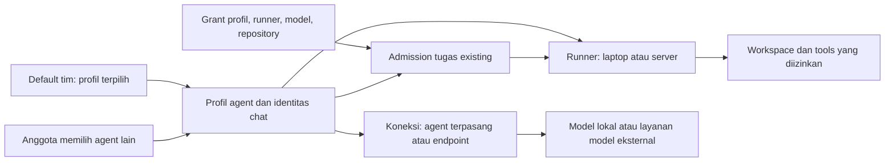

# Spesifikasi Pengaturan Agent, Koneksi Runner, dan Default Tim

Tanggal: 2026-09-22, Asia/Jakarta.

Status: **rancangan tambahan untuk implementasi berikutnya; bukan fitur yang sudah tersedia**.

Baseline dokumentasi Grow Team: `de318427be97a527decc10bc792a638ae8e2c8c1`.
Snapshot implementasi paralel: `3469f2f39de4d3487ab9ffeda0a8f3e661bec57c`, branch `feat/grow-team-agents`.
Baseline penelitian Buzz: `a3117a4762e3349054474e221c2e9cc5fea60dd9`.

## 1. Tujuan, keputusan pengguna, dan batas perubahan

Dokumen ini mengatur pengalaman pengguna ketika menemukan agent, menghubungkan
perangkat, memilih koneksi model, menambah profil, membagikan akses, dan memilih
agent default tim. Fokusnya adalah pengaturan yang dapat dipahami dari browser.

Keputusan pengguna yang menjadi kontrak:

- Grow Team tetap aplikasi web. Pengguna tidak memerlukan aplikasi desktop.
- Runner berjalan pada laptop atau server milik pengguna.
- Agent terpasang dan endpoint OpenAI-compatible tetap didukung.
- **Default tim menjadi pilihan awal ketika anggota membuat tugas. Anggota dapat memilih agent lain.**
- Implementasi spec sebelumnya sedang berjalan paralel. Penelitian ini menghasilkan dokumen baru, tanpa mengubah kode atau spec yang sedang dikerjakan.

Dokumen pendahulu tetap berlaku:

1. [Koneksi agent dan coding harness](2026-09-21-agent-connections-and-coding-harness.md): execution, pairing, sandbox, secret, lease, approval, dan artifact.
2. [Lifecycle dan mention](2026-09-21-agent-lifecycle-and-mention-flow.md): identitas, admission, setup, antrean, cancel/resume, serta urutan S0–S6.

Spec ini menambahkan pengaturan dan pemilihan agent. Ia tidak mengganti state
machine job, format credential, parser mention, atau protokol runner. Kriteria
AS pada dokumen ini melengkapi AT dan AF; ketiganya tidak saling menggantikan.

Istilah **tim** pada versi awal berarti satu organisasi Zulip atau `realm`.
User group tetap menjadi kelompok penerima grant. Default per user group, kanal,
atau proyek belum masuk versi awal ini.

## 2. Apa yang ditemukan pada Buzz

Penelitian membaca source dan tes pada commit yang dipatok. Graf parsial riset
sebelumnya hanya membantu navigasi; source pengaturan terbaru diperiksa langsung.
Tes upstream dibaca sebagai contoh regresi, bukan dijalankan sebagai bukti lulus.

| ID    | Bukti primer Buzz                                                               | Temuan                                                                                                                                                | Penerapan pada Grow Team                                                                                                                |
| ----- | ------------------------------------------------------------------------------- | ----------------------------------------------------------------------------------------------------------------------------------------------------- | --------------------------------------------------------------------------------------------------------------------------------------- |
| BS-01 | [Pilihan koneksi][buzz-connect], [pengelompokan runtime][buzz-methods]          | Onboarding memisahkan login subscription dan API key. Daftar runtime pada helper memakai ID yang ditentukan source.                                   | Pisahkan agent terpasang dan endpoint; tawarkan metode auth yang dilaporkan adapter, bukan menganggap semua CLI mendukung subscription. |
| BS-02 | [Readiness onboarding][buzz-ready]                                              | Runtime terpasang, status login, provider, model, dan credential merupakan pemeriksaan berbeda. Sebagian readiness merupakan pemeriksaan konfigurasi. | Tampilkan kebutuhan yang belum terpenuhi. Coding ready tetap membutuhkan probe dan sandbox dari fondasi Grow Team.                      |
| BS-03 | [AgentDialog][buzz-dialog], [lokasi eksekusi][buzz-run]                         | Dialog membedakan definisi, instance, dan lokasi menjalankan agent. Backend eksekusi berbeda dari provider inferensi.                                 | Profil, runner, dan koneksi model memiliki pilihan serta identitas sendiri.                                                             |
| BS-04 | [Draft lokasi][buzz-run-intent], [tes draft][buzz-run-tests]                    | Probe lambat tidak boleh menghapus isian pengguna, termasuk field yang sengaja dikosongkan.                                                           | Terapkan revision dan pembatalan hasil lama pada wizard koneksi.                                                                        |
| BS-05 | [Default konfigurasi][buzz-defaults], [sumber nilai][buzz-inherited]            | Urutan konfigurasi adalah build, global, persona, lalu instance. UI menjelaskan asal nilai.                                                           | Jelaskan nilai efektif pada profil, tetapi jangan membawa global environment desktop ke pengaturan tim.                                 |
| BS-06 | [Simpan konfigurasi global][buzz-global-save]                                   | Simpan dapat memulai ulang agent lokal yang konfigurasi efektifnya berubah. Hasil mencatat restart yang berhasil dan gagal.                           | Pisahkan konfigurasi tersimpan dari kesiapan runtime. Mengubah default pilihan tim tidak me-restart agent.                              |
| BS-07 | [Ranking saran agent][buzz-ranking]                                             | Saran default memperhitungkan mention terbaru, keaktifan, membership, dan persona.                                                                    | Kebijakan default tim Grow Team memakai pilihan admin yang tersimpan; urutan daftar atau recents tidak menentukan penerima tugas.       |
| BS-08 | [Management provenance][buzz-provenance], [predicate penanda][buzz-other-setup] | Penanda cloud berarti identitas milik pengguna tidak dikelola pada perangkat ini. Itu bukan bukti lokasi server.                                      | Label workstation/server berasal dari metadata runner yang dinyatakan pemilik, terpisah dari kepemilikan dan status.                    |
| BS-09 | [Availability][buzz-availability]                                               | Presence, proses, dan hak lifecycle berbeda. Query gagal berarti unknown.                                                                             | Jangan menyimpulkan agent siap dari status online saja; jangan menebak lokasi dari availability.                                        |
| BS-10 | [Discovery agent milik pengguna][buzz-discovery]                                | Agent dapat ditemukan tanpa record runtime lokal atau membership kanal. Discovery tidak memberikan izin mengirim.                                     | Direktori, izin memakai, akses kanal, dan hak mengelola diperiksa terpisah.                                                             |
| BS-11 | [Resolver team][buzz-team], [tambah team ke kanal][buzz-team-add]               | Team pada jalur ini adalah kumpulan persona. Deployment membuat instance per persona dan memakai fallback runtime.                                    | Jangan menyamakan team Buzz dengan realm Grow Team. Satu default tim tidak membuat sekelompok agent atau mengganti runtime diam-diam.   |
| BS-12 | [Tambah agent ke kanal][buzz-channel-add]                                       | Penambahan kanal merupakan aksi sendiri, memakai identitas agent tertentu.                                                                            | Memakai profil bersama tidak membuat bot baru. Membership kanal tetap terpisah dari grant eksekusi.                                     |
| BS-13 | [Penyimpanan default UI][buzz-default-tests], [edit instance][buzz-edit-tests]  | Tes memeriksa save/reread, cancel tanpa update, dan konfigurasi efektif saat perubahan inheritance.                                                   | Port skenario tersebut ke UI web dan API Grow Team yang sesungguhnya.                                                                   |
| BS-14 | [Pengaturan percakapan][buzz-settings]                                          | Ada preferensi otomatis menyebut agent pada balasan thread. Ini terpisah dari konfigurasi runtime.                                                    | Default tim tidak mengaktifkan auto-mention atau trigger pada seluruh pesan.                                                            |

Pada jalur yang diperiksa, konfigurasi global Buzz dan ranking saran mention
bukan kontrak admin realm untuk memilih satu agent default. Resolver pada bagian
11 adalah rancangan Grow Team berdasarkan kebutuhan pengguna.

Proposal remote agent Buzz masih memiliki bagian draft. Dokumen ini mengambil
bukti UI dan fungsi yang dibaca; tidak menganggap semua rancangan remote Buzz
sudah berfungsi atau sudah diuji dalam produksi.

## 3. Pilihan desain dan istilah yang dipakai

| Pilihan                                          | Kelebihan                                            | Konsekuensi                                                                     | Keputusan                                 |
| ------------------------------------------------ | ---------------------------------------------------- | ------------------------------------------------------------------------------- | ----------------------------------------- |
| Satu default profil per realm                    | Mudah dipahami; tidak mengubah routing job existing. | Anggota dapat perlu memilih profil lain untuk tugas berbeda.                    | Dipilih untuk versi awal.                 |
| Default per realm, kanal, proyek, dan anggota    | Lebih banyak penyesuaian.                            | Membutuhkan precedence, delegasi admin, dan penanganan konflik tambahan.        | Tahap berikutnya jika kebutuhan terbukti. |
| Selalu memilih agent aktif atau terakhir dipakai | Sedikit konfigurasi.                                 | Penerima dapat berganti karena heartbeat, urutan query, atau aktivitas anggota. | Tidak dipakai sebagai default tim.        |

### 3.1 Entitas dan label

| Istilah UI         | Entitas                                    | Makna                                                         |
| ------------------ | ------------------------------------------ | ------------------------------------------------------------- |
| Agent              | `AgentProfile` dan `bot_user_id`           | Identitas yang menerima tugas.                                |
| Perangkat / Runner | `AgentRunner`                              | Mesin yang menjalankan proses dan tools.                      |
| Agent terpasang    | Adapter dan katalog runner                 | Program agent yang tersedia pada runner terpilih.             |
| Koneksi model      | `AgentProvider`                            | Endpoint, model, dan referensi credential inferensi.          |
| Default tim        | Referensi profil pada `AgentRealmSettings` | Pilihan awal pada form tugas baru.                            |
| Mode awal profil   | `AgentProfile.default_mode`                | Diskusi atau Coding ketika tugas tidak menetapkan jenis lain. |
| Akses bersama      | `AgentGrant`                               | Siapa yang boleh memakai resource, pada scope tertentu.       |

Default tim tidak sama dengan model default atau `default_mode`. Mengubah salah
satu tidak mengubah yang lain. Nama menu dan field tidak boleh menyebut ketiganya
hanya sebagai “Default”.

### 3.2 Hubungan komponen



Diagram menyatakan hubungan, bukan tambahan otoritas. Default dan kartu profil
tidak menggantikan pemeriksaan grant pada admission.

## 4. Struktur pengaturan di browser

Gunakan halaman **Pengaturan → Agent** dengan empat area yang memakai komponen
dan pola aksesibilitas Grow Team existing.

| Area          | Isi utama                                                                            | Aksi                                                                               |
| ------------- | ------------------------------------------------------------------------------------ | ---------------------------------------------------------------------------------- |
| Agent         | Profil yang dapat dilihat, mode, runner, pemilik, kesiapan, dan penanda default tim. | Pakai agent; tambah profil; kelola profil sesuai hak.                              |
| Perangkat     | Runner yang dimiliki atau boleh dipakai; status koneksi dan platform.                | Hubungkan perangkat; lihat petunjuk lokal; cabut perangkat jika berwenang.         |
| Koneksi model | Koneksi yang boleh dikelola atau dipakai; model dan hasil probe yang relevan.        | Tambah koneksi; uji ulang; ganti credential jika berwenang.                        |
| Default tim   | Pilihan saat ini dan cakupan ketersediaannya.                                        | Admin menetapkan atau menghapus default; anggota membaca hasil yang aman untuknya. |

Filter direktori: **Semua yang bisa saya pakai**, **Milik saya**, **Dibagikan kepada
saya**, serta lokasi workstation/server. Filter hanya menyaring hasil yang sudah
diizinkan server. Filter, count, pencarian, pagination, dan detail harus memiliki
batas ACL yang sama.

Tombol utama untuk anggota yang sudah memiliki agent bersama adalah **Buat
tugas**. Mereka tidak harus melewati onboarding perangkat. Pemilik resource
mendapat **Tambah agent** dan **Hubungkan perangkat** sesuai izin.

Tidak ada query atau polling status per kartu. Halaman mengambil ringkasan
terbatas melalui satu query induk; detail dan log dimuat ketika dibuka.

## 5. Menjelaskan agent lokal dan agent server

### 5.1 Empat informasi yang terpisah

Setiap kartu dan pemilih menampilkan informasi yang relevan berikut:

1. **Berjalan di:** nama runner dan kategori lokasi yang dinyatakan pemilik.
2. **Pemilik:** akun penanggung jawab profil/perangkat; jangan menganggap server otomatis milik seluruh tim.
3. **Akses:** pribadi atau dibagikan sesuai grant yang dapat diketahui pengguna.
4. **Kesiapan:** koneksi runner, konfigurasi, dan kemampuan dari sumber yang berbeda.

Kategori runner: `workstation`, `server`, atau `unknown`. Kategori merupakan
metadata deklaratif, bukan bukti attestation, ketersediaan 24 jam, atau izin.
Nilai default untuk runner existing adalah `unknown`; jangan menebaknya dari OS,
hostname, IP, pemilik, URL endpoint, atau status online.

| Runner                | Lokasi model          | Label yang tepat                                                        | Makna praktis                                                      |
| --------------------- | --------------------- | ----------------------------------------------------------------------- | ------------------------------------------------------------------ |
| Laptop Rama           | API eksternal         | “Laptop Rama · Komputer pribadi”; “Model: koneksi eksternal”            | Tools berjalan di laptop; inferensi melalui endpoint yang dipilih. |
| Laptop Rama           | Endpoint lokal runner | “Laptop Rama · Komputer pribadi”; “Model: endpoint lokal runner”        | Browser tetap mengirim tugas melalui Grow Team.                    |
| Server pengembangan   | API eksternal         | “Server Pengembangan · Server”; pemilik dan akses ditampilkan terpisah. | Menutup browser anggota tidak mematikan proses runner.             |
| Server pengembangan   | Endpoint pada server  | “Server Pengembangan · Server”; “Model: endpoint lokal runner”          | Localhost merujuk server runner tersebut.                          |
| Runner tanpa kategori | Belum diketahui       | Nama runner; “Jenis perangkat belum ditentukan”.                        | Tidak menampilkan ikon server berdasarkan tebakan.                 |

`localhost` dan `127.0.0.1` pada koneksi model selalu dievaluasi dari runner yang
dipilih. Model di API eksternal tidak membuat proses agent menjadi “agent cloud”.

Dalam browser, gunakan nama perangkat yang stabil. Label **Perangkat ini** hanya
boleh muncul jika ada bukti asosiasi browser–runner yang terverifikasi. Versi
awal tidak memiliki mekanisme tersebut, sehingga tidak memakai label itu.
Membuka Grow Team dari ponsel tidak mengubah label Laptop Rama menjadi lokal
terhadap ponsel atau mengalihkan eksekusi ke ponsel.

### 5.2 Contoh informasi kartu

```text
Reviewer Grow                         Default tim
Mode awal: Coding
Berjalan di: Server Pengembangan · Server
Pemilik: Rama · Akses: Tim Engineering
Runner: Terhubung · Konfigurasi: Siap coding
Model: Koneksi Engineering / model yang dikonfigurasi
[Buat tugas] [Detail]
```

Contoh di atas adalah isi rancangan, bukan tangkapan aplikasi. Pengguna tanpa
hak detail koneksi hanya melihat label aman dan scope data yang relevan. URL
internal, path host, credential, log, dan anggota grup privat tidak ikut terbuka.

Status query gagal tampil **Status belum diketahui**. Status heartbeat dan umur
observasinya ditampilkan sesuai kontrak fondasi. Menghilangkan status cache yang
kedaluwarsa tidak menghilangkan konfigurasi atau identitas yang masih sah.

## 6. Memakai agent bersama tanpa memasang perangkat

Alur untuk anggota tim yang hanya memakai browser:

1. Anggota membuka aksi **Buat tugas** pada percakapan yang dapat diakses.
2. Server memeriksa default tim dalam konteks anggota dan tujuan tugas.
3. Form menampilkan agent terpilih, runner, mode, dan repository yang relevan.
4. Anggota dapat mengganti agent dengan kandidat lain yang diizinkan.
5. Anggota meninjau tujuan, lalu mengirim tugas melalui admission existing.
6. Tugas berjalan pada runner pemilik. Anggota mengikuti progres dari browser.

Tanpa kandidat yang sah, tampilkan **Pilih agent** atau petunjuk meminta akses.
Jangan membuat profil pribadi, menyalin credential pemilik, atau meminta anggota
memasang CLI sebagai fallback otomatis.

Profil bersama tetap memakai identitas bot yang sama bagi semua anggota.
Permintaan baru menghasilkan job baru, bukan bot atau profil baru per pengguna.

## 7. Menghubungkan laptop atau server

### 7.1 Alur pemilik runner

1. Pemilik memilih **Hubungkan perangkat** dan jenis workstation atau server.
2. UI menampilkan petunjuk pemasangan runner headless sesuai OS yang didukung.
3. Pemilik menjalankan runner pada mesin tujuan; pemasangan server dilakukan melalui akses mesin yang sudah dimilikinya.
4. Runner memulai pairing dan menampilkan kode pendek dari kontrak fondasi.
5. Pemilik membuka form pairing melalui browser pada realm yang benar dan memasukkan kode.
6. UI menampilkan nama perangkat, fingerprint, pemilik, dan realm; pemilik memeriksa lalu menyetujui.
7. Runner menukar credential, mengirim heartbeat, lalu melaporkan katalog adapter dan workspace alias yang diizinkan.
8. UI menawarkan tambah agent pada nama runner yang sudah terikat.

Pairing yang berhasil hanya berarti perangkat terhubung. Ia belum membuktikan
login model, ketersediaan repository, atau kesiapan coding. Runner tidak membuka
port inbound; browser tidak memindai localhost untuk mencari agent.

Petunjuk instalasi harus memakai versi dan command runner yang benar-benar
dirilis. Dokumen ini tidak menetapkan URL unduhan atau subcommand CLI yang belum
ada. Pengujian pemasangan dan autostart menjadi keluaran implementasi runner.

### 7.2 Perbedaan operasional

| Kondisi                       | Workstation                                                     | Server                                                                              |
| ----------------------------- | --------------------------------------------------------------- | ----------------------------------------------------------------------------------- |
| Instalasi                     | Pemilik memasang layanan latar pada komputernya.                | Operator memasang layanan pada server yang dikelolanya.                             |
| Perangkat tidur atau berhenti | Job mengikuti deadline antrean dan lease existing.              | Perilaku protokol sama; label server tidak menjanjikan selalu online.               |
| Startup setelah reboot        | Harus diuji pada service manager OS yang didukung.              | Harus diuji pada service manager OS yang didukung.                                  |
| Pemakai lain                  | Membutuhkan grant pemilik.                                      | Tetap membutuhkan grant pemilik.                                                    |
| Default tim                   | Dapat dipilih; tampilkan ketergantungan pada perangkat pemilik. | Direkomendasikan untuk pekerjaan bersama jika operator menyediakan ketersediaannya. |

Satu runner dapat menjadi host beberapa profil, dengan kapasitas dan isolasi
attempt dari spec pertama. UI tidak membuat salinan service runner untuk setiap
profil. Registrasi lintas realm tetap terpisah; tidak berbagi token secara implisit.

## 8. Menghubungkan agent terpasang atau koneksi model

### 8.1 Agent terpasang pada runner

Katalog berasal dari runner terpilih, bukan dari mesin Grow Team atau browser.
Setiap pilihan memuat ID adapter, versi, availability, metode auth yang
dilaporkan, dan hasil probe. Label seperti “terpasang” dan “sudah login” tetap
berbeda dari “siap coding”.

Jika login diperlukan, arahkan pemilik ke metode adapter yang didukung pada
runner. Jangan meminta credential subscription melalui chat atau menampilkan
tombol login browser yang belum benar-benar didukung adapter. Handshake yang
mengumumkan metode auth tidak membuktikan auth tersebut berhasil.

Menyambungkan program existing berarti memakai adapter dari katalog yang
diizinkan, kemudian membuat sesi kerja baru sesuai attempt. Ini tidak berarti
menempel ke PID, terminal, atau percakapan CLI pribadi yang sedang berjalan.
UI tidak menerima arbitrary executable path dari anggota tim.

### 8.2 Endpoint OpenAI-compatible

Form mengikuti `ProviderCreate` pada implementasi fondasi. Field utama adalah
nama koneksi, runner, base URL, mode API, model, referensi credential, scope data,
dan batas konteks/output yang diketahui. Field jaringan lanjutan mengikuti
policy pemilik, bukan override bebas dari anggota.

Alur:

1. Pemilik memilih runner yang melakukan request inferensi.
2. Pemilik memilih koneksi existing atau membuat koneksi baru.
3. UI menampilkan tujuan data dan tempat credential disimpan.
4. Probe memakai data sintetis melalui runner dan menyimpan capability report.
5. UI menampilkan kemampuan chat, tools, stream, dan batas yang belum diketahui.
6. Profil memilih koneksi berdasarkan ID; nilai secret tidak disalin ke profil.

Discovery model bersifat opsional. Jika katalog tidak tersedia, pemilik boleh
mengisi model secara manual lalu menjalankan probe. Keberhasilan respons teks
saja tidak mengaktifkan Coding. Endpoint lokal/private tetap melalui policy
egress fondasi; browser tidak menguji URL tersebut secara langsung.

Saat pengguna mengganti runner, kosongkan pilihan provider/repository yang tidak
berlaku. Jangan memindahkan secret, mengubah base URL localhost, atau memakai
path workspace runner lama pada runner baru.

### 8.3 Tiga arti “connect” pada UI

| Maksud pengguna                      | Aksi yang tersedia                    | Efek                                                           |
| ------------------------------------ | ------------------------------------- | -------------------------------------------------------------- |
| Memakai agent yang sudah dibagikan   | Pilih agent dari direktori.           | Tidak ada pairing atau profil baru.                            |
| Memakai agent CLI pada mesin sendiri | Hubungkan runner, lalu pilih adapter. | Profil memakai runtime dan auth yang diizinkan pada mesin itu. |
| Memakai API model                    | Pilih runner dan koneksi model.       | Runtime endpoint Grow Runner menyediakan loop dan tools.       |

Hindari satu tombol “Connect” yang dapat berarti ketiganya tanpa penjelasan.

## 9. Menambah dan mengatur profil agent

Wizard memakai alur simpan → probe → enable dari spec lifecycle, dengan tahap:

1. **Identitas:** nama, deskripsi, dan mode awal Diskusi atau preset Coding.
2. **Perangkat:** runner yang boleh dipakai dan label lokasi yang jelas.
3. **Koneksi:** adapter terpasang atau koneksi model yang sesuai runner.
4. **Pekerjaan:** repository alias, pemeriksaan, budget, dan tools dalam mandat pemilik.
5. **Akses:** pribadi terlebih dahulu; grant bersama dapat diatur sebagai langkah terpisah.
6. **Ringkasan:** nilai efektif, pemilik resource, penggunaan data, serta kemampuan yang belum diuji.
7. **Simpan draft:** server membuat profil/bot/setup sekali dengan idempotency key.
8. **Periksa dan aktifkan:** runner menjalankan probe; pengguna mengaktifkan revision yang lulus.

Nama dan deskripsi tidak menjadi ID. Duplikasi profil merupakan aksi eksplisit
yang membuat identitas baru. Tombol retry atau perubahan lokasi kanal tidak
membuat profil baru.

Mode Diskusi tidak memerlukan repository jika tugas hanya memakai konteks chat.
Coding membutuhkan repository dan izin baca/edit/test yang lengkap. Tidak ada
permintaan persetujuan berulang untuk tindakan yang sudah masuk mandat itu.

### 9.1 Penyimpanan, perubahan draft, dan konfigurasi efektif

Setiap save/probe membawa profil, runner, revision, dan descriptor yang sama
dengan eksekusi. Callback lama tidak boleh menimpa draft baru, field yang sudah
dikosongkan, pilihan runner lain, atau form yang sudah ditutup.

Saat menyimpan, tampilkan hasil canonical server. Jika pengguna mengedit selama
request berlangsung, pertahankan draft terbaru dan tunjukkan bahwa ada perubahan
yang belum disimpan. Simpan berhasil tetapi probe gagal adalah dua hasil yang
berbeda; retry hanya menjalankan tahap gagal pada profil yang sama.

MVP menyimpan konfigurasi profil secara eksplisit. Preset boleh mengisi form
awal, tetapi nilainya menjadi snapshot saat disimpan. Tidak ada inheritance
otomatis dari environment global semua anggota atau perubahan template yang
diam-diam mengubah profil existing.

Aturan nilai efektif:

- Policy dan grant menetapkan batas; preset atau permintaan tugas tidak dapat memperluasnya.
- Form dapat memilih nilai dalam batas itu, lalu server menyimpan konfigurasi canonical pada revision profil.
- Job/attempt memakai konfigurasi yang diperiksa sesuai kontrak revision fondasi.
- Perubahan budget/model pada tugas hanya tersedia jika schema fondasi mendukung override tersebut secara eksplisit.
- Secret tetap berupa reference. Placeholder credential yang dimask tidak boleh terkirim kembali sebagai secret baru.

### 9.2 Pengaturan lanjutan dan batas dukungan

Buzz juga menyediakan [instruksi persona][buzz-definition] dan [panel konfigurasi
efektif][buzz-config-panel] untuk model, mode, effort, batas token, dan MCP.
Ambil pola penjelasan nilainya; kontrol Grow Team hanya muncul jika kontrak
backend dan adapter benar-benar mendukung pengaturan itu.

| Pengaturan                                     | Perlakuan Grow Team                                                                                                             |
| ---------------------------------------------- | ------------------------------------------------------------------------------------------------------------------------------- |
| Nama dan deskripsi                             | Metadata profil. Deskripsi tidak diam-diam menjadi system prompt.                                                               |
| Model pada mode endpoint                       | Berasal dari `AgentProvider.model_id`. Versi awal tidak menambah override model tersembunyi pada profil.                        |
| Model/config agent terpasang                   | Ditampilkan dari kemampuan/config yang dilaporkan dan diuji. Field yang belum bisa disimpan tampil sebagai informasi.           |
| Budget, batas konteks, output, dan pemeriksaan | Memakai field typed fondasi dan batas policy; nilai unknown tidak ditampilkan sebagai angka kemampuan terukur.                  |
| Thinking effort                                | Hanya dapat diedit bila adapter/provider mendukung nilai dan persistensinya; jangan menyamakan vocabulary semua model.          |
| Tools                                          | Tampilkan kemampuan dan scope grant. Tidak ada toggle yang membuka seluruh filesystem atau host shell.                          |
| MCP tambahan                                   | Konfigurasi server/tool baru tetap mengikuti broker dan sandbox. Editor MCP bebas bukan syarat MVP pengaturan ini.              |
| Instruksi peran persisten                      | Memerlukan kontrak tersendiri pada profil, context broker, dan descriptor. Tidak tersedia pada payload snapshot yang diperiksa. |

Instruksi peran dapat ditambahkan setelah jalur fondasi stabil. Implementasinya
harus versioned, masuk anggaran konteks, terikat snapshot attempt, dan tetap
berada di bawah policy otorisasi. Jangan menyediakan form yang tampak menyimpan
instruksi tetapi tidak memasukkannya ke prompt, atau menyelipkan instruksi lewat
field deskripsi untuk melewati schema. Kebutuhan ini tidak menghambat default tim.

Jika pemilik mengubah model pada koneksi yang dipakai banyak profil, UI harus
menunjukkan dampaknya pada profil yang boleh dilihat. Capability report koneksi
dan readiness terkait menjadi stale sesuai versi konfigurasi; tidak ada restart
massal atau penggantian model pada attempt aktif secara diam-diam. Jika dibutuhkan
varian model terpisah, pemilik membuat koneksi terpisah melalui alur yang sah.

## 10. Membagikan agent dan menetapkan default tim

### 10.1 Akses bersama bukan perpindahan kepemilikan

Pengelola profil memilih pengguna atau user group existing, scope kanal/DM,
repository, tindakan, dan expiry. Ringkasan akses harus mencakup profil, runner,
provider jika digunakan, dan repository jika diperlukan. Grant profil saja
belum membuktikan seluruh resource dapat dipakai.

Setiap pemilik resource menyetujui grant yang berada dalam wewenangnya. Admin
realm tidak otomatis memperoleh kendali mesin, credential provider, atau akses
repository anggota. Gunakan service policy existing untuk memeriksa hak.

UI dapat menggabungkan beberapa kebutuhan grant dalam satu ringkasan. Jika
pengguna berwenang atas semua resource, mutasi lokal dapat ditransaksikan.
Jika ada pemilik lain, simpan hanya perubahan yang sah dan tampilkan kebutuhan
akses yang tersisa; jangan menyatakan “dibagikan” secara lengkap sebelum sesuai.
Spec ini tidak menambahkan workflow pesan permintaan izin otomatis.

Tombol **Tambahkan ke kanal** menambah membership bot dan grant terkait sesuai
fondasi. Memilih default tim tidak otomatis memasukkan bot ke semua kanal privat
atau memberinya riwayat seluruh organisasi.

### 10.2 Alur admin menetapkan default

1. Admin realm membuka **Default tim**.
2. UI menampilkan profil yang boleh diketahui dan dipakai admin tersebut.
3. Admin memilih satu profil yang sudah enabled, memiliki readiness sesuai revision, dan memiliki grant berbagi yang eksplisit.
4. UI menampilkan runner, pemilik, mode awal, serta kelompok/scope yang mendapat akses.
5. UI menjelaskan bahwa anggota tetap membutuhkan grant seluruh resource untuk tugasnya.
6. Admin menyimpan dengan expected selection revision; server mencatat aktor dan perubahan.
7. Form tugas baru memakai resolver pada bagian 11. Job dan draft existing tidak dialihkan.

Kandidat default harus memiliki audience grant profil berupa user group yang
dipilih secara eksplisit, dengan otoritas pemberi grant yang sah. Realm memakai
grup anggota existing jika cakupannya seluruh tim. Keanggotaan grup tidak boleh
ditentukan dari daftar pengguna yang dikirim browser.

Pengaturan default tidak membuat semua anggota memenuhi syarat. Repository,
kanal privat, guest, atau scope tertentu masih dapat membatasi penggunaan.
Panel admin harus menjelaskan cakupan tersebut; jangan menjanjikan akses seluruh
tim hanya karena penyimpanan default berhasil.

Runner offline tidak menghapus pilihan default yang konfigurasinya masih sah.
Admin dapat mempertahankannya dengan informasi bahwa tugas akan mengantre.
Profil paused, archived, revoked, atau belum lulus konfigurasi tidak dapat menjadi
pilihan baru. Perubahan kondisi sesudah disimpan ditangani resolver, bukan
diganti otomatis dengan profil lain.

MVP tetap mempunyai pemilik akun untuk runner dan profil. Label **Dibagikan
kepada tim** tidak menciptakan entitas pemilik tim atau akun layanan tersembunyi.
Alih kepemilikan perangkat merupakan pekerjaan terpisah; bagian 12 menetapkan
pemulihan yang tidak mengambil alih credential akun lama.

## 11. Kontrak pemilihan default pada tugas

### 11.1 Urutan keputusan

Resolver hanya memberi pilihan awal. Membuka form, membuka pengaturan, atau
mengganti default tidak membuat job, menjalankan probe berbayar, atau menyalakan
proses agent.

| Urutan | Kondisi                                                                          | Hasil                                                                               |
| ------ | -------------------------------------------------------------------------------- | ----------------------------------------------------------------------------------- |
| 1      | Pengguna melanjutkan job yang sudah ada.                                         | Gunakan profil job tersebut dan kontrak resume; default tim tidak ikut menentukan.  |
| 2      | Form berasal dari profil tertentu atau pengguna memilih profil secara eksplisit. | Pertahankan ID tersebut; periksa kesesuaian dengan konteks.                         |
| 3      | Pengguna sengaja mengosongkan pemilih pada draft yang sama.                      | Tetap kosong; refresh atau callback tidak mengisi ulang default.                    |
| 4      | Form tugas baru belum mempunyai pilihan.                                         | Evaluasi satu default realm terhadap pengguna, scope, jenis tugas, dan repository.  |
| 5      | Default tidak ada atau tidak memenuhi syarat.                                    | Tidak ada pilihan otomatis; tampilkan pemilih berisi kandidat yang boleh diketahui. |

Tidak ada fallback ke nama sama, model sama, agent online pertama, agent milik
admin, atau recents. Urutan pencarian boleh membantu pengguna menemukan kandidat,
tetapi tidak memberi mandat mengeksekusi pada kandidat tersebut.

### 11.2 Kelayakan default

Pemilihan memeriksa realm, pengguna aktif, feature flag, profil/bot yang aktif,
readiness sesuai revision/configuration, dan grant profil/runner/provider/repo
pada konteks tugas. Kanal privat tetap memerlukan membership bot yang sah.
Pemeriksaan provider hanya berlaku ketika profil memakai provider terpisah.

Default tidak dapat dipilih baru jika akun pemilik profil, runner, atau resource
yang diperlukan sudah nonaktif. Periksa kontrak ini bersama offboarding dan
admission fondasi; cache default tidak boleh mempertahankan akses akun lama.

`job_kind` yang ditentukan pengguna dipertahankan. Jika belum ditentukan, form
mengambil `default_mode` profil dan menampilkannya. Profil Diskusi tidak diam-diam
diubah menjadi Coding. Jika tugas Coding tidak sesuai kemampuan default, tampilkan
pilihan agent yang sesuai atau langkah perbaikan, tanpa menjalankan mutasi.

| Keadaan default                                                             | Hasil pemilih untuk pengguna yang berhak                                  | Tindakan                                                                      |
| --------------------------------------------------------------------------- | ------------------------------------------------------------------------- | ----------------------------------------------------------------------------- |
| Konfigurasi valid dan runner online                                         | Terpilih dengan runner dan mode terlihat.                                 | Pengguna dapat mengirim atau mengganti agent.                                 |
| Konfigurasi valid dan runner offline                                        | Tetap boleh terpilih jika admission mengizinkan antrean.                  | Jelaskan deadline mulai dan bahwa tugas belum berjalan.                       |
| Status koneksi tidak dapat dipastikan                                       | Tampilkan unknown; jangan mengklaim siap eksekusi sekarang.               | Server menentukan apakah job boleh queued; jangan menebak dari cache browser. |
| Profil paused, readiness stale, provider dinonaktifkan, atau runner revoked | Tidak menjadi pilihan awal baru.                                          | Beri alasan yang aman dan pemilih alternatif.                                 |
| Pengguna tidak mempunyai akses                                              | Respons tidak memuat identitas atau konfigurasi default yang tersembunyi. | “Belum ada agent default yang bisa dipakai untuk tugas ini.”                  |
| Default tidak ditetapkan                                                    | Tidak ada pilihan otomatis.                                               | Pilih agent; admin dapat mengatur default secara terpisah.                    |

Untuk pengguna yang tidak berhak, respons tidak membedakan resource privat yang
ada dari resource yang tidak dapat diketahui. Admin hanya mendapatkan detail
diagnostik yang diizinkan oleh ACL resource; peran admin bukan bypass.

### 11.3 Draft, perubahan default, dan pengiriman

Saat resolver mengisi form, browser menyimpan ID profil, revision yang dilihat,
selection revision, sumber pilihan, serta identitas realm/tujuan/draft. Label
**Default tim** menjelaskan asal pilihan; ID profil tetap tujuan sebenarnya.

Jika admin mengganti default ketika draft sudah memilih A, draft tetap memilih
A. UI dapat memberi pemberitahuan perubahan default jika informasi itu boleh
diketahui. Mengikuti default baru membutuhkan pilihan pengguna. Refresh,
keaktifan agent B, atau late response tidak boleh mengganti A diam-diam.

Ketika konteks berubah, periksa ulang kelayakan pilihan. Pilihan eksplisit yang
tidak lagi sah tetap terlihat sebagai pilihan bermasalah jika identitasnya masih
boleh diketahui; tombol kirim ditahan sampai diperbaiki. Jangan menggantinya
dengan default pada tujuan baru. Pergantian realm/logout membersihkan data
draft dan cache yang tidak boleh dibawa ke sesi baru.

Request pembuatan job harus membawa profile ID aktual. Admission memeriksa izin
dan konfigurasi terbaru sebagaimana fondasi. Server tidak menafsirkan ID kosong
sebagai perintah memilih default terbaru saat request tiba. Selection revision
menjelaskan asal pilihan, bukan token otorisasi atau syarat membatalkan draft A
yang masih sah hanya karena default sudah berubah ke B.

Source pilihan dari client bukan bukti kewenangan. Jika disimpan untuk audit,
server memvalidasi hubungan terhadap hasil resolver dan konteks yang direkam.
Seluruh retry tetap memakai idempotency key yang mengikat profile ID aktual dan
payload, mengikuti spec lifecycle.

### 11.4 Hubungan dengan chat biasa

- Mention profil tertentu tetap menunjuk profil tersebut, meskipun berbeda dari default tim.
- Default tidak menyisipkan mention tambahan pada pesan biasa.
- Default tidak membuat pesan grup atau bot menjadi trigger baru.
- DM satu manusia dengan satu agent tetap mengikuti identitas DM dan aturan spec lifecycle.
- Tombol **Buat tugas** memakai pemilihan default, kemudian melalui jalur job/admission existing.

## 12. Mengedit, mencabut, dan memindahkan penggunaan agent

### 12.1 Matriks efek perubahan

| Perubahan                                 | Efek konfigurasi                                                      | Efek pekerjaan existing                                                        |
| ----------------------------------------- | --------------------------------------------------------------------- | ------------------------------------------------------------------------------ |
| Mengganti default tim                     | Selection revision bertambah.                                         | Tidak restart, tidak rebind draft/job/attempt.                                 |
| Mengubah label kategori runner            | Metadata revision bertambah.                                          | Tidak mengganti policy atau konfigurasi eksekusi.                              |
| Mengubah provider/model/repository profil | Revision dan readiness mengikuti fondasi.                             | Attempt memakai snapshot; perubahan scope tidak disisipkan di tengah eksekusi. |
| Mengganti credential provider             | Versi konfigurasi/cache secret diperbarui sesuai fondasi.             | Grant lama atau credential yang dicabut tidak boleh terus dipakai.             |
| Pause profil                              | Admission/claim baru tertahan.                                        | Cancel tugas aktif tetap aksi terpisah.                                        |
| Cabut runner atau grant                   | Otorisasi baru ditolak; kontrol penghentian mengikuti fondasi.        | UI menjelaskan penghentian yang sudah atau belum terkonfirmasi.                |
| Arsip profil yang menjadi default         | Referensi historis dipertahankan; resolver menyatakan tidak tersedia. | Job tidak dialihkan; admin memilih default pengganti secara eksplisit.         |
| Hapus pilihan default                     | Profile reference menjadi null; audit tetap ada.                      | Profil, bot, runner, dan job tidak dihapus.                                    |

Jika penyimpanan hanya mengubah metadata tampilan, jangan membuat seluruh
descriptor eksekusi menjadi stale. Jika perubahan memengaruhi akses, auth,
adapter, model, tools, atau repository, gunakan revision policy/configuration
yang memang mengatur perubahan tersebut.

### 12.2 Dari laptop ke server

MVP tidak menyediakan pemindahan proses aktif atau credential otomatis.
Pemilik menghubungkan server, menyiapkan koneksi dan repository di sana, lalu
membuat profil pengganti dengan identitas baru. Setelah probe dan tugas fixture
lulus, pemilik memberikan grant yang diperlukan dan admin dapat mengganti
default tim ke profil baru.

Job lama tetap mengacu profil dan attempt asal. Pemindahan pekerjaan yang belum
selesai merupakan tugas lanjutan yang ditinjau, dengan hasil/checkpoint yang
boleh dibawa; bukan retry yang diam-diam berganti runner. Profil lama dapat
dipause setelah pekerjaan aktif ditangani. Jangan menghapus workspace atau
riwayat sebagai bagian pemindahan penggunaan.

Pilihan ini menjaga hubungan satu profil–satu runner versi awal. Migrasi dengan
identitas tetap membutuhkan protokol handoff, fencing, transfer auth, dan
keputusan produk tersendiri; tidak menjadi prasyarat halaman pengaturan.

Jika pemilik meninggalkan organisasi, pengelola meninjau default dan akses
resource yang bergantung pada akun itu. Jangan menganggap kepemilikan berpindah
ke admin atau mengambil credential vendor akun lama. Siapkan runner/profil
pengganti dengan pemilik yang sah, lalu pilih default baru. Penonaktifan akun
harus mengikuti policy pencabutan fondasi sebelum pengaturan ini dirilis.

## 13. Tambahan kontrak data yang minimal

Gunakan model yang sedang dibangun. Tidak ada tabel runner, profil, provider,
atau grant kedua untuk halaman pengaturan.

| Lokasi                | Tambahan usulan                                                                  | Aturan                                                                       |
| --------------------- | -------------------------------------------------------------------------------- | ---------------------------------------------------------------------------- |
| `AgentRealmSettings`  | `default_profile`: FK nullable ke `AgentProfile`, `on_delete=PROTECT`            | Target harus satu realm; null berarti tidak ada default.                     |
| `AgentRealmSettings`  | `default_selection_revision`: integer positif, awal 1                            | CAS untuk perubahan pilihan; terpisah dari revision policy/settings fondasi. |
| `AgentRealmSettings`  | `default_selected_by`: actor nullable; `default_selected_at`: waktu nullable     | Menjelaskan perubahan; audit durable memakai jalur audit server.             |
| `AgentRunner`         | `host_kind`: `workstation/server/unknown`, default unknown                       | Deklarasi pemilik; tidak mengubah auth, grant, atau scheduler.               |
| `AgentRunner`         | `metadata_revision`: integer positif, awal 1                                     | CAS metadata tampilan tanpa membatalkan descriptor eksekusi.                 |
| Respons daftar/detail | Ringkasan runner, pemilik yang boleh diketahui, kemampuan, dan `allowed_actions` | Proyeksi server berdasarkan pengguna; bukan salinan mentah model/secret.     |
| Respons resolver      | Profile ID terpilih atau null, alasan aman, mode, revision, dan status antrean   | Tidak disimpan sebagai izin untuk eksekusi berikutnya.                       |

Perubahan default memerlukan transaksi yang memvalidasi target lalu memperbarui
selection revision dan audit. Dua admin dengan expected revision sama tidak
boleh saling menimpa tanpa conflict. Jika respons hilang, client membaca keadaan
terbaru sebelum mencoba lagi. Jika pilihan yang diminta sudah tersimpan, UI
menampilkan keadaan itu. Jangan mengambil revision terbaru lalu mengulang write
otomatis, karena tindakan tersebut dapat menimpa keputusan admin lain.

Foreign key tidak membuktikan kesamaan realm. Gunakan service validation serta
tes negatif existing, termasuk actor dan default profile. Audit pemilihan
default tidak memerlukan job fiktif dan tidak boleh dipublikasikan oleh runner
sebagai event keputusan manusia.

Tambahan `host_kind` dapat dikumpulkan setelah pairing selesai. Jangan memaksa
perubahan handshake pairing atau format katalog sebagai syarat label lokasi.
Metadata lokasi model diturunkan dari koneksi runner dan policy endpoint yang
tervalidasi; tidak cukup dari string URL yang dikirim client.

## 14. API dan kontrak frontend

Nama route berikut adalah usulan. Implementor harus memakai prefix, serializer,
error envelope, dan OpenAPI/changelog yang sudah dipakai implementasi fondasi.
Jangan menambahkan wrapper HTTP kedua atau mengubah versi protokol secara diam-diam.

| Route/area                                  | Otoritas                                  | Kontrak                                                                                       |
| ------------------------------------------- | ----------------------------------------- | --------------------------------------------------------------------------------------------- |
| List/detail profil existing                 | `accessible_profiles` dan policy resource | Tambahkan proyeksi aman untuk direktori; count setelah filter ACL.                            |
| List/detail runner existing                 | Owner/grant sesuai fondasi                | Kategori, nama, status teramati, dan aksi yang boleh dilakukan.                               |
| `PATCH /agent/runners/{id}/metadata` — baru | Pemilik runner pada realm yang sama       | Ubah nama/kategori dengan expected metadata revision; tidak mengubah executable atau koneksi. |
| List/detail provider                        | Owner/grant sesuai fondasi                | Bedakan data pengelola koneksi dari label aman pemakai. Tidak mengembalikan secret.           |
| `GET /agent/defaults` — baru                | Admin realm; target tetap dibatasi ACL    | Pilihan tersimpan, selection revision, dan diagnostik yang boleh diketahui.                   |
| `PUT /agent/defaults` — baru                | Admin realm dan syarat bagian 10          | Pilih profile ID atau null secara atomik; tidak membuat grant.                                |
| `POST /agent/selection/resolve` — baru      | Anggota terautentikasi                    | Evaluasi default atau pilihan eksplisit pada konteks tugas, tanpa membuat job.                |
| Create/setup/enable/grant existing          | Policy fondasi                            | Dipakai wizard; jangan membuat versi kedua lifecycle.                                         |

Input resolver menggunakan source message yang dapat diakses atau destination
terstruktur yang tervalidasi, jenis tugas opsional, repository opsional, dan
profil eksplisit opsional. Scope tidak boleh berasal dari nama kanal bebas.
Reuse pemeriksaan preflight/admission; jika helper sekarang membutuhkan message
tersimpan, perluas evaluator scope bersama tanpa membuat dummy message untuk
sekadar membuka form.

Contoh payload pemilihan default; UUID adalah ilustrasi:

```json
{
  "schema_version": 1,
  "expected_selection_revision": 3,
  "profile_id": "6bdd5cac-7150-4d51-b568-b8d70ec6d416"
}
```

Contoh data resolver untuk anggota yang berhak dan runner offline:

```json
{
  "schema_version": 1,
  "selection_source": "team_default",
  "selection_revision": 4,
  "profile_id": "6bdd5cac-7150-4d51-b568-b8d70ec6d416",
  "profile_revision": 2,
  "job_kind": "code",
  "eligible": true,
  "queue_permitted": true,
  "reason": "runner_offline",
  "runner": {
    "name": "Server Pengembangan",
    "host_kind": "server",
    "status": "offline"
  }
}
```

Envelope HTTP mengikuti aplikasi. Pada hasil default yang tidak boleh diketahui,
`profile_id` dan objek profil/runner tidak diberikan, `selection_source` bernilai
`none`, serta reason generik `no_eligible_default`. Selection revision default
juga tidak diberikan jika akan mengungkap perubahan konfigurasi tersembunyi.

Admin tetap dapat membaca revision pengaturan realm dan mengosongkan pilihan
default meskipun akses target lama sudah hilang. Respons tersebut memakai target
tersembunyi tanpa nama/ID; kewenangan mengelola pilihan tidak membuka target.

`allowed_actions` membantu tampilan, bukan otorisasi. Request mutasi tetap
memeriksa hak terkini. `queue_permitted` hanya hasil advisory pada waktu resolve;
antrean penuh atau pencabutan izin saat submit tetap dapat menolak admission.

Cache memakai realm, user, konteks tujuan, jenis tugas, dan repository sebagai
bagian key. Default change menginvalidasi preselection untuk form baru. Grant,
membership, konfigurasi, atau login yang berubah menginvalidasi kelayakan.
Callback harus cocok dengan draft revision dan konteks yang masih aktif.

Logout/realm switch tidak boleh meninggalkan profil privat pada cache pemilih
realm berikutnya. Semua label dari nama/deskripsi diperlakukan sebagai teks;
tidak menjadi HTML, command, atau prompt sistem tepercaya.

## 15. Integrasi dengan pekerjaan yang sedang berjalan

### 15.1 Fakta snapshot implementasi

Pembacaan memakai `git show` pada commit implementasi yang dicantumkan di awal,
bukan menganggap worktree paralel tetap diam. Temuan berikut adalah bukti source
pada snapshot, bukan klaim hasil pengujian atau fitur produksi.

| Source pada commit `3469f2f`                                    | Yang ditemukan                                                                                                          | Konsekuensi bagi spec baru                                                                                    |
| --------------------------------------------------------------- | ----------------------------------------------------------------------------------------------------------------------- | ------------------------------------------------------------------------------------------------------------- |
| `zerver/models/agents.py`                                       | `AgentRealmSettings`, runner, provider, profil, grant, setup, dan records job sudah didefinisikan.                      | Tambahkan field default/lokasi secara aditif; jangan membuat subsystem kedua.                                 |
| `zerver/lib/agent_requests.py`                                  | Payload typed untuk provider, repository, profil, revision, grant, dan setup.                                           | Form memakai kontrak ini; tambahan schema harus mengikuti validasi version 1 yang ketat.                      |
| `zerver/lib/agent_policy.py`                                    | `accessible_profiles`, pemeriksaan owner/grant, scope, resource, serta realm.                                           | Gunakan sebagai batas direktori dan resolver; jangan menggandakan logika ACL di browser.                      |
| `zerver/views/agents.py`                                        | List/create profil, runner, pairing approval, setup/retry, lifecycle, grant, dan attachment kanal.                      | Pengaturan memakai endpoint fondasi; tambah proyeksi dan endpoint yang belum ada saja.                        |
| `zerver/actions/agents.py`                                      | `record_setup_result` dapat mengubah draft menjadi enabled ketika probe ready; `enable_profile` juga tersedia.          | Ada perbedaan dengan alur aktivasi eksplisit pada kedua spec. Selaraskan sebelum wizard dinyatakan selesai.   |
| `internals/docs/agent-runtime-decision.md`                      | Rencana aktif memilih runtime endpoint TypeScript terbatas dan adapter ACP yang dipatok, berdasarkan source/probe awal. | Spec ini mengikuti arah tersebut; tidak membuka ulang pemilihan runtime hanya untuk meniru pengaturan Buzz.   |
| `docs/superpowers/plans/2026-09-21-grow-team-agent-platform.md` | Task koneksi dan Task 9 UI pengaturan sudah mempunyai tanggung jawab.                                                   | Perlakukan dokumen ini sebagai detail tambahan task UI dan default; pertahankan urutan fondasi yang berjalan. |

Pada snapshot, `AgentRealmSettings` belum memiliki default profile dan runner
belum memiliki kategori lokasi. Ini adalah delta nyata, bukan permintaan
mengulang pairing atau lifecycle. Adapter handshake pada laporan runtime belum
membuktikan auth, coding, sandbox, atau browser end-to-end.

Snapshot branch implementasi belum memuat perapian dokumentasi `de31842` tentang
urutan save/probe dan hubungan S0–S6 dengan P0–P6. Bawa perapian tersebut ke
baseline dokumentasi integrasi bersama spec baru ini, setelah memeriksa perubahan
yang mungkin sudah masuk. Jangan menganggap perbedaan snapshot sebagai perubahan
produk yang telah disetujui.

### 15.2 Penyesuaian aktivasi yang perlu disepakati pada integrasi

Kontrak produk tetap: probe menyatakan kesiapan; aksi enable menyatakan niat
menerima tugas. Untuk wizard ini, hasil setup tidak boleh mengaktifkan draft
secara implisit. Pakai `enable_profile` dengan revision yang lulus dan pemeriksaan
hak terkini. Retry probe juga tidak boleh membuka profil yang dipause.

Catat perubahan terbatas tersebut pada pekerjaan fondasi yang memiliki action
setup. Jangan menambahkan workaround frontend yang langsung mempause profil
setelah backend mengaktifkannya; celah admission tetap ada selama jeda tersebut.
Periksa ulang source terbaru sebelum membuat patch karena implementasi paralel
dapat sudah menutup perbedaan ini.

### 15.3 Batas kepemilikan pekerjaan

| Paket pekerjaan                | Ketergantungan                                  | Keluaran                                                                     | Batas perubahan                                                  |
| ------------------------------ | ----------------------------------------------- | ---------------------------------------------------------------------------- | ---------------------------------------------------------------- |
| G1 — Direktori dan label       | Serializer/policy profil dan runner fondasi     | Proyeksi aman, filter, label owner/lokasi/status, empty state anggota.       | Tidak mengubah proses claim atau scheduler.                      |
| G2 — Wizard koneksi dan profil | Pairing, catalog, provider probe, setup, enable | Form browser, partial recovery, petunjuk runner, konfigurasi efektif.        | Memakai action fondasi dan kontrak activation yang diselaraskan. |
| G3 — Default tim               | G1, grant, model settings, admission/preflight  | Field aditif, admin setting, resolver, preselection form.                    | Tidak mengubah aturan mention biasa atau job existing.           |
| G4 — Perubahan dan recovery    | G2–G3 serta lifecycle fondasi                   | Edit, pencabutan, default unavailable, pemindahan penggunaan ke profil baru. | Tidak memindahkan proses atau credential antarhost otomatis.     |
| G5 — Pilot dan bukti           | Gate fondasi serta G1–G4                        | Walkthrough dua pengguna, laptop/server, two-browser, dan checks AS.         | Bukan pengganti gate coding/cancel/isolasi dari AT/AF.           |

G1 dapat dirancang dengan fixture API ketika runner belum selesai. G2 tetap
membutuhkan kontrak pairing/setup yang stabil. G3 tidak menahan penyelesaian
eksekusi agent pada spec awal; tugas dengan pilihan eksplisit tetap dapat diuji.

Perubahan bersama pada `models/agents.py`, `actions/agents.py`, schema, route,
dan settings frontend harus dimiliki satu pekerjaan integrasi pada suatu waktu.
Jangan mengedit worktree implementasi lain, menetapkan nomor migrasi di spec,
atau mengganti plan aktif dari penelitian ini.

Lokasi tambahan yang disarankan adalah `zerver/lib/agent_selection.py` untuk
resolver dan action settings yang kecil untuk CAS default. Nama file menyesuaikan
pemisahan modul saat integrasi; jangan memindahkan action existing hanya untuk
menyamakan nama usulan dokumen.

## 16. Keadaan gagal dan pesan yang dapat ditindaklanjuti

| Keadaan                                       | Pesan bagi pengguna yang berhak                                         | Tindakan                                                                 |
| --------------------------------------------- | ----------------------------------------------------------------------- | ------------------------------------------------------------------------ |
| Belum ada agent yang dapat dipakai            | Belum ada agent untuk tugas ini.                                        | Pilih yang dibagikan atau lihat petunjuk meminta akses.                  |
| Runner belum terhubung                        | Perangkat belum terhubung ke Grow Team.                                 | Pemilik memeriksa layanan runner atau melanjutkan pairing.               |
| Agent terpasang tetapi belum login            | Agent ditemukan; login masih diperlukan pada runner.                    | Tampilkan metode adapter yang benar-benar didukung.                      |
| Adapter terpasang belum sesuai versi          | Versi adapter belum didukung untuk konfigurasi ini.                     | Tampilkan versi yang diuji dan petunjuk pemilik.                         |
| API model hanya mendukung teks                | Koneksi dapat dipakai untuk Diskusi; tools belum lulus pemeriksaan.     | Pilih Diskusi atau perbaiki koneksi untuk Coding.                        |
| Profil tersimpan, probe gagal                 | Profil tersimpan. Pemeriksaan belum berhasil.                           | Perbaiki requirement; uji ulang profil yang sama.                        |
| Akses profil ada, resource lain belum lengkap | Akses untuk menjalankan tugas ini belum lengkap.                        | Tampilkan resource yang boleh diketahui dan pihak pengelolanya.          |
| Default offline                               | Tugas akan mengantre sampai runner terhubung atau batas mulai tercapai. | Tunggu atau pilih agent lain sebelum mengirim.                           |
| Default tidak boleh diketahui                 | Belum ada agent default yang bisa dipakai untuk tugas ini.              | Pilih kandidat yang diizinkan; jangan menampilkan identitas tersembunyi. |
| Default berubah selama form terbuka           | Pilihan default tim berubah; agent pada draft ini tetap dipertahankan.  | Pengguna meninjau dan mengganti sendiri jika diperlukan.                 |
| Dua admin menyimpan bersamaan                 | Pengaturan sudah berubah sejak halaman dibuka.                          | Muat nilai terbaru dan tinjau ulang; tidak menimpa otomatis.             |
| Query status gagal                            | Status perangkat belum diketahui.                                       | Coba muat ulang; jangan membuat runner/profil duplikat.                  |

Error dari proses, provider, dan katalog melewati redaction fondasi. UI tidak
menampilkan payload auth, command dengan credential, raw environment, atau
traceback yang berisi lokasi privat. Pesan pemulihan harus menunjuk pihak yang
dapat memperbaiki masalah, bukan meminta setiap anggota menginstal ulang agent.

## 17. Paket pengujian dan kriteria penerimaan

Port perilaku dari tes Buzz berikut, dengan wire contract Grow Team:

- `whereToRunIntent.test.mjs`: probe tertunda, field wajib, nilai pengguna menang, serta field kosong tetap kosong.
- `agentDefaultsEditor.test.mjs`: interaksi kontrol nyata, save, dan pembacaan ulang melalui parent pengaturan/onboarding.
- `agentInstanceEditPinning.test.mjs`: konfigurasi yang divalidasi sama dengan yang dikirim; cancel tidak melakukan update.
- `agentReadiness.test.mjs`: status auth unknown dan runtime lain tidak dianggap kesiapan runtime yang dipilih.
- Catatan provenance/availability: inventory gagal tidak menjadi bukti lokasi atau offline; jumlah query tidak bertambah per kartu.

Tes UI Buzz dengan mock IPC tidak membuktikan integrasi Grow Team. Uji UI dengan
API Django, database fixture, dan runner fixture sesuai tahap. Untuk platform
yang akan dirilis, pairing, install/autostart, dan kedua mode koneksi memerlukan
bukti runtime sebenarnya dari gate fondasi.

| ID    | Skenario                                                        | Hasil yang harus dibuktikan                                                                                         |
| ----- | --------------------------------------------------------------- | ------------------------------------------------------------------------------------------------------------------- |
| AS-01 | Anggota memakai agent yang dibagikan                            | Dapat membuat tugas tanpa pairing, instalasi lokal, atau profil baru.                                               |
| AS-02 | Workstation dan server melalui pairing                          | Protokol sama; owner/realm terikat benar; kategori berasal dari deklarasi pemilik.                                  |
| AS-03 | Browser berbeda, termasuk ponsel                                | Nama/lokasi runner tetap tepat; tidak ada tebakan “perangkat ini”.                                                  |
| AS-04 | Empat kombinasi lokasi runner dan model                         | Label membedakan eksekusi tools dari lokasi inferensi; localhost merujuk runner.                                    |
| AS-05 | Kategori atau status belum diketahui                            | Unknown tetap terlihat; tidak berubah menjadi server atau offline berdasarkan fallback.                             |
| AS-06 | Katalog adapter runner A dan B berbeda                          | Form hanya menawarkan hasil runner terpilih; callback lama tidak mengganti hasil runner baru.                       |
| AS-07 | Adapter terpasang tetapi auth unknown/logout                    | UI meminta tindakan yang tepat; tidak mengumumkan code_ready.                                                       |
| AS-08 | Endpoint tanpa discovery model atau tools                       | Model manual dapat diprobe; kegagalan tools tidak disamarkan sebagai Coding siap.                                   |
| AS-09 | Runner diubah saat form koneksi terbuka                         | Provider/repository yang tidak cocok dibatalkan; secret/path tidak berpindah otomatis.                              |
| AS-10 | Endpoint localhost/private                                      | Request probe berasal dari runner berizin; browser dan server web tidak melakukan probe ke host tersebut.           |
| AS-11 | Create/retry profil setelah respons hilang                      | Satu identitas profil dan bot; status setup dapat ditemukan kembali.                                                |
| AS-12 | Probe selesai setelah pengguna mengetik atau mengosongkan field | Nilai draft terbaru tetap utuh; tidak ada probe ulang per keystroke.                                                |
| AS-13 | Save berlangsung lalu pengguna mengedit atau menutup form       | Hasil lama tidak menghapus draft baru; cancel sebelum submit tidak mengirim mutasi.                                 |
| AS-14 | Draft lulus probe, belum enable                                 | Profil siap tetap draft dan tidak menerima tugas; enable revision yang tepat mengaktifkannya.                       |
| AS-15 | Hanya grant profil yang diberikan                               | UI tidak mengklaim akses lengkap; admission menolak resource lain yang belum diberikan.                             |
| AS-16 | Admin memilih profil privat atau profil realm lain              | Tidak menembus ACL; pilihan default tidak memberi grant tambahan.                                                   |
| AS-17 | Default tim dipakai dua anggota                                 | Identitas agent sama, job terpisah, izin kedua anggota diperiksa sendiri.                                           |
| AS-18 | Anggota memilih profil lain                                     | Pilihan eksplisit menang atas default, recents, serta refresh status.                                               |
| AS-19 | Anggota mengosongkan pemilih                                    | Callback resolver tidak mengisi ulang default pada draft yang sama.                                                 |
| AS-20 | Admin mengganti default A menjadi B saat draft A terbuka        | Draft dan job A tetap ke A; form baru memakai B jika sah.                                                           |
| AS-21 | Default offline atau kapasitas penuh                            | Tidak berpindah agent otomatis; antrean/rejection mengikuti admission existing.                                     |
| AS-22 | Default paused, stale, revoked, atau tidak dapat diketahui      | Tidak dipilih untuk form baru; reason disesuaikan ACL dan tidak membocorkan ID tersembunyi.                         |
| AS-23 | Default Diskusi dipilih untuk permintaan Coding eksplisit       | Tidak menaikkan kemampuan atau grant; pengguna memilih agent yang sesuai.                                           |
| AS-24 | Mention eksplisit, chat biasa, DM, dan pesan bot                | Default tim tidak menambah penerima atau trigger di luar aturan AT/AF.                                              |
| AS-25 | Dua admin menyimpan expected revision yang sama                 | Satu perubahan menang; pihak lain mendapat conflict dan dapat membaca keadaan terbaru.                              |
| AS-26 | Izin dicabut antara resolve dan submit                          | Tidak ada spawn tanpa otoritas; profile ID kosong tidak diisi default server diam-diam.                             |
| AS-27 | Logout/realm switch dengan request tertunda                     | Data/cache/callback realm lama tidak muncul pada konteks baru.                                                      |
| AS-28 | Credential atau model profil berubah                            | Kesiapan lama tidak berlaku; secret tidak tersalin ke browser/anggota atau artifact.                                |
| AS-29 | Default diganti, label runner diedit, atau default dikosongkan  | Tidak ada restart proses, perubahan budget, atau pembatalan job sebagai efek samping.                               |
| AS-30 | Profil default diarsip atau pemilik dinonaktifkan               | Tidak ada pengambilalihan credential/ownership atau pengalihan job; pengguna mendapat jalur pemulihan yang sah.     |
| AS-31 | Penggunaan dipindah dari laptop ke server                       | Profil/runner baru diprobe dan diberi grant; job serta bot lama tetap dapat ditelusuri.                             |
| AS-32 | Migrasi aditif, UI lintas browser, dan regresi chat             | Data existing memakai default null/lokasi unknown; query tidak per kartu; AT-33/AT-36 dan regresi chat tetap lulus. |

Fixture minimum memakai dua realm, seorang admin, pemilik runner berbeda,
anggota berizin, anggota tanpa izin, dua profil bernama sama, dan dua runner.
Catat perubahan database, jumlah profil/job/spawn, target ID, dan request count.
Label status saja tidak cukup sebagai bukti otorisasi atau eksekusi.

## 18. Urutan adopsi dan batas penyelesaian

1. Bekukan nama/field API pengaturan bersama implementor fondasi pada commit integrasi yang dipilih.
2. Tambahkan metadata runner dan field default secara aditif; backfill unknown/null tanpa menebak konfigurasi lama.
3. Bangun direktori dan wizard di atas action yang ada; tutup perbedaan probe versus enable.
4. Tambahkan pemilihan default, resolver, CAS, dan perlindungan draft.
5. Jalankan AS serta AT/AF yang terkait; lakukan walkthrough pemilik laptop, pemilik server, dan anggota browser.
6. Aktifkan hanya pada realm pilot setelah gate fondasi untuk mode yang dirilis lulus.

Feature flag fondasi tetap menjadi gerbang utama. Default null mempertahankan
alur pemilihan eksplisit. Rollback pengaturan mengosongkan/menonaktifkan pilihan
baru sesuai kebutuhan dan menyembunyikan UI tambahan; jangan menghapus profil,
job, credential, audit, atau mengembalikan database chat ke backup lama.

Walkthrough akhir harus menunjukkan: pemilik menghubungkan server, memilih
koneksi, membuat profil, mengaktifkan revision yang lulus, membagikan grant,
dan admin memilih default. Anggota dari browser lain membuat tugas dengan
default tersebut, menggantinya pada tugas berikutnya, lalu melihat perilaku
yang benar saat default offline atau haknya dicabut.

Dokumen ini belum membuktikan kelulusan tes Buzz, UI Grow Team, instalasi runner,
provider pengguna, atau deployment produksi. Penelitian tidak menjalankan model
berbayar, mengganti default nyata, memberi grant, atau mengubah worktree paralel.
Detail platform/harness yang sudah dipilih pekerjaan aktif tidak dibuka ulang
oleh spec pengaturan ini.

## 19. Rujukan primer yang dipatok

Semua rujukan Buzz berikut memakai commit yang sama. Path dan isi source serta
tes dibaca; definisi tes bukan laporan hasil eksekusinya.

[buzz-connect]: https://github.com/block/buzz/blob/a3117a4762e3349054474e221c2e9cc5fea60dd9/desktop/src/features/onboarding/ui/ConnectionMethodSection.tsx
[buzz-methods]: https://github.com/block/buzz/blob/a3117a4762e3349054474e221c2e9cc5fea60dd9/desktop/src/features/onboarding/ui/harnessConnectionOptions.ts
[buzz-ready]: https://github.com/block/buzz/blob/a3117a4762e3349054474e221c2e9cc5fea60dd9/desktop/src/features/onboarding/ui/agentReadiness.ts
[buzz-dialog]: https://github.com/block/buzz/blob/a3117a4762e3349054474e221c2e9cc5fea60dd9/desktop/src/features/agents/ui/AgentDialog.tsx
[buzz-run]: https://github.com/block/buzz/blob/a3117a4762e3349054474e221c2e9cc5fea60dd9/desktop/src/features/agents/ui/WhereToRunSection.tsx
[buzz-run-intent]: https://github.com/block/buzz/blob/a3117a4762e3349054474e221c2e9cc5fea60dd9/desktop/src/features/agents/ui/whereToRunIntent.ts
[buzz-run-tests]: https://github.com/block/buzz/blob/a3117a4762e3349054474e221c2e9cc5fea60dd9/desktop/src/features/agents/ui/whereToRunIntent.test.mjs
[buzz-defaults]: https://github.com/block/buzz/blob/a3117a4762e3349054474e221c2e9cc5fea60dd9/desktop/src/features/agents/ui/AgentDefaultsEditor.tsx
[buzz-inherited]: https://github.com/block/buzz/blob/a3117a4762e3349054474e221c2e9cc5fea60dd9/desktop/src/features/agents/ui/bakedEnvHelpers.ts
[buzz-global-save]: https://github.com/block/buzz/blob/a3117a4762e3349054474e221c2e9cc5fea60dd9/desktop/src-tauri/src/commands/global_agent_config.rs
[buzz-ranking]: https://github.com/block/buzz/blob/a3117a4762e3349054474e221c2e9cc5fea60dd9/desktop/src/features/messages/lib/mentionRanking.ts
[buzz-provenance]: https://github.com/block/buzz/blob/a3117a4762e3349054474e221c2e9cc5fea60dd9/docs/agent-management-provenance.md
[buzz-other-setup]: https://github.com/block/buzz/blob/a3117a4762e3349054474e221c2e9cc5fea60dd9/desktop/src/features/agents/lib/otherSetupAgent.ts
[buzz-availability]: https://github.com/block/buzz/blob/a3117a4762e3349054474e221c2e9cc5fea60dd9/docs/agent-availability.md
[buzz-discovery]: https://github.com/block/buzz/blob/a3117a4762e3349054474e221c2e9cc5fea60dd9/docs/owned-agent-discovery.md
[buzz-team]: https://github.com/block/buzz/blob/a3117a4762e3349054474e221c2e9cc5fea60dd9/desktop/src/features/agents/lib/teamPersonas.ts
[buzz-team-add]: https://github.com/block/buzz/blob/a3117a4762e3349054474e221c2e9cc5fea60dd9/desktop/src/features/agents/ui/AddTeamToChannelDialog.tsx
[buzz-channel-add]: https://github.com/block/buzz/blob/a3117a4762e3349054474e221c2e9cc5fea60dd9/desktop/src/features/agents/ui/AddAgentToChannelDialog.tsx
[buzz-default-tests]: https://github.com/block/buzz/blob/a3117a4762e3349054474e221c2e9cc5fea60dd9/desktop/src/features/agents/ui/agentDefaultsEditor.test.mjs
[buzz-edit-tests]: https://github.com/block/buzz/blob/a3117a4762e3349054474e221c2e9cc5fea60dd9/desktop/src/features/agents/ui/agentInstanceEditPinning.test.mjs
[buzz-settings]: https://github.com/block/buzz/blob/a3117a4762e3349054474e221c2e9cc5fea60dd9/desktop/src/features/settings/ui/AgentsSettingsPanel.tsx
[buzz-definition]: https://github.com/block/buzz/blob/a3117a4762e3349054474e221c2e9cc5fea60dd9/desktop/src/features/agents/ui/AgentDefinitionDialog.tsx
[buzz-config-panel]: https://github.com/block/buzz/blob/a3117a4762e3349054474e221c2e9cc5fea60dd9/desktop/src/features/agents/ui/AgentConfigPanel.tsx
