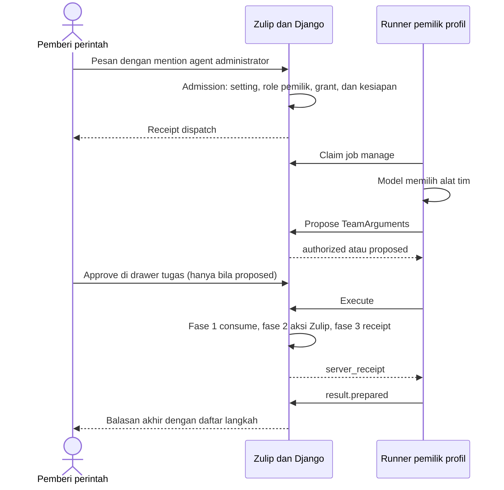

# Spesifikasi Agent Administrator Grow Team

Tanggal: 2026-09-23, Asia/Jakarta.

Status: **kontrak rilis 23; implementasi berjalan dan semua [baris AD](../agent-acceptance.md) belum diuji.**

Baseline source: `83b1a57b9e4` (image `12.2-grow-team.22`). Pilihan platform ada di
[keputusan harness](../agent-harness-decision.md).

## 1. Tujuan dan keputusan pengguna

Administrator organisasi memberi tugas pengelolaan tim lewat chat. Agent
administrator membuat channel dan grup, mengatur anggota, dan merapikan topik.
Server menjalankan setiap perubahan dengan izin orang yang memberi perintah.

Keputusan pengguna:

1. Perintah masuk lewat chat, dengan mention personal atau DM ke bot agent.
2. Secara default, hanya administrator organisasi yang boleh memberi perintah.
3. Administrator dapat mengganti siapa yang boleh memberi perintah.

Keputusan rekayasa:

1. Pakai platform agent yang sudah ada: Zulip, control plane Django, dan `grow-agent-runner`.
2. Model berjalan di runner milik pemilik profil. Server menjalankan efek di Zulip.
3. Bot tidak menambah izin. Izin efektif adalah irisan semua syarat pada bagian 4.
4. Server memutuskan konfirmasi saat propose. Runner tidak memutuskan konfirmasi.

### 1.1 Istilah

| Istilah             | Arti                                                                                |
| ------------------- | ----------------------------------------------------------------------------------- |
| Agent administrator | Profil agent dengan `default_mode` `manage`. Label UI: "Team management".           |
| Pemberi perintah    | Pengirim pesan yang membuat job `manage` (`job.requester`).                         |
| Pemilik profil      | Pengguna yang memiliki profil agent.                                                |
| Alat tim            | Satu dari 11 alat pada bagian 2. Runner memanggil alat; server menjalankan efeknya. |
| Konfirmasi          | Keputusan Approve atau Reject dari pemberi perintah lewat `AgentApproval`.          |
| `server_receipt`    | Hasil satu alat tim yang server tulis sesudah eksekusi.                             |
| Receipt dispatch    | Hasil admission untuk satu pesan dan satu agent.                                    |

## 2. Cakupan versi 1

| Nama katalog runner         | ID alat                | Fungsi                                                             | Input (semua wajib)                                                                                         |
| --------------------------- | ---------------------- | ------------------------------------------------------------------ | ----------------------------------------------------------------------------------------------------------- |
| `grow_team_find`            | `team.find`            | Cari orang, channel, dan grup yang terlihat oleh pemberi perintah. | `query`: string 1–100; `kinds`: array 1–3 item dari `"person"`, `"channel"`, `"group"`                      |
| `grow_channel_create`       | `channel.create`       | Buat channel dengan subscriber awal.                               | `name`: string 1–60; `description`: string 0–1024; `is_private`: boolean; `subscriber_user_ids`: int[] 0–50 |
| `grow_channel_subscribe`    | `channel.subscribe`    | Tambahkan orang ke channel.                                        | `channel_id`: int; `user_ids`: int[] 1–50                                                                   |
| `grow_channel_unsubscribe`  | `channel.unsubscribe`  | Keluarkan orang dari channel.                                      | `channel_id`: int; `user_ids`: int[] 1–50                                                                   |
| `grow_group_create`         | `group.create`         | Buat grup dengan anggota awal.                                     | `name`: string 1–100; `description`: string 0–1024; `member_user_ids`: int[] 0–50                           |
| `grow_group_add_members`    | `group.add_members`    | Tambahkan anggota grup.                                            | `group_id`: int; `user_ids`: int[] 1–50                                                                     |
| `grow_group_remove_members` | `group.remove_members` | Keluarkan anggota grup.                                            | `group_id`: int; `user_ids`: int[] 1–50                                                                     |
| `grow_topic_post`           | `topic.post`           | Bot mengirim pesan di topik.                                       | `channel_id`: int; `topic`: string 1–60; `content`: string 1–10000                                          |
| `grow_topic_add_person`     | `topic.add_person`     | Ajak orang ke topik (bagian 7).                                    | `channel_id`: int; `topic`: string 1–60; `user_ids`: int[] 1–20                                             |
| `grow_topic_resolve`        | `topic.resolve`        | Tandai topik selesai atau belum selesai.                           | `channel_id`: int; `topic`: string 1–60; `resolved`: boolean                                                |
| `grow_topic_move`           | `topic.move`           | Ganti nama topik atau pindahkan topik ke channel lain.             | `channel_id`: int; `topic`: string 1–60; `new_topic`: string 1–60; `new_channel_id`: int atau null          |

Aturan input:

- Setiap record input menolak field tambahan.
- Pakai konstanta Zulip bila batasnya lebih kecil dari tabel: `Stream.MAX_NAME_LENGTH`,
  `Stream.MAX_DESCRIPTION_LENGTH`, `NamedUserGroup.MAX_NAME_LENGTH`,
  `MAX_TOPIC_NAME_LENGTH`, dan `settings.MAX_MESSAGE_LENGTH`.
- `team.find` mengembalikan maksimum 10 item per jenis. Hasil hanya memuat item yang
  terlihat oleh pemberi perintah: orang `{user_id, full_name}`, channel
  `{channel_id, name, is_private}`, dan grup `{group_id, name}`.

Di luar cakupan versi 1:

| Tindakan                                                                    | Alasan                                                  |
| --------------------------------------------------------------------------- | ------------------------------------------------------- |
| Undangan lewat email                                                        | Email keluar dari organisasi dan tidak dapat ditarik.   |
| Arsip channel                                                               | Tindakan luas yang menutup channel untuk semua anggota. |
| Ubah role                                                                   | Role mengubah izin orang di seluruh organisasi.         |
| Nonaktifkan pengguna                                                        | Tindakan ini menutup akun orang lain.                   |
| Subgroup                                                                    | Subgroup dapat memperluas grup izin realm atau channel. |
| Setting channel lanjutan: default channel, web-public, retensi, grup kustom | Versi 1 memakai default Zulip untuk setting ini.        |

## 3. Nama dan kontrak teknis

| Item                     | Nama                                     | Aturan                                                                                                                                                                           |
| ------------------------ | ---------------------------------------- | -------------------------------------------------------------------------------------------------------------------------------------------------------------------------------- |
| Setting realm            | `can_command_administrator_agents_group` | `GroupPermissionSetting` dengan default `role:administrators`, `allow_nobody_group=True`, dan `allow_everyone_group=False`. Label: "Who can give tasks to administrator agents". |
| Mode profil dan job kind | `manage`                                 | Label UI: "Team management". Hanya administrator realm yang dapat menyimpan mode ini.                                                                                            |
| Aksi grant               | `team.manage`                            | Pada grant profil, untuk pemberi perintah yang bukan pemilik profil.                                                                                                             |
| Target hasil             | `answer`                                 | Hasil job `manage` terbit sebagai balasan bot di percakapan sumber.                                                                                                              |
| Event server             | `team.executed`                          | Payload: `server_receipt` dan `operation_id`.                                                                                                                                    |

Setting realm ada di Organization permissions, subbagian "Other permissions".

### 3.1 Protokol

Perubahan pada `zerver/lib/agent_protocol.py`:

- `Action` menambah `"team.manage"`. `ExecutionAction` tidak berubah.
- `JobKind` menjadi `Literal["answer", "code", "manage"]`.
- Record baru `TeamArguments` memuat `action: Literal["team.manage"]` dan `input`.
  `input` adalah union satu record per alat dengan diskriminator `tool` (ID alat).
- `OperationArguments` dan `ApprovalArguments` memuat `TeamArguments`.
- `ApprovalRecord.tree_hash` menjadi `GitHash | None`. Nilainya `None` untuk `team.manage`.
- Data operasi dari propose, consume, execute, dan `/runner/operations` menambah
  `server_receipt: object | null`.
- Descriptor attempt job `manage` tidak punya repository dan workspace.
  `policy.actions` hanya memuat `context.read` dan `team.manage`.
- Ekspor schema JSON ke `zerver/tests/fixtures/agents/protocol-v1.schema.json` dengan
  helper ekspor yang ada. Salin berkas itu byte demi byte ke
  `services/grow-agent-runner/protocol/protocol-v1.schema.json`.

Bentuk `server_receipt`:

```json
{
  "tool": "channel.create",
  "outcome": "succeeded",
  "summary": "Created the private channel #launch-q4 and subscribed Budi and Sari.",
  "objects": {"channel_id": 42, "user_ids": [12, 15]},
  "error": null
}
```

- `outcome` bernilai `"succeeded"` atau `"failed"`.
- `summary` adalah teks server, maksimum 2048 karakter. Server menulisnya dengan
  gettext dan bahasa default realm.
- `objects` dapat memuat `channel_id`, `group_id`, `message_id`, dan `user_ids`.
- `error` berisi teks yang aman untuk pengguna, atau `null`.

### 3.2 API runner

1. Runner memanggil `POST /api/v1/agent/runner/operations/propose` dengan `Proposal`:
   field lease, `operation_id`, `arguments` berupa `TeamArguments`, dan `tree_hash: null`.
   Respons adalah `{"operation": proposal_data}`. Status `authorized` berarti alat tidak
   perlu konfirmasi. Status `proposed` membawa `approval_id` dan `nonce`.
2. Runner menunggu keputusan dengan cara yang sama seperti approval Git di
   `services/grow-agent-runner/src/tool-broker.ts`, yaitu lewat reconcile dan controls.
3. Runner memanggil endpoint baru `POST /api/v1/agent/runner/operations/execute` dengan
   payload `Consume` yang ada: field lease, `operation_id`, `expected_version`,
   `operation_hash`, dan `nonce` bila ada. Server menjalankan tiga fase:
   - Fase 1: consume di dalam `agent_transaction`.
   - Fase 2: aksi Zulip sebagai pemberi perintah, di luar `agent_transaction`.
   - Fase 3: simpan `server_receipt` dan kirim `team.executed` di dalam `agent_transaction`.
4. Respons execute adalah `{"operation": {..., "status": "succeeded" | "failed", "server_receipt": {...}}}`.
5. Execute berulang untuk operasi yang sama mengembalikan receipt yang tersimpan.
6. Operasi `started` tanpa receipt berarti crash terjadi di antara fase. Server menjawab
   409 dengan kode `outcome_unknown`. Runner tidak mengulang dan memberi tahu model:
   "This step may have finished. Check the channel before you try again."
7. `team.find` memakai alur propose lalu execute yang sama dan tidak pernah butuh konfirmasi.
8. Profil `manage` siap hanya bila probe menunjukkan tool calling `passed` dan runner
   melaporkan kapabilitas `team_tools: "passed"`. Runner lama tidak dapat menjalankan job `manage`.
9. Balasan akhir bot berakhir dengan daftar langkah yang server tulis dari receipt tersimpan.
   Balasan tidak pernah mengklaim langkah yang tidak terjadi.

Fase 2 berada di luar `agent_transaction` karena dua alasan. Transaksi itu mengunci
tabel ACL, termasuk `zerver_message`, dengan batas 5 detik. Aksi Zulip seperti
`check_update_message` juga memakai transaksi `durable=True`.

### 3.3 API web

- Data profil (`GET /json/agent/profiles` dan `GET /json/agent/profiles/<id>`) menambah
  `command_allowed: bool`. Nilainya `false` untuk profil `manage` bila pembaca tidak ada
  di setting realm, atau bila pembaca bukan pemilik dan tidak memegang `team.manage`.
- Data operasi pada detail job menambah `summary` (teks server) untuk operasi `team.manage`.
- `can_decide` bernilai `true` hanya untuk pemberi perintah pada approval `team.manage`.
- Receipt dispatch memakai alasan `command_not_allowed` bila pengirim tidak boleh
  memerintah profil `manage`.

## 4. Model izin

Izin efektif adalah irisan lima syarat. Server memeriksa syarat yang sudah dapat
diperiksa saat admission. Server memeriksa semua syarat lagi pada setiap execute.

| No  | Syarat                                                                                                                                                                      | Tempat pemeriksaan                               |
| --- | --------------------------------------------------------------------------------------------------------------------------------------------------------------------------- | ------------------------------------------------ |
| 1   | Pemberi perintah ada di `can_command_administrator_agents_group`.                                                                                                           | Admission, propose, execute, dan request runner. |
| 2   | Pemilik profil adalah administrator realm (role administrator atau owner).                                                                                                  | Simpan profil, admission, propose, dan execute.  |
| 3   | Pemberi perintah yang bukan pemilik memegang grant profil (`profile.use`, `context.read`, `team.manage`), grant runner (`runner.use`), dan grant provider (`provider.use`). | Admission, claim, dan execute.                   |
| 4   | Pemberi perintah punya izin Zulip yang sama dengan pemeriksaan view normal. Executor memanggil pemeriksaan itu dengan `acting_user` = pemberi perintah.                     | Execute.                                         |
| 5   | Alat ada di katalog tertutup pada bagian 2.                                                                                                                                 | Schema protokol dan propose.                     |

Aturan tambahan:

- Pencabutan berlaku pada request runner berikutnya. `controls` lalu menghentikan job.
- Bot hanya menjadi pengirim pesan. Izin posting bot Zulip mengikuti pemilik bot, jadi
  executor memeriksa pemberi perintah dulu, baru mengirim pesan sebagai bot.
- Role administrator tidak memberi akses ke runner, provider, atau profil milik orang lain.
- Berbagi profil `manage` ke tim menambah `team.manage` pada grant profil.

### 4.1 Pemeriksaan Zulip per alat

| Alat                   | View Zulip acuan                                 | Pemeriksaan utama untuk pemberi perintah                                                                                                                                                                                     |
| ---------------------- | ------------------------------------------------ | ---------------------------------------------------------------------------------------------------------------------------------------------------------------------------------------------------------------------------- |
| `team.find`            | Daftar channel, daftar grup, dan daftar pengguna | Akses user untuk guest, channel yang terlihat, dan `require_non_guest_user` untuk grup.                                                                                                                                      |
| `channel.create`       | Buat channel                                     | `require_non_guest_user`, nama unik, `can_create_public_channel_group` atau `can_create_private_channel_group`, dan akses ke setiap subscriber.                                                                              |
| `channel.subscribe`    | Tambah subscription                              | `require_non_guest_user`, akses channel, `can_add_subscribers_group`, dan akses ke setiap orang.                                                                                                                             |
| `channel.unsubscribe`  | Hapus subscription                               | `can_remove_subscribers_group`.                                                                                                                                                                                              |
| `group.create`         | Buat grup                                        | `can_create_groups`.                                                                                                                                                                                                         |
| `group.add_members`    | Tambah anggota grup                              | `can_add_members_group` atau `can_manage_all_groups`. Grup sistem ditolak.                                                                                                                                                   |
| `group.remove_members` | Hapus anggota grup                               | `can_remove_members_group` atau `can_manage_all_groups`. Grup sistem ditolak.                                                                                                                                                |
| `topic.post`           | Kirim pesan                                      | Akses kirim ke channel, `can_send_message_group`, `can_create_topic_group`, dan izin mention grup atau wildcard.                                                                                                             |
| `topic.add_person`     | Tambah subscription dan kirim pesan              | Gabungan pemeriksaan `channel.subscribe` dan `topic.post`.                                                                                                                                                                   |
| `topic.resolve`        | Edit pesan                                       | `can_resolve_topics_group` dan akses ke pesan topik.                                                                                                                                                                         |
| `topic.move`           | Edit pesan                                       | `can_move_messages_between_topics_group` atau `can_move_messages_within_channel_group`, batas waktu edit, dan `can_move_messages_between_channels_group` atau `can_move_messages_out_of_channel_group` bila channel berubah. |

Executor mengulang urutan pemeriksaan view. Tes paritas per alat wajib ada, karena
upstream dapat menambah pemeriksaan baru pada view.

## 5. Aturan konfirmasi

Server menghitung kebutuhan konfirmasi saat propose. Runner tidak pernah memutuskannya.

| Alat                   | Pemilik profil memberi perintah                          | Orang lain memberi perintah |
| ---------------------- | -------------------------------------------------------- | --------------------------- |
| `team.find`            | Tidak                                                    | Tidak                       |
| `channel.create`       | Ya bila `is_private` bernilai true                       | Ya                          |
| `channel.subscribe`    | Ya bila channel privat                                   | Ya                          |
| `channel.unsubscribe`  | Ya                                                       | Ya                          |
| `group.create`         | Tidak                                                    | Ya                          |
| `group.add_members`    | Tidak                                                    | Ya                          |
| `group.remove_members` | Ya                                                       | Ya                          |
| `topic.post`           | Tidak                                                    | Ya                          |
| `topic.add_person`     | Ya bila channel privat dan alat men-subscribe orang baru | Ya                          |
| `topic.resolve`        | Tidak                                                    | Ya                          |
| `topic.move`           | Ya                                                       | Ya                          |

Aturan keputusan:

- Hanya pemberi perintah (`job.requester`) yang dapat menyetujui atau menolak approval `team.manage`.
- Approval memakai alur `AgentApproval` yang ada, dengan batas 15 menit.
- Satu approval berlaku untuk satu operasi dan hanya satu kali.
- Approval terikat pada hash operasi. Argumen yang berubah membuat execute ditolak.
- Reject membuat job `blocked`. Approval yang kedaluwarsa menghentikan job.

## 6. Alur dari mention sampai balasan akhir



1. Pemberi perintah menulis di topik atau DM, misalnya: "@**Agen Admin** buat channel
   privat launch-q4, tambahkan Budi dan Sari, lalu buat grup launch-team."
2. Admission memeriksa syarat 1, 2, dan 3 pada bagian 4, lalu kesiapan profil. Bila
   pengirim tidak boleh memerintah, pesan tetap tersimpan dan receipt dispatch memakai
   alasan `command_not_allowed`.
3. Server membuat job `manage` dengan target `answer` dan aksi `context.read` serta
   `team.manage`.
4. Runner mengklaim job. Descriptor tidak memuat repository atau workspace.
5. Runner membaca konteks lewat operasi `context.read`. Model mendapat katalog 11 alat tim.
6. Untuk setiap panggilan alat, runner memvalidasi argumen dengan schema, lalu memanggil propose.
7. Server memeriksa izin dan aturan konfirmasi. Bila alat perlu konfirmasi, job menjadi
   `waiting_for_approval`. Bot mengirim satu pesan di percakapan sumber: mention biasa ke
   pemberi perintah, satu kalimat kebutuhan, dan tautan tugas.
8. Pemberi perintah membuka drawer tugas. Kartu approval menampilkan `summary` dari
   server. Hanya pemberi perintah melihat tombol Approve dan Reject.
9. Runner memanggil execute. Server menjalankan tiga fase dan mengembalikan `server_receipt`.
10. Runner memberi `summary` receipt kepada model sebagai hasil alat.
11. Sesudah model selesai, server menerbitkan balasan akhir. Balasan dimulai dengan
    silent mention ke pemberi perintah, lalu berakhir dengan daftar langkah dari receipt
    dan tautan tugas.

## 7. Menambah orang ke topik

Zulip tidak mempunyai keanggotaan topik. Topik hanyalah nama pada pesan channel.
Alat `topic.add_person` melakukan dua langkah:

1. Bila orang itu belum subscribe, alat men-subscribe orang itu ke channel. Alat memakai
   pemeriksaan `channel.subscribe`.
2. Bot agent mengirim satu pesan di topik dengan mention biasa untuk setiap orang.
   Alat memakai pemeriksaan `topic.post` untuk pemberi perintah.

Aturan:

- Alat tidak pernah mengubah preferensi visibilitas topik milik orang lain.
- Mention memberi notifikasi. Zulip lalu mengikuti topik untuk orang itu bila setting
  `automatically_follow_topics_where_mentioned` aktif. Default setting itu `True`.
  Mute eksplisit tetap berlaku.
- Pada channel privat, subscribe membuka riwayat untuk subscriber. Karena itu subscribe
  baru ke channel privat perlu konfirmasi.
- `summary` menyebut apa yang terjadi, misalnya: "Budi is now subscribed to #launch
  and was mentioned in the topic plan." Jangan menulis "Budi was added to the topic."

## 8. Audit

| Bukti                                            | Sumber                                                                                                                                                                       |
| ------------------------------------------------ | ---------------------------------------------------------------------------------------------------------------------------------------------------------------------------- |
| Channel baru, subscription, dan keanggotaan grup | RealmAuditLog dari aksi Zulip dengan `acting_user` = pemberi perintah: `CHANNEL_CREATED`, `SUBSCRIPTION_*`, `USER_GROUP_CREATED`, dan `USER_GROUP_DIRECT_USER_MEMBERSHIP_*`. |
| Pesan dari `topic.post` dan `topic.add_person`   | Pesan bot dengan client "Grow Agent".                                                                                                                                        |
| Topik yang pindah atau selesai                   | Riwayat edit pesan.                                                                                                                                                          |
| Hasil setiap alat tim                            | `AgentOperation.server_receipt` dan event server `team.executed`.                                                                                                            |
| Konfirmasi                                       | Event `approval.requested` dan `approval.resolved` dengan actor.                                                                                                             |
| Perintah yang ditolak                            | Receipt dispatch dengan alasan `command_not_allowed`.                                                                                                                        |
| Perubahan setting realm                          | RealmAuditLog `REALM_PROPERTY_CHANGED`, seperti setting grup lain.                                                                                                           |

Runner tidak mengirim `tool.started` atau `tool.finished` untuk alat tim. Server adalah
satu-satunya sumber bukti efek. Korelasi RealmAuditLog ke job memakai actor, waktu, dan
ID objek. Payload event melewati penolakan secret yang sama dengan event agent lain.

## 9. Teks UI

Semua teks memakai `$t`, `{{t}}`, atau gettext. Teks tidak menyebut endpoint, tabel,
kode internal, atau hash. Kode mentah pindah ke blok `<details>` "Technical details".

| Tempat                                                  | Teks sumber (English)                                                                             |
| ------------------------------------------------------- | ------------------------------------------------------------------------------------------------- |
| Organization permissions, subbagian "Other permissions" | "Who can give tasks to administrator agents"                                                      |
| Pilihan default task type pada form profil              | "Team management"                                                                                 |
| Alasan pilihan nonaktif untuk non-administrator         | "Only organization administrators can turn on team management."                                   |
| Receipt dispatch `command_not_allowed`                  | "You cannot give tasks to this agent. Ask an organization administrator for access."              |
| Kartu approval untuk orang selain pemberi perintah      | `Waiting for <requester name> to approve.` Ganti `<requester name>` dengan nama pemberi perintah. |
| Langkah dengan hasil belum pasti                        | "This step may have finished. Check the channel before you try again."                            |

Kartu approval `team.manage` menampilkan `summary` dari server, lalu tombol Approve dan
Reject untuk pemberi perintah saja.

## 10. Risiko

| Risiko                                                                                     | Mitigasi                                                                                                    |
| ------------------------------------------------------------------------------------------ | ----------------------------------------------------------------------------------------------------------- |
| Confused deputy: runner milik pemilik membuat panggilan alat dengan izin pemberi perintah. | Pemilik profil wajib administrator. Setiap alat tulis perlu konfirmasi bila pemberi perintah bukan pemilik. |
| Izin posting bot mengikuti pemilik bot.                                                    | Executor memeriksa pemberi perintah sebelum bot mengirim pesan.                                             |
| Drift: upstream menambah pemeriksaan baru pada view Zulip.                                 | Tes paritas per alat. Audit ulang executor pada setiap merge upstream.                                      |
| Crash di antara efek dan receipt.                                                          | Status `outcome_unknown`. Runner tidak mengulang. UI menampilkan langkah belum pasti.                       |
| Kunci ACL pada `agent_transaction` menahan chat.                                           | Jaga fase 1 dan fase 3 tetap singkat. Fase 2 berjalan di luar transaksi agent.                              |
| Hasil `team.find` dan konteks masuk ke runner dan provider model milik pemilik.            | Batas 10 item per jenis. Hanya item yang terlihat oleh pemberi perintah.                                    |
| Prompt injection dari pesan konteks.                                                       | Katalog tertutup, konfirmasi dari server, dan hanya pemberi perintah yang menyetujui.                       |
| Subscribe massal mengirim banyak notifikasi.                                               | Maksimum 50 orang per panggilan, 20 untuk `topic.add_person`, dan batas `tool_rounds`.                      |
| RealmAuditLog dan notifikasi menyebut pemberi perintah, bukan agent.                       | Korelasi lewat `server_receipt` dan event `team.executed`.                                                  |
| Perubahan schema mengubah identitas paket runner.                                          | Upgrade runner dan ulangi sertifikasi sebelum aktivasi.                                                     |

## 11. Kriteria penerimaan

Setiap baris membutuhkan bukti dari tes pada commit rilis. Tracker mencatat statusnya
pada bagian AD di [bukti penerimaan](../agent-acceptance.md).

| ID    | Skenario                                                                                                                             | Hasil wajib                                                                                                                                                                            | Bukti minimum                                           |
| ----- | ------------------------------------------------------------------------------------------------------------------------------------ | -------------------------------------------------------------------------------------------------------------------------------------------------------------------------------------- | ------------------------------------------------------- |
| AD-01 | Realm baru dan realm lama sesudah migrasi                                                                                            | Setting bernilai `role:administrators`. UI menampilkannya di Organization permissions, subbagian "Other permissions".                                                                  | Tes backend realm, event, dan data register.            |
| AD-02 | Administrator mengganti grup pemberi perintah; anggota biasa mencoba mengubahnya                                                     | Perubahan administrator berlaku pada admission berikutnya dan tercatat di RealmAuditLog. Perubahan anggota biasa ditolak.                                                              | Tes backend update realm dan admission.                 |
| AD-03 | Non-administrator menyimpan profil dengan `default_mode` `manage`                                                                    | Server menolak. Form menampilkan "Team management" sebagai pilihan nonaktif dengan alasan dari bagian 9.                                                                               | Tes backend profil dan tes Node form.                   |
| AD-04 | Pemilik profil kehilangan role administrator                                                                                         | Admission baru ditolak. Job aktif berhenti pada request runner berikutnya, tanpa efek baru.                                                                                            | Tes backend admission dan controls.                     |
| AD-05 | Pengirim di luar grup setting menyebut agent administrator                                                                           | Pesan tersimpan. Receipt dispatch ditolak dengan `command_not_allowed`. Tidak ada job. Banner memakai teks dari bagian 9.                                                              | Tes backend admission dan tes Node receipt.             |
| AD-06 | Pemberi perintah bukan pemilik, memegang grant lain, tetapi tanpa `team.manage`                                                      | Admission ditolak dengan `command_not_allowed`. Data profil memberi `command_allowed: false`.                                                                                          | Tes backend policy dan API profil.                      |
| AD-07 | Setting atau grant dicabut saat job aktif                                                                                            | Request runner berikutnya menerima stop. Execute berikutnya ditolak. Tidak ada efek baru.                                                                                              | Tes backend lifecycle.                                  |
| AD-08 | Setiap alat tulis dengan izin Zulip yang cocok                                                                                       | Objek Zulip berubah sesuai input. RealmAuditLog memakai `acting_user` = pemberi perintah. `server_receipt` tersimpan dan `team.executed` terkirim.                                     | Tes backend per alat.                                   |
| AD-09 | Pemberi perintah ada di grup setting tetapi tanpa izin Zulip untuk alat itu, termasuk guest                                          | Receipt `failed` dengan `error` yang aman. Tidak ada objek atau RealmAuditLog baru.                                                                                                    | Tes backend per alat.                                   |
| AD-10 | Pemilik profil subscribe ke channel privat P, sedangkan pemberi perintah tidak                                                       | `topic.post` dan `topic.add_person` ke P gagal. Bot tidak mengirim pesan.                                                                                                              | Tes backend eskalasi bot.                               |
| AD-11 | `team.find` oleh guest dan oleh anggota biasa                                                                                        | Hasil hanya memuat item yang terlihat oleh pemberi perintah, maksimum 10 per jenis, tanpa konfirmasi.                                                                                  | Tes backend.                                            |
| AD-12 | Pemilik profil memakai `channel.unsubscribe`, `group.remove_members`, atau `topic.move`                                              | Server membuat `AgentApproval` 15 menit. Job menjadi `waiting_for_approval`. Alat belum berjalan.                                                                                      | Tes backend propose.                                    |
| AD-13 | Target channel privat: `channel.create` privat, `channel.subscribe`, dan `topic.add_person` yang men-subscribe orang baru            | Server meminta konfirmasi. Versi channel publik oleh pemilik profil berjalan tanpa konfirmasi.                                                                                         | Tes backend propose.                                    |
| AD-14 | Pemberi perintah bukan pemilik profil                                                                                                | Setiap alat tulis perlu konfirmasi, termasuk `channel.create` publik. `team.find` tetap tanpa konfirmasi.                                                                              | Tes backend propose.                                    |
| AD-15 | Administrator lain dengan akses job mencoba menyetujui                                                                               | Keputusan ditolak. `can_decide` bernilai `false`. Drawer menampilkan teks tunggu dari bagian 9.                                                                                        | Tes backend approval dan tes Node drawer.               |
| AD-16 | Pemberi perintah menyetujui, menolak, atau membiarkan approval kedaluwarsa                                                           | Approve menjalankan alat satu kali. Reject membuat job `blocked`. Approval kedaluwarsa menolak execute dan menghentikan job.                                                           | Tes backend approval.                                   |
| AD-17 | Runner mengubah argumen sesudah approval                                                                                             | Execute ditolak karena hash operasi berbeda. Tidak ada efek.                                                                                                                           | Tes backend.                                            |
| AD-18 | Runner memanggil execute dua kali untuk operasi yang sama                                                                            | Panggilan kedua mengembalikan `server_receipt` yang sama. Efek Zulip hanya terjadi satu kali.                                                                                          | Tes backend.                                            |
| AD-19 | Crash sesudah fase 2 dan sebelum fase 3                                                                                              | Operasi tetap `started` tanpa receipt. Execute berikutnya mendapat 409 `outcome_unknown`. Runner tidak mengulang. UI menampilkan teks langkah belum pasti.                             | Tes backend dengan fault injection dan tes runner.      |
| AD-20 | `topic.add_person` untuk orang yang belum subscribe, orang yang sudah subscribe, dan orang dengan follow otomatis mati               | Server men-subscribe bila perlu. Bot mengirim satu pesan dengan mention biasa. Preferensi topik orang lain tidak berubah. `summary` menyebut apa yang terjadi.                         | Tes backend dengan follow otomatis aktif dan mati.      |
| AD-21 | Job `answer` atau `code` mengusulkan `team.manage`; input punya field tambahan, pasangan `tool` dan input salah, atau melewati batas | Protokol dan propose menolak. Tidak ada operasi yang tersimpan.                                                                                                                        | Tes protokol backend dan tes runner.                    |
| AD-22 | Descriptor job `manage` dan ekspor schema                                                                                            | Descriptor tanpa repository dan workspace, dengan aksi `context.read` dan `team.manage` saja. Descriptor `manage` dengan repository ditolak. Schema server dan salinan runner identik. | Tes protokol backend dan tes snapshot runner.           |
| AD-23 | Runner tanpa `team_tools: "passed"`, atau probe tool calling gagal                                                                   | Server tidak menandai profil `manage` siap. Job `manage` tidak dimulai.                                                                                                                | Tes backend readiness dan tes runner.                   |
| AD-24 | Job `manage` selesai dengan langkah berhasil, gagal, dan belum pasti                                                                 | Balasan akhir berakhir dengan daftar langkah dari receipt tersimpan. Langkah gagal atau belum pasti tidak tertulis sebagai berhasil.                                                   | Tes backend publikasi.                                  |
| AD-25 | Pesan konteks meminta agent mengeluarkan orang, memindahkan topik, atau mengundang lewat email                                       | Katalog tidak punya alat undangan. Alat sensitif tetap butuh konfirmasi pemberi perintah. Tidak ada efek tanpa keputusan.                                                              | Tes runner dan backend dengan fixture prompt injection. |
| AD-26 | Pengaturan dan kartu approval pada tema terang dan gelap, lebar 480 sampai 1920 px, dan keyboard                                     | Semua kontrol dapat dipakai. Kartu menampilkan `summary` tanpa hash atau kode internal. Semua teks dapat diterjemahkan.                                                                | Tes visual dan e2e.                                     |

## 12. Rujukan

- [Keputusan harness](../agent-harness-decision.md): alasan memakai platform agent Grow Team.
- [Bukti penerimaan](../agent-acceptance.md): status baris AD.
- [Security](../security.md): batas otoritas agent.
- [Spec harness](2026-09-21-agent-connections-and-coding-harness.md), [spec lifecycle](2026-09-21-agent-lifecycle-and-mention-flow.md),
  dan [spec settings](2026-09-22-agent-settings-connections-and-team-defaults.md): lease, approval, grant, dan admission yang dipakai ulang.
- Kode acuan: [protokol](../../../zerver/lib/agent_protocol.py), [approval](../../../zerver/actions/agent_approvals.py),
  [policy](../../../zerver/lib/agent_policy.py), dan [tool broker runner](../../../services/grow-agent-runner/src/tool-broker.ts).
