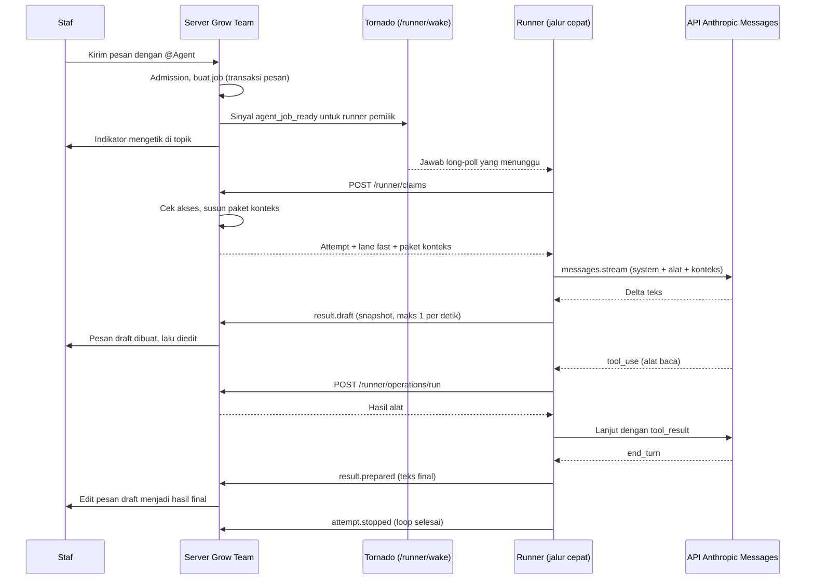

# Spesifikasi Jalur Cepat Agent (Fast Lane) dengan Anthropic SDK

Tanggal: 2026-09-24, Asia/Jakarta.

Status: **kontrak baru; belum diimplementasikan. Semua baris FL belum diuji.**

Baseline source: `8217d765a19` (image `12.2-grow-team.25`).

Keputusan platform ada di [keputusan SDK agent](../agent-sdk-decision.md).
Pengiriman jawaban ke chat ada di [spesifikasi streaming](2026-09-24-agent-streaming-delivery.md).
Target waktu dan keandalan ada di [spesifikasi latensi dan keandalan](2026-09-24-agent-latency-and-reliability.md).

## 1. Tujuan

Staf me-mention agent di channel mana pun. Agent harus terasa seperti rekan kerja
yang langsung menjawab.

Hasil yang diminta:

1. Tanda pertama bahwa agent bekerja muncul dalam 1 detik.
2. Teks jawaban pertama muncul dalam 5 detik (p50).
3. Jawaban pendek selesai dalam 12 detik (p50).
4. Tidak ada job yang gagal tanpa pesan ke pemberi perintah.

Keadaan sekarang (diukur dari 8 job `answer` yang selesai di produksi, 2026-09-23):

| Tahap                             | Waktu                  | Penyebab                                                         |
| --------------------------------- | ---------------------- | ---------------------------------------------------------------- |
| Pesan sampai job masuk antrean    | 1–2 s                  | Sudah cepat                                                      |
| Job masuk antrean sampai mulai    | 12–17 s (sekali 53 s)  | Polling 2 s, lalu satu container model baru untuk setiap attempt |
| Baca konteks                      | 8–15 s                 | `context.read` lewat propose, consume, dan siklus polling        |
| Model menjawab                    | 18–40 s                | Tanpa streaming, effort default `high`, 150–830 token keluaran   |
| Hasil siap sampai tampil di chat  | 6–24 s                 | Publikasi menunggu bukti container berhenti                      |
| **Total**                         | **47–118 s, median ±75 s** |                                                              |

Dari 15 job, 7 berakhir `interrupted` atau `cancelled`.

## 2. Keputusan

1. Job `answer` dan `manage` berjalan di **jalur cepat**. Loop model berjalan di dalam
   proses `grow-agent-runner` dengan paket resmi `@anthropic-ai/sdk`.
2. Jalur cepat tidak memakai container, adapter ACP, atau endpoint child.
3. Job `code` tetap berjalan di **jalur code** dengan container dan adapter yang ada.
   Spesifikasi ini tidak mengubah jalur code.
4. Server mengirim **paket konteks** (context bundle) bersama respons claim. Runner tidak
   membaca konteks awal lewat operasi.
5. Jawaban tampil sebagai **satu pesan draft** yang server edit selama model menulis.
   Pesan draft itu menjadi pesan hasil akhir.
6. Server menerbitkan hasil jalur cepat segera sesudah `result.prepared`. Server tidak
   menunggu `attempt.stopped`.
7. Effort, batas token, dan batas giliran alat mengikuti jenis job.
8. Semua aturan otoritas tetap berlaku: server memutuskan dan menjalankan setiap efek,
   konteks dibatasi audiens, kredensial tinggal di host runner.

### 2.1 Istilah

| Istilah         | Arti                                                                                        |
| --------------- | ------------------------------------------------------------------------------------------- |
| Jalur (lane)    | Cara menjalankan attempt. Nilai: `fast` atau `code`. Server memilih jalur dari jenis job.   |
| Jalur cepat     | Loop Anthropic SDK di dalam proses runner. Untuk `answer` dan `manage`.                     |
| Jalur code      | Container, adapter, dan workspace yang ada. Untuk `code`.                                   |
| Paket konteks   | Konteks awal yang server susun saat claim, dibatasi audiens dan token.                      |
| Pesan draft     | Pesan bot di topik asal yang server edit selama jawaban ditulis.                            |
| Snapshot draft  | Teks jawaban lengkap sampai saat itu, dikirim runner dengan nomor urut.                     |
| Koneksi model   | Base URL, kunci, dan model pada host runner untuk API Anthropic Messages.                   |
| Alat baca       | Alat tanpa efek yang server jalankan dalam satu request (`operations/run`).                 |
| Alat tim        | Satu dari 11 alat `manage` pada [spesifikasi administrator](2026-09-23-agent-administrator.md). |

## 3. Pemilihan jalur

| `job_kind` | Jalur  | Alat                                             | Effort default | Batas giliran alat | Batas waktu attempt |
| ---------- | ------ | ------------------------------------------------ | -------------- | ------------------ | ------------------- |
| `answer`   | `fast` | Alat baca (bagian 7)                             | `low`          | 8                  | 3 menit             |
| `manage`   | `fast` | Alat baca + alat tim                             | `medium`       | 20                 | 15 menit            |
| `code`     | `code` | Sesuai [spesifikasi eksekusi](2026-09-22-agent-execution-context-skills-and-mcp.md) | Sesuai profil | 40 | 60 menit |

Aturan:

1. Server menulis `lane` pada `AgentAttempt` saat claim. Runner tidak memilih jalur.
2. Tidak ada fallback antarjalur. Bila jalur cepat tidak siap, job tidak pindah ke jalur code.
3. Batas waktu `manage` tidak menghitung waktu tunggu konfirmasi. Tunggu konfirmasi
   memakai batas 15 menit dari approval.
4. Pemilik profil dapat menaikkan effort `answer` ke `medium`. Pemilik tidak dapat
   menurunkan effort `manage` di bawah `low`.

## 4. Alur end-to-end

Langkah dan target waktu:

| Langkah                                   | Target p50 | Catatan                                               |
| ----------------------------------------- | ---------- | ----------------------------------------------------- |
| Pesan sampai indikator mengetik           | < 1 s      | Server mengirim indikator saat admission menerima job |
| Job masuk antrean sampai claim            | < 0,5 s    | Long-poll `/runner/wake`, bukan polling               |
| Claim sampai request model dikirim        | < 0,5 s    | Paket konteks sudah ada di respons claim              |
| Request model sampai delta teks pertama   | < 4 s      | Effort `low`, prompt cache                            |
| Delta pertama sampai pesan draft tampil   | < 1,5 s    | Snapshot pertama langsung, lalu maks 1 per detik      |
| `result.prepared` sampai hasil final      | < 1 s      | Tanpa menunggu `attempt.stopped`                      |

## 5. Bangun runner dan claim

### 5.1 Membangunkan runner

1. Runner membuka long-poll `GET /runner/wake` dengan kredensial runner. Tornado
   melayani request ini dan menahannya maksimal 25 s. Runner tidak punya akun pengguna
   Zulip, jadi runner tidak memakai event queue pengguna.
2. Server mengirim sinyal `agent_job_ready` ke Tornado untuk runner pemilik profil
   sesudah transaksi job commit (`transaction.on_commit`). Sinyal hanya berisi `job_id`
   dan `lane`.
3. Tornado langsung menjawab long-poll runner itu. Runner lalu memanggil
   `POST /runner/claims` dan membuka long-poll baru.
4. Polling 2 detik tetap berjalan sebagai cadangan bila long-poll terputus.
5. Sinyal tidak memberi otoritas. Claim tetap memeriksa lease, versi, dan akses.
6. Django tidak menahan request long-poll. Worker Django tetap bebas.

### 5.2 Kapasitas

1. Runner melaporkan kapasitas per jalur: `fast` (default 4) dan `code` (tetap 1).
2. Satu job `code` yang aktif tidak memblokir job jalur cepat.
3. Batas realm: 8 job jalur cepat aktif dan 2 job jalur code aktif.
4. Batas antrean tetap: 20 job per profil dan 100 per realm. Bila penuh, server
   menjawab `queue_full` dan tidak membuang job yang sudah diterima.

### 5.3 Paket konteks

Server menyusun paket konteks di dalam claim, sesudah pemeriksaan akses terakhir.

Isi paket:

| Bagian               | Isi                                                                                         | Batas                     |
| -------------------- | ------------------------------------------------------------------------------------------- | ------------------------- |
| `request`            | Pesan pemicu, pengirim, waktu, dan pesan yang dikutip                                        | 1 pesan + kutipan         |
| `conversation`       | Pesan terbaru di topik asal atau DM, urut waktu                                              | 50 pesan atau 12.000 token |
| `place`              | Nama channel, deskripsi channel, nama topik, jenis audiens                                   | —                         |
| `people`             | Nama dan peran orang yang muncul di `conversation`                                           | 50 orang                  |
| `requester`          | Nama, peran realm, zona waktu, bahasa                                                        | —                         |
| `instructions`       | Instruksi realm, instruksi profil, indeks skill (urutan dari spesifikasi eksekusi bagian 9.2) | 8.000 token               |
| `audience_epoch`     | Epoch audiens saat paket disusun                                                             | —                         |

Aturan:

1. Setiap pesan dalam paket harus terbaca oleh irisan pemberi perintah, bot, dan
   audiens tujuan. Server memeriksa akses per pesan, sama seperti `context.read`.
2. Paket tidak memuat pesan dari channel lain, isi file lampiran, atau riwayat penuh.
3. Server tidak memanggil model dan tidak memanggil jaringan di dalam transaksi claim.
4. Server mencatat digest paket pada `AgentAttempt`. Log dan event tidak memuat isi paket.
5. Bila audiens berubah sesudah paket disusun, aturan tahan hasil (AF-35) berlaku.
6. Pemangkasan membuang pesan tertua lebih dulu. Paket mencatat jumlah pesan yang dibuang.

### 5.4 Protokol v2

Paket konteks, jalur, dan snapshot draft butuh `schema_version` 2.

1. `ClaimRequest` v2 membawa `capacity` per jalur.
2. `ClaimResponse` v2 membawa `attempt.lane`, `attempt.context_bundle`, dan
   `attempt.model_policy` (bagian 6.3).
3. `RunnerEvent` v2 menambah tipe `result.draft` (bagian 8.2).
4. Server menolak event `result.draft` dari attempt jalur code.
5. Runner v1 tetap bekerja untuk jalur code. Server tidak memberi job jalur cepat ke
   runner v1 (EX-51).
6. Skema server dan runner tetap identik per byte, seperti aturan v1.

## 6. Loop model di runner

### 6.1 Paket dan versi

1. Pakai `@anthropic-ai/sdk` dengan versi terkunci persis di `package-lock.json`.
2. Pakai Messages API dengan streaming: `client.messages.stream(...)`.
3. Tulis loop alat sendiri dengan tipe SDK (`Anthropic.MessageParam`, `Anthropic.Tool`,
   `Anthropic.ToolUseBlock`). Jangan pakai Tool Runner beta. Loop sendiri memberi titik
   untuk jurnal, otoritas server, dan pembatalan sebelum setiap efek.
4. Jangan definisikan ulang tipe yang SDK sediakan.

### 6.2 Koneksi model

| Field        | Arti                                                                  |
| ------------ | --------------------------------------------------------------------- |
| `api`        | Nilai tetap `anthropic_messages`                                      |
| `base_url`   | Endpoint Anthropic Messages, misalnya 9router atau API Anthropic      |
| `api_key`    | Disimpan di berkas privat runner (mode 600). Tidak pernah ke server   |
| `model`      | ID model, misalnya `claude-opus-5`                                    |
| `max_output` | Batas atas `max_tokens` yang pemilik izinkan                          |

Aturan:

1. Klien SDK memakai opsi `fetch` milik runner. Fungsi itu menegakkan aturan egress:
   origin tetap, cek DNS dan IP per koneksi, tanpa redirect, HTTPS terverifikasi kecuali
   loopback yang pemilik setujui.
2. Kunci tidak masuk ke argumen proses, event, jurnal, log, atau pesan error.
3. Tidak ada fallback provider atau model tersembunyi.
4. Server hanya menyimpan metadata koneksi: `api`, host `base_url`, `model`, dan status
   probe terakhir.
5. **Gerbang F0:** jalur cepat baru aktif sesudah probe membuktikan endpoint menerima
   `POST /v1/messages` dengan streaming dan `tool_use` (bagian 12).

### 6.3 Kebijakan model per attempt

Server mengirim `model_policy` pada claim. Runner tidak menaikkan nilainya.

| Field               | `answer`        | `manage`        |
| ------------------- | --------------- | --------------- |
| `effort`            | `low`           | `medium`        |
| `thinking`          | `adaptive`, tampilan `omitted` | `adaptive`, tampilan `omitted` |
| `max_tokens`        | 8.000           | 16.000          |
| `tool_rounds`       | 8               | 20              |
| `idle_timeout_s`    | 30              | 30              |
| `turn_timeout_s`    | 120             | 180             |
| `attempt_timeout_s` | 180             | 900             |
| `max_retries`       | 2               | 2               |

Aturan:

1. `idle_timeout_s` memutus stream yang diam, bukan stream yang lambat tetapi aktif.
   Batas absolut 60 detik yang lama tidak berlaku lagi.
2. Retry hanya untuk 408, 409, 429, 5xx, dan error koneksi. Hormati `retry-after`.
   Jangan retry sesudah delta pertama tampil di chat. Kirim error ke pesan draft.
3. Thinking tidak pernah tampil di chat atau di panel tugas.
4. Pemakaian token dan biaya tetap memakai reservasi dan batas biaya yang ada.

### 6.4 Susunan prompt dan cache

Urutan request harus stabil supaya prompt cache kena:

1. `tools`: katalog alat jalur, urut nama, deskripsi tetap.
2. `system` blok 1: identitas agent dan aturan kerja jalur. Tetap per versi runner.
3. `system` blok 2: instruksi realm, instruksi profil, dan indeks skill.
   Pasang `cache_control` dengan TTL `1h` di akhir blok ini.
4. `messages[0]` (`user`): paket konteks sebagai data, lalu permintaan.
5. Giliran berikutnya ditambahkan di akhir. Riwayat tidak pernah diedit.

Aturan:

1. Jangan masukkan waktu, ID job, atau nilai acak ke `tools` atau `system`.
2. Paket konteks adalah data tak tepercaya. Bungkus dalam penanda data. Teks di dalamnya
   tidak dapat mengubah alat, izin, atau instruksi.
3. Catat `cache_read_input_tokens` dan `cache_creation_input_tokens` per giliran.
4. Bila `cache_read_input_tokens` bernilai 0 pada 3 job berurutan dengan prefix sama,
   laporkan sebagai gangguan cache di metrik.

### 6.5 Validasi giliran

1. Runner menyusun respons lengkap sebelum menjalankan alat. Delta `input_json` sebagian
   tidak pernah menjalankan alat (AF-38).
2. Setiap `tool_use` harus punya nama dari katalog jalur, argumen yang lolos skema, dan ID
   unik. Nama tidak dikenal ditolak sebelum dispatch (EX-16).
3. `stop_reason` `max_tokens`, `refusal`, atau `end_turn` tanpa teks mengakhiri attempt
   dengan kegagalan yang terlihat (AF-28). Model tidak dapat menandai job selesai.
4. Semua `tool_result` untuk satu giliran dikirim dalam satu pesan `user`.
5. Alat baca dalam satu giliran berjalan paralel. Alat tim berjalan satu per satu.

### 6.6 Isolasi antar job

Satu proses runner menjalankan beberapa job jalur cepat. Aturan pengganti
"satu proses per attempt" untuk jalur ini:

1. Setiap attempt punya objek percakapan, `AbortController`, jurnal, dan batas sendiri.
2. Tidak ada riwayat, hasil alat, atau cache lokal yang dipakai bersama antar attempt.
3. Prompt cache penyedia hanya berbagi prefix `tools` dan `system`. Prefix itu tidak
   memuat data audiens.
4. Error pada satu attempt tidak menghentikan attempt lain.
5. Proses runner tidak menjalankan kode dari model, repo, atau pesan.

## 7. Alat jalur cepat

### 7.1 Satu request per alat baca

Alat baca memakai endpoint baru `POST /runner/operations/run`:

1. Runner mencatat intent di jurnal, lalu mengirim satu request berisi `operation_id`,
   nama alat, argumen, lease, dan versi job.
2. Server memeriksa lease, katalog, argumen, dan akses, lalu menjalankan alat dan
   mengembalikan hasil dalam respons yang sama.
3. Server mencatat operasi dan audit seperti propose dan consume.
4. Request yang diulang dengan `operation_id` sama mengembalikan hasil yang tersimpan.
5. Endpoint ini menolak alat yang punya efek. Alat tim tetap memakai propose, konfirmasi,
   dan `execute` (spesifikasi administrator bagian 3.2).

### 7.2 Katalog alat baca v2

Semua alat membaca atas nama pemberi perintah, dibatasi audiens job.

| ID alat              | Fungsi                                                                     | Batas hasil       |
| -------------------- | -------------------------------------------------------------------------- | ----------------- |
| `context.read`       | Baca referensi konteks tambahan yang server sebut di paket                  | Sesuai v1         |
| `messages.search`    | Cari pesan di channel yang terlihat oleh irisan audiens                     | 20 pesan          |
| `topic.history`      | Baca pesan satu topik yang terlihat, dengan kursor                          | 50 pesan per call |
| `channels.list`      | Daftar channel yang terlihat, dengan jumlah anggota dan deskripsi           | 200 channel       |
| `people.find`        | Cari orang yang terlihat: nama, peran, zona waktu                           | 20 orang          |
| `tasks.list`         | Daftar kartu task board yang terlihat, dengan filter kolom dan penanggung jawab | 50 kartu      |
| `team.find`          | Sesuai spesifikasi administrator, hanya untuk `manage`                      | 10 per jenis      |

Aturan:

1. Hasil tidak membocorkan nama, ID, atau jumlah sumber daya yang tidak terlihat (EX-52).
2. Hasil alat adalah data tak tepercaya bagi model.
3. Hasil lebih dari 16.000 token dipotong dengan penanda potong.
4. Job `answer` tidak mendapat alat tim.

## 8. Hasil dan publikasi

### 8.1 Status job

Jalur cepat memakai state machine yang ada. Perubahan:

1. `answer` dan `manage` selesai sesudah hasil tersimpan dan terkirim (AF lama bagian 11).
2. Bukti berhenti untuk jalur cepat adalah akhir loop di runner. Runner mengirim
   `attempt.stopped` segera sesudah loop berakhir.
3. Publikasi tidak menunggu `attempt.stopped`, checkpoint, atau timer reconcile.
4. Timer reconcile 15 detik tetap menjadi cadangan untuk publikasi yang tertunda.

### 8.2 Event `result.draft`

| Field       | Arti                                                  |
| ----------- | ----------------------------------------------------- |
| `draft_seq` | Nomor urut naik per attempt                           |
| `text`      | Teks jawaban lengkap sampai saat ini, maks 10.000 karakter |
| `final`     | Selalu `false`. Hasil final memakai `result.prepared` |

Aturan:

1. Runner mengirim snapshot pertama segera sesudah delta teks pertama. Sesudah itu,
   maks satu snapshot per detik.
2. Server mengabaikan snapshot dengan `draft_seq` yang lebih kecil dari yang tersimpan.
3. Runner menyaring rahasia sebelum mengirim snapshot. Filter menahan 64 karakter
   terakhir supaya rahasia yang terpotong di batas delta tidak lolos.
4. Server menyaring rahasia lagi sebelum mengedit pesan.
5. Snapshot tidak memuat thinking, argumen alat, atau hasil alat.

Detail pesan draft, edit, dan teks untuk pengguna ada di
[spesifikasi streaming](2026-09-24-agent-streaming-delivery.md).

## 9. Batal, lanjut, dan input susulan

1. Batal: server menulis `cancel_requested`. Runner membatalkan stream lewat
   `AbortController`, menunggu loop berakhir, lalu mengirim `attempt.stopped`.
   Status `cancelled` tampil sesudah itu.
2. Bila runner tidak menjawab dalam 30 detik sesudah `cancel_requested`, job menjadi
   `interrupted`.
3. Lanjut (resume): attempt baru menerima paket konteks baru. Tidak ada sesi model yang
   dilanjutkan.
4. Input susulan pada job jalur cepat yang aktif masuk di batas giliran berikutnya.
   Input sesudah job selesai membuat job baru dengan `follows_job_id`.
5. Batal di tengah streaming mengubah pesan draft menjadi teks batal
   (spesifikasi streaming bagian 5).

## 10. Keamanan

Semua invarian ini tetap berlaku di jalur cepat:

1. Server memutuskan dan menjalankan setiap efek. Runner hanya mengusulkan.
2. Alat tim berjalan dengan izin pemberi perintah (`acting_user`), bukan izin bot.
3. Katalog alat tertutup. Isi pesan, repo, atau hasil alat tidak menambah izin.
4. Konteks dibatasi audiens. Akses diperiksa ulang di claim, di setiap alat, dan
   sebelum publikasi.
5. Kredensial model hanya ada di host runner.
6. Jurnal ditulis sebelum request dikirim. `outcome_unknown` tidak pernah di-retry.
7. Lease, epoch, dan versi diikat pada setiap request yang mengubah data.
8. Teks model bukan otoritas untuk approval, verifikasi, atau status selesai.
9. Satu pesan hasil per job. Kunci pengiriman tetap `result:{job_id}`.
10. Rahasia disaring pada snapshot, hasil final, hasil alat, dan error.
11. Thinking tidak pernah tampil.

Risiko baru dan pengendaliannya:

| Risiko                                             | Pengendalian                                                        |
| -------------------------------------------------- | ------------------------------------------------------------------- |
| Loop model sekarang di proses host, tanpa container | Proses runner tidak menjalankan kode. Alat hanya request ke server. |
| Data satu job terbaca job lain                     | Isolasi bagian 6.6 dan tes FL-12                                    |
| Rahasia lolos lewat snapshot                       | Filter dengan buffer 64 karakter, disaring lagi di server           |
| Paket konteks terlalu luas                         | Batas bagian 5.3 dan cek akses per pesan                            |

## 11. Observabilitas

Runner dan server mencatat per attempt, tanpa isi prompt dan tanpa isi jawaban:

| Metrik                     | Sumber  |
| -------------------------- | ------- |
| `queued_at`, `claimed_at`, `model_request_at`, `first_delta_at`, `first_draft_at`, `prepared_at`, `published_at` | Event job |
| `input_tokens`, `output_tokens`, `cache_read_input_tokens`, `cache_creation_input_tokens` | Usage SDK |
| `tool_calls`, `tool_ms_total`, `retries`                   | Runner    |
| `failure_code`                                             | Server    |

Target, dasbor, dan alarm ada di
[spesifikasi latensi dan keandalan](2026-09-24-agent-latency-and-reliability.md).

## 12. Rencana rilis

| Fase | Isi                                                                                               | Syarat lanjut                         |
| ---- | ------------------------------------------------------------------------------------------------- | ------------------------------------- |
| F0   | Probe koneksi model: `POST /v1/messages`, streaming, dan satu `tool_use` pada endpoint produksi.   | Probe lulus, atau keputusan pengganti |
| F1   | Perbaikan cepat di harness lama: idle timeout, effort `low` untuk `answer`, publikasi `answer` tanpa menunggu stop | Tes AT, AF lama tetap lulus |
| F2   | Protokol v2, long-poll `/runner/wake`, paket konteks, loop SDK jalur cepat di balik flag profil `fast_lane` | FL-01 sampai FL-15 lulus      |
| F3   | Pesan draft dan snapshot streaming                                                                | FL-16 sampai FL-22 lulus              |
| F4   | Katalog alat baca v2 dan `operations/run`                                                         | FL-23 sampai FL-27 lulus              |
| F5   | Flag aktif untuk semua profil. Jalur `answer` dan `manage` lama dipensiunkan                      | Target latensi 7 hari berturut-turut  |

Aturan:

1. Setiap fase punya flag dan jalan balik tanpa menghapus tabel.
2. Fase F1 tidak mengubah protokol dan dapat rilis lebih dulu.
3. Bila probe F0 gagal karena 9router tidak mendukung format Anthropic, pemilik memilih:
   (a) tambahkan dukungan Messages di 9router, (b) koneksi langsung ke API Anthropic,
   atau (c) pakai Vercel AI SDK sesuai keputusan cadangan.

## 13. Kriteria penerimaan (FL)

| ID    | Kriteria                                                                                                  |
| ----- | --------------------------------------------------------------------------------------------------------- |
| FL-01 | Server memilih `lane` dari `job_kind`. Runner tidak dapat mengubahnya.                                    |
| FL-02 | Job `answer` dan `manage` tidak membuat container.                                                        |
| FL-03 | Sinyal `agent_job_ready` membuat runner mengklaim job dalam 0,5 s (p50) di lingkungan tes.                 |
| FL-04 | Polling cadangan mengklaim job bila long-poll `/runner/wake` terputus.                                    |
| FL-05 | Paket konteks hanya memuat pesan yang terlihat oleh irisan audiens. Tes negatif untuk channel privat lain. |
| FL-06 | Paket konteks dipangkas sesuai batas bagian 5.3 dan mencatat jumlah pesan yang dibuang.                    |
| FL-07 | Tidak ada panggilan jaringan atau model di dalam transaksi claim.                                          |
| FL-08 | Runner v1 tidak menerima job jalur cepat.                                                                  |
| FL-09 | Request model memakai `effort`, `max_tokens`, dan timeout dari `model_policy`.                             |
| FL-10 | Stream diam 30 s diputus. Stream lambat yang aktif tidak diputus.                                         |
| FL-11 | `cache_read_input_tokens` lebih dari 0 pada job kedua dengan profil sama dalam 1 jam.                      |
| FL-12 | Dua job paralel pada satu runner tidak berbagi riwayat atau hasil alat.                                    |
| FL-13 | `tool_use` dengan nama asing ditolak sebelum dispatch.                                                     |
| FL-14 | JSON alat yang terpotong tidak menjalankan alat.                                                           |
| FL-15 | `max_tokens`, `refusal`, dan `end_turn` tanpa teks berakhir dengan pesan gagal yang terlihat.              |
| FL-16 | Pesan draft pertama tampil paling lambat 1,5 s sesudah delta teks pertama.                                 |
| FL-17 | Snapshot lama (`draft_seq` lebih kecil) tidak menimpa teks yang lebih baru.                                |
| FL-18 | Rahasia yang terpotong di batas dua delta tidak tampil di pesan draft.                                     |
| FL-19 | Hasil final mengedit pesan draft. Tidak ada pesan hasil kedua.                                             |
| FL-20 | Hasil final tampil paling lambat 1 s sesudah `result.prepared`, tanpa menunggu `attempt.stopped`.          |
| FL-21 | Batal di tengah streaming mengubah pesan draft ke teks batal, lalu job menjadi `cancelled`.                |
| FL-22 | Perubahan audiens di tengah streaming menahan hasil dan menyembunyikan pesan draft.                        |
| FL-23 | `operations/run` menjalankan alat baca dalam satu request dan mengembalikan hasil tersimpan saat diulang.   |
| FL-24 | `operations/run` menolak alat tim.                                                                         |
| FL-25 | Alat baca v2 tidak membocorkan nama, ID, atau jumlah sumber daya yang tidak terlihat.                     |
| FL-26 | Job `answer` tidak mendapat alat tim.                                                                      |
| FL-27 | Alat baca dalam satu giliran berjalan paralel. Alat tim berjalan berurutan.                                |
| FL-28 | Kunci model tidak muncul di event, jurnal, log, atau error.                                                |
| FL-29 | Job `code` tetap memakai jalur code dan lulus tes EX yang ada.                                             |
| FL-30 | Gagal di mana pun menghasilkan pesan untuk pemberi perintah dalam 30 s. Tidak ada job yang gagal diam-diam. |

## 14. Yang tidak berubah

- Admission, dedup, dan aturan trigger dari
  [spesifikasi siklus hidup](2026-09-21-agent-lifecycle-and-mention-flow.md).
- Katalog, konfirmasi, dan eksekusi alat tim dari
  [spesifikasi administrator](2026-09-23-agent-administrator.md), kecuali konteks awal
  yang sekarang datang dari paket konteks.
- Pairing runner, transport, dan kepercayaan dari
  [spesifikasi koneksi](2026-09-21-agent-connections-and-coding-harness.md) bagian 9.
- Pengaturan profil dan default tim dari
  [spesifikasi pengaturan](2026-09-22-agent-settings-connections-and-team-defaults.md),
  kecuali mode API model (bagian 6.2 di sini).
- Seluruh jalur code.

## 15. Keputusan terbuka

1. Gerbang F0 **lulus** pada 2026-09-24 17:12 WIB. 9router (`127.0.0.1:20129`, model
   `cc/claude-opus-5`) menerima `POST /v1/messages` dengan header `x-api-key` dan
   `anthropic-version`. Respons memuat blok `tool_use` (2,2 s). Streaming mengirim semua
   event Messages (`message_start` sampai `message_stop`); "halo" selesai dalam 2,8 s.
   Temuan: 9router mengganti nama alat (`get_weather` kembali sebagai `get_weather_ide`).
   Runner wajib memetakan nama kembali ke katalog dengan aturan pasti sebelum validasi,
   atau 9router harus berhenti mengganti nama. Tanpa itu, FL-13 menolak setiap alat.
2. Apakah jalur code nanti pindah dari ACP ke Claude Agent SDK? Di luar cakupan ini.
3. Apakah pemilik profil boleh memilih `speed: "fast"` bila endpoint mendukungnya?
   Biayanya lebih tinggi.
